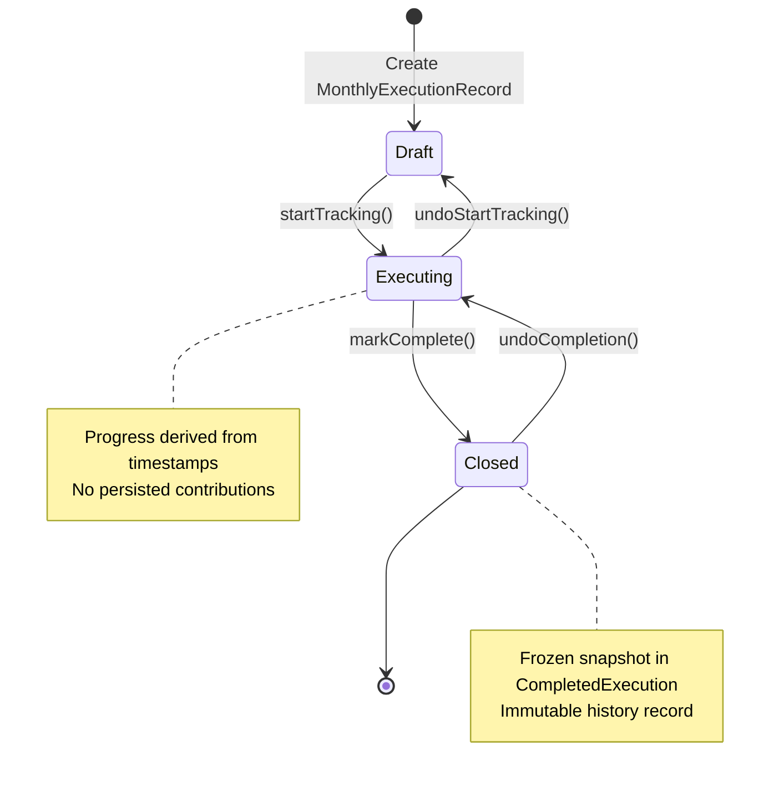
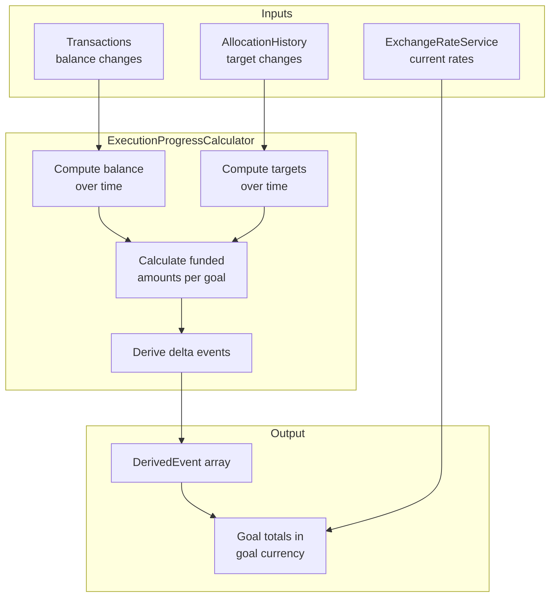
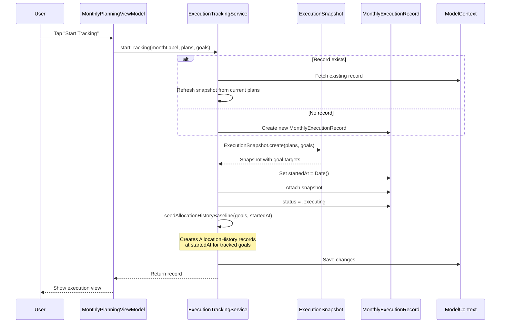
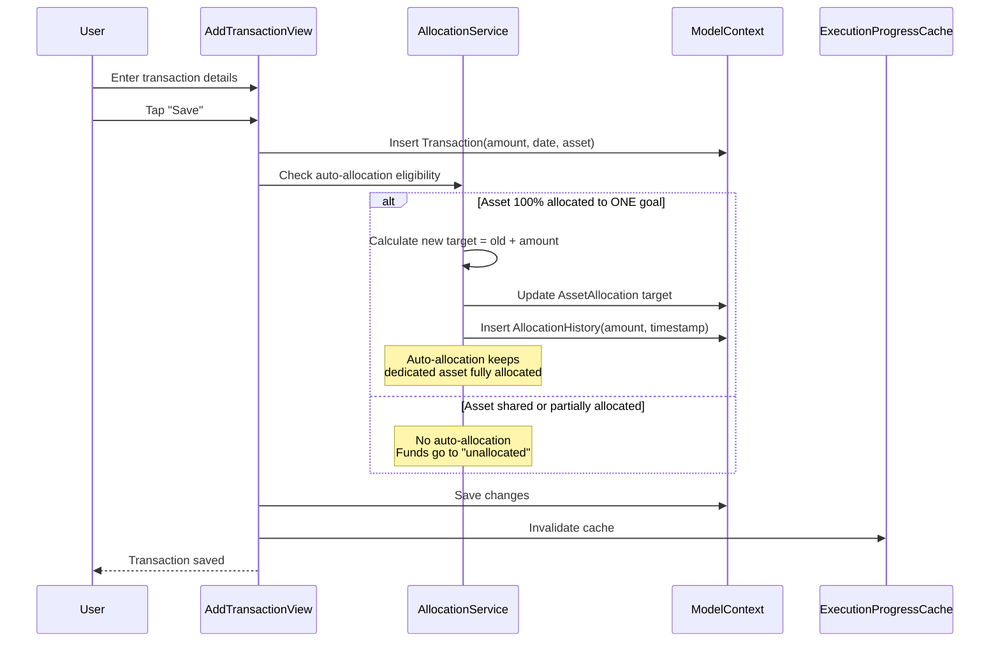
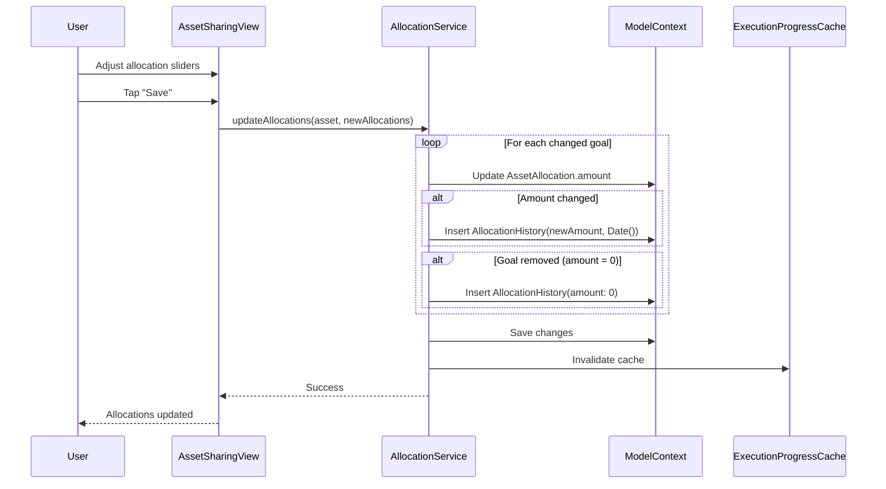
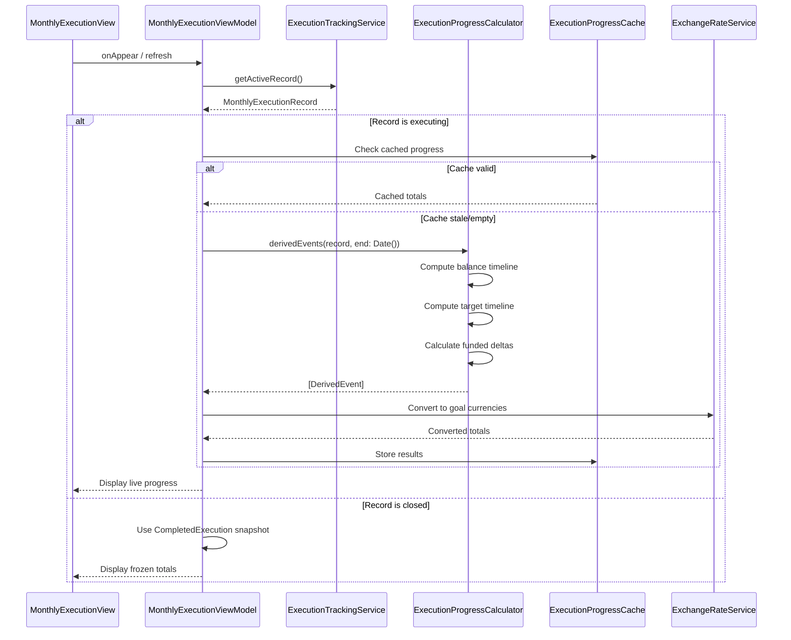
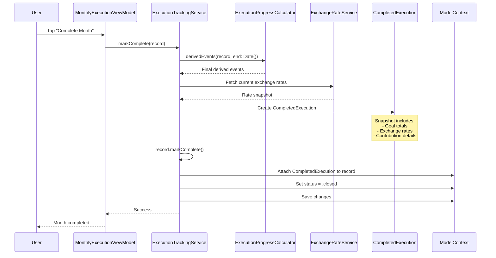
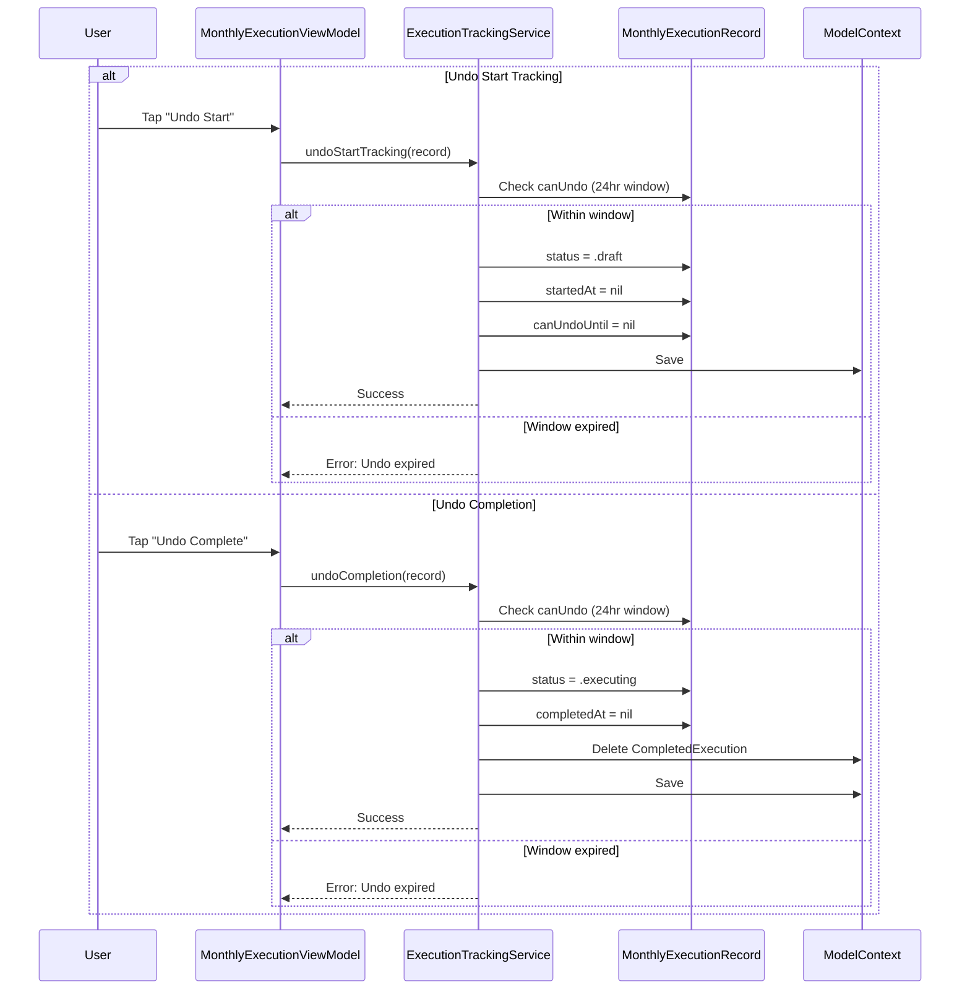
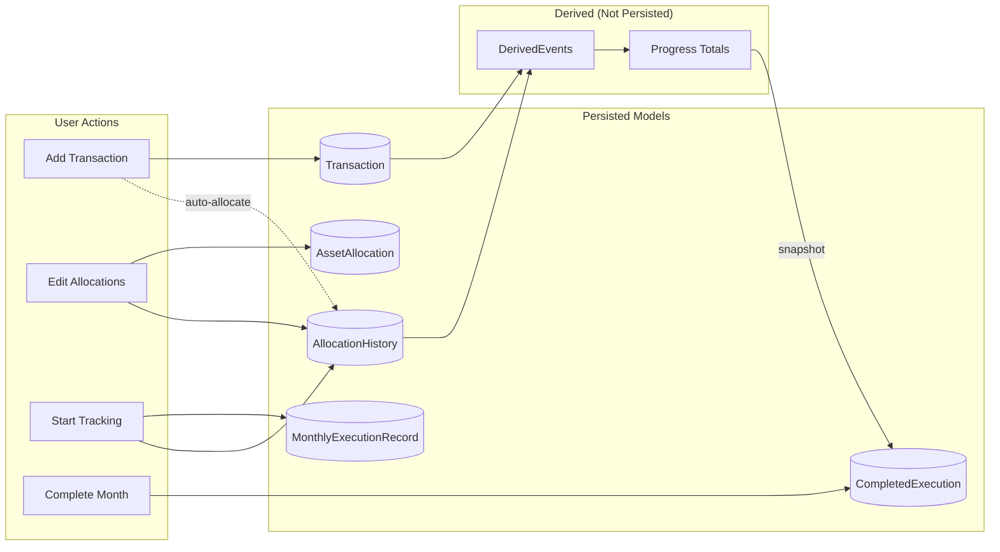

# Contribution Flow (Timestamp-Based Execution Tracking)

> How monthly plan fulfillment is tracked using timestamps and derived contributions

| Metadata | Value |
|----------|-------|
| Status | ✅ Current |
| Last Updated | 2026-01-04 |
| Platform | Shared |
| Audience | Developers |

---

## Overview

This project tracks monthly plan fulfillment without persisting contributions during execution.

- **While a month is executing:** Progress is **derived on the fly** from timestamps
- **When a month is completed:** Derived events are **snapshotted into `CompletedExecution`** for immutable history

---

## Key Models

### `Transaction`
Balance change for an `Asset` (manual or blockchain-imported).

| Field | Description |
|-------|-------------|
| `date` | When the transaction occurred |
| `amount` | Change amount (negative for withdrawals) |
| `asset` | Associated Asset |
| `source` | `.manual` or `.onChain` |

### `AssetAllocation`
Current allocation **target** from an asset to a goal.

| Field | Description |
|-------|-------------|
| `amount` | Target amount in asset's native currency |
| `asset` | Source Asset |
| `goal` | Destination Goal |

### `AllocationHistory`
Historical record of allocation **target snapshots** for a `(goal, asset)` pair.

| Field | Description |
|-------|-------------|
| `amount` | Target amount at this timestamp |
| `timestamp` | When this snapshot was recorded |
| `createdAt` | Tie-breaker for same-timestamp records |
| `monthLabel` | "yyyy-MM" for efficient queries |

### `MonthlyExecutionRecord`
Defines the window of what "counts" for a month's execution.

| Field | Description |
|-------|-------------|
| `startedAt` | Timestamp when tracking began |
| `status` | `.draft` → `.executing` → `.closed` |
| `snapshot` | `ExecutionSnapshot` captured at start |
| `completedExecution` | `CompletedExecution` created on close |

---

## How Execution Progress Is Derived

The `ExecutionProgressCalculator` derives "contributions" as **funding deltas** over time:

### Calculation Logic

1. **Compute asset balance over time** from `Transaction` changes
2. **Compute allocation targets over time** from `AllocationHistory` snapshots
3. **Convert balance + targets into funded amounts per goal:**
   - If `sum(targets) <= balance`: each goal is fully funded up to its target; extra is **unallocated**
   - If `sum(targets) > balance`: distribute available balance **proportionally** across targets
4. **Compute deltas** when balance or targets change → these become derived events

**Implementation:** `ExecutionProgressCalculator.swift:12`

---

## Core Flows

### 1. Start Tracking (Draft → Executing)

When a user starts tracking for a month:

**What happens:**
- `MonthlyExecutionRecord.startedAt` is set to current time
- `ExecutionSnapshot` captures planned amounts for each goal
- Baseline `AllocationHistory` snapshots are seeded at `startedAt` so the calculator has a stable reference point

**Implementation:** `ExecutionTrackingService.swift:71`

---

### 2. Add a Transaction

When a user adds a transaction during execution:

**Auto-allocation rule:**
- If asset is **fully allocated to exactly one goal** before the deposit: increase that allocation target and record `AllocationHistory`
- Otherwise (shared or partially allocated): no allocation change, funds remain **unallocated**

**Implementation:** `AddTransactionView.swift`, `AllocationService.swift:36`

---

### 3. Change Allocations

When a user edits asset allocations:

**What happens:**
- `AssetAllocation` current state is updated
- For every changed goal, an `AllocationHistory` snapshot is inserted at current timestamp
- If a goal is removed from allocations, an `AllocationHistory(amount: 0)` is recorded

**Note:** UI can block over-allocation at save time, but persisted state can still become over-allocated later (external withdrawals). Calculations remain defensive.

**Implementation:** `AllocationService.swift:36`, `AssetSharingView.swift`

---

### 4. View Execution Progress (Read-Only)

`MonthlyExecutionViewModel` displays progress without persisting anything:

**Display sources:**
- **Executing:** Live calculated progress from `ExecutionProgressCalculator`
- **Closed:** Frozen totals from `CompletedExecution`

**Implementation:** `MonthlyExecutionViewModel.swift`, `ExecutionTrackingService.swift:254`

---

### 5. Complete Month (Executing → Closed)

When a user finishes the month:

**What happens:**
- Derived events from `startedAt` to `completedAt` are calculated one final time
- Exchange rates are snapshotted at completion time
- Everything is frozen into `CompletedExecution` for immutable history
- Record status transitions to `.closed`

**Implementation:** `ExecutionTrackingService.swift:206`

---

## Undo Operations

Both start and completion support a 24-hour undo window:

---

## Data Flow Summary

---

## Key Implementation Files

| File | Purpose |
|------|---------|
| `ExecutionTrackingService.swift` | Lifecycle operations (start, complete, undo) |
| `ExecutionProgressCalculator.swift` | Derives contribution events from timestamps |
| `ExecutionProgressCache.swift` | Caches calculated progress |
| `AllocationService.swift` | Manages allocations and history records |
| `MonthlyExecutionViewModel.swift` | View model for execution UI |
| `MonthlyExecutionRecord.swift` | Execution window model |
| `AllocationHistory.swift` | Historical allocation snapshots |
| `CompletedExecution.swift` | Immutable completion record |

---

## Related Documentation

- `CONTRIBUTION_TRACKING_REDESIGN.md` - Architecture overview and design decisions
- `CLOUDKIT_MIGRATION_PLAN.md` - CloudKit compatibility requirements
