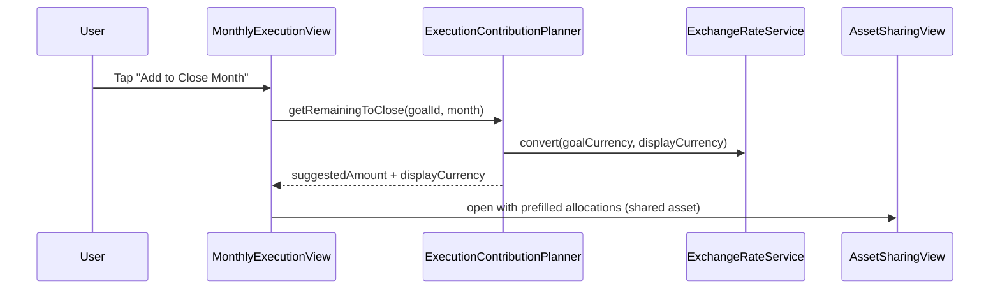

# Contribution Process Improvement Proposal

Status: Draft  
Owner: Product + iOS  
Last updated: 2025-02-14

## Summary

Improve the monthly contribution experience for shared assets and multi-currency execution by:
- Adding a "Add to Close Month" action that computes required contribution amounts with currency conversion.
- Prioritizing the current goal at the top of the share-asset list.
- Allowing execution tracking to display remaining contribution amounts in a user-selected currency.

This proposal is additive and does not change the timestamp-based execution model described in `docs/CONTRIBUTION_FLOW.md`.

## Goals

- Make it fast to contribute the exact amount needed to close the current month, including shared assets.
- Reduce friction in the share-asset UI by surfacing the current goal first.
- Let users contribute in a preferred currency while still showing accurate per-goal progress.

## Non-Goals

- Persisting per-contribution records during execution (the execution model remains derived).
- Changing plan lifecycle states or execution snapshots.
- Replacing the allocation model (AssetAllocation + AllocationHistory).

## Current Behavior (Summary)

- Shared assets do not auto-allocate on deposit; contributions become "unallocated" unless the user updates allocations.
  - `ios/CryptoSavingsTracker/Views/AddTransactionView.swift`
  - `ios/CryptoSavingsTracker/Services/AllocationService.swift`
- Execution view displays totals in each goal's native currency only.
  - `ios/CryptoSavingsTracker/Views/Planning/MonthlyExecutionView.swift`
  - `ios/CryptoSavingsTracker/Services/ExecutionProgressCalculator.swift`
- Share-asset list is sorted by name and does not prioritize the current goal.
  - `ios/CryptoSavingsTracker/Views/AssetSharingView.swift`

## Proposed Changes

### 1) "Add to Close Month" Action (Shared Assets Included)

Add a per-goal CTA that computes the remaining amount required to close the month and pre-fills contribution inputs.

**Where it appears**
- Execution view goal cards (per-goal primary entry point).
- Share-asset sheet (secondary entry point for shared assets).

**Behavior**
- Compute `remainingToClose` per goal for the executing month:
  - `remainingToClose = max(0, plannedAmount - contributedAmount)`
  - `plannedAmount` comes from the execution snapshot (planned month amount).
  - `contributedAmount` comes from the execution calculator’s current derived totals.
- Convert `remainingToClose` from goal currency to selected display currency using `ExchangeRateService`.
- When the selected asset is **dedicated** to a single goal:
  - Pre-fill the Add Transaction amount in the asset’s currency.
  - Keep the existing auto-allocation behavior.
- When the selected asset is **shared**:
  - Pre-fill Allocation targets (in asset currency) to increase the chosen goal’s allocation by the required converted amount.
  - Keep totals within the current asset balance.

**Suggested flow**

**Implementation notes**
- Add a small calculator/service to centralize calculation (see Service Location & Naming).
- Use existing snapshot + derived totals to avoid new storage.

### 2) Show Current Goal First in Share-Asset List

Update the share-asset UI to surface the active goal at the top of the list.

**Approach**
- Add a `currentGoalId` parameter to `AssetSharingView`.
- Build a sorted list: `[currentGoal] + remainingGoals.sorted(by: name)`.
- Keep the existing alphabetic sort for the rest of the list.

### 3) Execution Currency Selector

Allow users to select a display currency while executing and show the remaining amount in that currency.

**Behavior**
- Add a currency selector to `MonthlyExecutionView` (header or filter row).
- Persist selection in settings (UserDefaults or a small `ExecutionSettings` model).
- Convert the following for display:
  - Remaining-to-close per goal.
  - Total remaining for the month.
- Show rate timestamp or "last updated" indicator.

## Data and Service Changes

- New service or helper (see Service Location & Naming):
  - `ExecutionContributionCalculator` (reads snapshot + derived totals + rates).
- New settings:
  - `ExecutionDisplayCurrency` stored in UserDefaults or a small settings model.
- No schema changes required.

## Edge Cases

- Missing exchange rates: fall back to goal currency and show a warning.
- Shared asset over-allocation: clamp prefilled allocations to available balance and show a warning.
- Closed or draft month: disable "Add to Close Month" CTA.
- Partial funding with zero remaining: show "Month already closed for this goal" state.

## Testing Plan

**Unit**
- Planner computes remaining-to-close from snapshot + derived totals.
- Currency conversion rounding and precision.
- Allocation prefill clamps to balance.

**UI**
- Shared asset: current goal appears at top of share list.
- Finish month → next month planning remains intact (existing flow tests).
- "Add to Close Month" pre-fills amount and shows converted currency.
- Execution currency selector persists and updates displayed totals.

## Android Parity Notes

- Android implementation should mirror these behaviors:
  - Add a "Close Month" contribution CTA in execution tracking.
  - Re-order share-asset allocations to show the current goal first.
  - Add an execution currency selector for remaining contribution amounts.
- Android placement guidance:
  - Core calculation should live in a `UseCase` (e.g., `ExecutionContributionCalculatorUseCase`).
  - UI should live in the execution tracking screen and allocation dialog/sheet equivalents.

## Service Location & Naming

- iOS:
  - Use a calculator-style name for pure computation, e.g., `ExecutionContributionCalculator`.
  - Place it in `ios/CryptoSavingsTracker/Services/` alongside `ExecutionProgressCalculator`.
  - Inject via `DIContainer` to keep testability consistent.
- Android:
  - Use a `UseCase` for the calculation, e.g., `ExecutionContributionCalculatorUseCase`.
  - Wire into the existing ViewModel or interactor layer.

## Open Questions

- Should the execution display currency be shared with monthly planning’s display currency or be independent?
- Do we need a per-asset currency override for the suggested amount?
