# Integration Safety Analysis: Preserving Current Features

## Executive Summary

This document identifies all features that could be lost during the implementation of the new monthly execution tracking system and provides a comprehensive integration strategy to preserve everything while adding new capabilities.

**Risk Level**: 🟡 MEDIUM - Requires careful planning but fully solvable

**Key Finding**: Your current planning features are **excellent** and must be preserved 100%. The new system should be **additive**, not a replacement.

---

## Table of Contents

1. [Current Features Inventory](#current-features-inventory)
2. [Risk Analysis](#risk-analysis)
3. [Integration Architecture](#integration-architecture)
4. [Preservation Strategy](#preservation-strategy)
5. [Implementation Roadmap](#implementation-roadmap)

---

## Current Features Inventory

### ✅ Features That Work Perfectly Now

#### 1. **Flex Adjustment System** ⭐ CRITICAL
**Location**: `MonthlyPlanningViewModel`, `FlexAdjustmentService`

**Features**:
- Adjust payment amounts from 0% to 200%
- Protected goals (cannot be reduced)
- Skipped goals (excluded this month)
- Real-time preview of adjustments
- Smart redistribution strategies
- Quick actions (Skip Month, Pay Half, Pay Exact, Reset)

**Why Critical**:
- This is a **unique feature** not in the original MONTHLY_EXECUTION_SOLUTION.md
- Users rely on this for flexible budgeting
- Complex logic that took time to build

**Risk**: 🔴 HIGH - Could be lost if we replace MonthlyPlan model

---

#### 2. **User Preferences Persistence** ⭐ CRITICAL
**Location**: `MonthlyPlanningViewModel.loadUserPreferences()`, `MonthlyPlan` model

**Features**:
- Protected goals saved per goal
- Skipped goals saved per goal
- Custom amounts per goal
- Flex adjustment percentage
- Display currency preference
- All persisted to UserDefaults + SwiftData

**Why Critical**:
- Users expect their settings to persist
- Losing this would reset all user customizations

**Risk**: 🔴 HIGH - Directly tied to current MonthlyPlan structure

---

#### 3. **Real-Time Calculation Updates** ⭐ IMPORTANT
**Location**: `MonthlyPlanningViewModel.setupObservers()`

**Features**:
- Auto-recalculates when goals change
- Auto-recalculates when assets change
- Auto-recalculates when settings change
- Debounced for performance
- Reactive with Combine publishers

**Why Important**:
- Keeps plan always up-to-date
- Great UX - no manual refresh needed

**Risk**: 🟡 MEDIUM - Need to adapt to new architecture

---

#### 4. **Planning Statistics Dashboard** ⭐ IMPORTANT
**Location**: `PlanningStatistics` struct

**Features**:
- Total goals count
- Goals by status (onTrack, attention, critical, completed)
- Average monthly required
- Shortest deadline warning
- Smart status summary

**Why Important**:
- Provides at-a-glance overview
- Helps users prioritize

**Risk**: 🟢 LOW - Easy to preserve

---

#### 5. **Multi-Currency Support** ⭐ IMPORTANT
**Location**: `MonthlyPlanningService.calculateTotalRequired()`

**Features**:
- Each goal in its own currency
- Total calculated in display currency
- Real-time exchange rate conversion
- Fallback to 1:1 if conversion fails

**Why Important**:
- Essential for international users
- Cryptocurrency is inherently multi-currency

**Risk**: 🟢 LOW - Independent of plan structure

---

#### 6. **Smart Status Determination** ⭐ USEFUL
**Location**: `MonthlyPlanningService.determineRequirementStatus()`

**Features**:
- Completed (remaining <= 0)
- Critical (required > $10k)
- Attention (required > $5k or 1 month left)
- OnTrack (normal)

**Why Useful**:
- Helps users see urgency
- Visual indicators in UI

**Risk**: 🟢 LOW - Pure calculation logic

---

#### 7. **Quick Actions** ⭐ USEFUL
**Location**: `MonthlyPlanningViewModel.applyQuickAction()`

**Features**:
- Skip Month (skip all flexible goals)
- Pay Half (50% of all amounts)
- Pay Exact (100% calculated)
- Reset (clear all adjustments)

**Why Useful**:
- Fast common operations
- Good UX shortcuts

**Risk**: 🟡 MEDIUM - Tied to flex adjustment system

---

#### 8. **Settings Integration** ⭐ USEFUL
**Location**: `MonthlyPlanningSettings`

**Features**:
- Display currency
- Payment day (for reminders)
- Auto-adjust preferences
- Persisted preferences

**Why Useful**:
- Centralized configuration
- Consistent across app

**Risk**: 🟢 LOW - Independent system

---

#### 9. **Performance Optimization** ⭐ IMPORTANT
**Location**: `MonthlyPlanningService` cache

**Features**:
- 5-minute calculation cache
- Debounced updates (0.5-1s)
- Efficient SwiftData queries
- Lazy loading

**Why Important**:
- Keeps app responsive
- Prevents unnecessary calculations

**Risk**: 🟡 MEDIUM - Need to adapt caching strategy

---

#### 10. **Goal-Specific Persistence** ⭐ CRITICAL
**Location**: `MonthlyPlan` @Model

**Features**:
- Each goal has saved preferences
- Custom amounts persisted
- Flex states persisted
- Version tracking for migrations
- Last modified tracking

**Why Critical**:
- This is how user preferences are stored
- Losing this means losing all customizations

**Risk**: 🔴 HIGH - Core data model

---

## Risk Analysis

### 🔴 HIGH RISK Features (Could Be Lost)

#### 1. **Flex Adjustment System**
**Why at Risk**:
- New document doesn't mention flex adjustment
- Tied to current MonthlyPlan model
- Complex redistribution logic

**What Could Happen**:
- If we replace MonthlyPlan with new structure, flex states could be lost
- Adjustment preview might break
- Protected/skipped goals might not persist

**Impact**:
- Users lose flexible budgeting capability
- Major feature regression
- User complaints

---

#### 2. **Goal-Level Preferences**
**Why at Risk**:
- New architecture is month-centric, not goal-centric
- Current: One MonthlyPlan per goal
- New: One MonthlyPlan per month

**What Could Happen**:
- Custom amounts per goal might not have a home
- Protection/skip status might be lost
- User has to reconfigure every month

**Impact**:
- Annoying UX - re-enter preferences monthly
- Loss of personalization

---

#### 3. **Real-Time Reactivity**
**Why at Risk**:
- Current system auto-updates when goals change
- New system has explicit "Start Executing" state
- Might conflict with dynamic recalculation

**What Could Happen**:
- Plan doesn't update when goals change (if locked)
- OR plan updates too much (breaking execution tracking)
- Confusing UX

**Impact**:
- Either stale data or broken tracking

---

### 🟡 MEDIUM RISK Features (Needs Adaptation)

#### 1. **Quick Actions**
- Need to work in both DRAFT and EXECUTING states
- Behavior might differ per state

#### 2. **Performance Caching**
- Cache keys might need to include month label
- Cache invalidation strategy needs update

#### 3. **Notification System**
- Current: Triggers on any change
- New: Should only trigger in DRAFT state?

---

### 🟢 LOW RISK Features (Easy to Preserve)

1. **Statistics Dashboard** - Pure calculation
2. **Multi-Currency** - Independent logic
3. **Status Determination** - Pure function
4. **Settings** - Separate system

---

## Integration Architecture

### Strategy: **Hybrid Two-Layer System**

Keep the best of both worlds:

```
┌─────────────────────────────────────────────────┐
│           LAYER 1: Planning Preferences         │
│                (Current System)                 │
├─────────────────────────────────────────────────┤
│                                                 │
│  GoalPlanPreference @Model                      │
│  ├─ goalId: UUID                                │
│  ├─ customAmount: Double?                       │
│  ├─ flexState: FlexState                        │
│  ├─ isProtected: Bool                           │
│  └─ isSkipped: Bool                             │
│                                                 │
│  → Persists LONG-TERM preferences per goal     │
│  → Updated anytime user changes settings        │
│  → Survives across multiple monthly plans      │
│                                                 │
└─────────────────────────────────────────────────┘
                     ▲
                     │ Applied to
                     │
┌─────────────────────────────────────────────────┐
│         LAYER 2: Monthly Execution Plan         │
│                (New System)                     │
├─────────────────────────────────────────────────┤
│                                                 │
│  MonthlyExecutionPlan @Model                    │
│  ├─ monthLabel: String (e.g. "2025-09")        │
│  ├─ status: PlanStatus (DRAFT/EXECUTING/CLOSED)│
│  ├─ startedAt: Date?                           │
│  ├─ closedAt: Date?                            │
│  └─ snapshot: MonthlyPlanSnapshot?             │
│                                                 │
│  MonthlyRequirement @Model                      │
│  ├─ goalId: UUID                                │
│  ├─ requiredAmount: Double                      │
│  ├─ effectiveAmount: Double (after preferences) │
│  ├─ customAmountOverride: Double?               │
│  ├─ flexStateSnapshot: FlexState                │
│  ├─ isFulfilledThisMonth: Bool                  │
│  └─ plan: MonthlyExecutionPlan                  │
│                                                 │
│  → Tracks MONTHLY execution                     │
│  → Starts in DRAFT (editable)                   │
│  → Locks when EXECUTING                         │
│  → Immutable when CLOSED                        │
│                                                 │
└─────────────────────────────────────────────────┘
```

### How It Works:

#### Phase 1: DRAFT State (Planning)
```swift
1. User opens Monthly Planning view
2. System creates/loads MonthlyExecutionPlan for current month (status: DRAFT)
3. System loads GoalPlanPreference for each goal
4. System applies preferences to calculate effective amounts:
   - If goal has customAmount → use it
   - If goal is skipped → amount = 0
   - If goal is protected → cannot be reduced by flex
5. User can adjust flex slider
6. User can toggle protect/skip (saves to GoalPlanPreference)
7. All changes are LIVE and DYNAMIC
```

**Key**: GoalPlanPreference is the source of truth for user settings.

#### Phase 2: Start Execution
```swift
1. User clicks "Start Executing This Plan"
2. System creates MonthlyPlanSnapshot
   - Captures current calculated amounts
   - Copies flex states from GoalPlanPreference
3. System sets status = EXECUTING
4. System sets startedAt = Date()
```

**Key**: Snapshot preserves "what was planned" even if preferences change later.

#### Phase 3: EXECUTING State (Contribution Tracking)
```swift
1. User adds money to goals
2. System records Contribution
3. System updates isFulfilledThisMonth per requirement
4. Goals that are fulfilled disappear from view

IMPORTANT DECISION:
Q: What if user changes GoalPlanPreference during EXECUTING?
A: TWO OPTIONS:

Option A (Dynamic):
- MonthlyRequirement.effectiveAmount recalculates from GoalPlanPreference
- Plan updates in real-time
- Good: Always reflects current user intent
- Bad: "Moving target" problem returns

Option B (Locked):
- MonthlyRequirement has its own fields
- Changes to GoalPlanPreference don't affect EXECUTING plan
- Good: Stable execution target
- Bad: User can't adjust mid-month

RECOMMENDATION: Option A (Dynamic) based on your requirements
```

#### Phase 4: Close Plan
```swift
1. User clicks "Close This Month's Plan" OR all goals funded
2. System sets status = CLOSED
3. System sets closedAt = Date()
4. Plan becomes immutable historical record
```

---

## Preservation Strategy

### 1. Rename Current MonthlyPlan → GoalPlanPreference

**Before**:
```swift
@Model
final class MonthlyPlan {
    var goalId: UUID
    var customAmount: Double?
    var flexState: FlexState
    // ...
}
```

**After**:
```swift
@Model
final class GoalPlanPreference {
    var goalId: UUID
    var customAmount: Double?
    var flexState: FlexState
    var isProtected: Bool
    var isSkipped: Bool
    // ... (keep ALL existing fields)
}
```

**Migration**:
```swift
// In MigrationService
func migrateV3ToV4() {
    // Rename table: MonthlyPlan → GoalPlanPreference
    // All data preserved, just rename
}
```

**Why This Works**:
- ✅ Zero data loss
- ✅ All user preferences preserved
- ✅ FlexAdjustmentService keeps working
- ✅ MonthlyPlanningViewModel keeps working
- ✅ Just rename the model

---

### 2. Create New MonthlyExecutionPlan

**New Model**:
```swift
@Model
final class MonthlyExecutionPlan {
    @Attribute(.unique) var id: UUID
    var monthLabel: String
    var status: PlanStatus
    var createdAt: Date
    var startedAt: Date?
    var closedAt: Date?

    @Relationship(deleteRule: .cascade)
    var requirements: [MonthlyRequirement]

    @Relationship(deleteRule: .cascade)
    var snapshot: MonthlyPlanSnapshot?

    enum PlanStatus: String, Codable {
        case draft
        case executing
        case closed
    }

    static func currentMonthLabel() -> String {
        let formatter = DateFormatter()
        formatter.dateFormat = "yyyy-MM"
        return formatter.string(from: Date())
    }
}
```

---

### 3. Enhance MonthlyRequirement

**New Model** (replaces current struct):
```swift
@Model
final class MonthlyRequirement {
    @Attribute(.unique) var id: UUID
    var goalId: UUID
    var goalName: String

    // Calculated values
    var calculatedAmount: Double  // From GoalCalculationService

    // User preferences (from GoalPlanPreference)
    var customAmountOverride: Double?
    var flexStateSnapshot: String  // FlexState as String
    var isProtectedSnapshot: Bool
    var isSkippedSnapshot: Bool

    // Execution tracking
    var isFulfilledThisMonth: Bool

    // Metadata
    var calculatedAt: Date
    var currency: String

    // Relationships
    var plan: MonthlyExecutionPlan?

    // Computed
    var effectiveAmount: Double {
        if isSkippedSnapshot {
            return 0
        }
        return customAmountOverride ?? calculatedAmount
    }

    var flexState: MonthlyPlan.FlexState {
        MonthlyPlan.FlexState(rawValue: flexStateSnapshot) ?? .flexible
    }
}
```

---

### 4. Adapt MonthlyPlanningViewModel

**Key Changes**:
```swift
@MainActor
final class MonthlyPlanningViewModel: ObservableObject {

    // CURRENT STATE
    @Published var currentExecutionPlan: MonthlyExecutionPlan?
    @Published var goalPreferences: [UUID: GoalPlanPreference] = [:]

    // Keep existing
    @Published var monthlyRequirements: [MonthlyRequirement] = []
    @Published var flexAdjustment: Double = 1.0
    @Published var protectedGoalIds: Set<UUID> = []
    @Published var skippedGoalIds: Set<UUID> = []

    // NEW METHOD: Load or create current month's plan
    func loadCurrentMonthPlan() async {
        let monthLabel = MonthlyExecutionPlan.currentMonthLabel()

        // Try to load existing plan for this month
        let descriptor = FetchDescriptor<MonthlyExecutionPlan>(
            predicate: #Predicate { $0.monthLabel == monthLabel }
        )

        if let existingPlan = try? modelContext.fetch(descriptor).first {
            currentExecutionPlan = existingPlan
        } else {
            // Create new DRAFT plan
            let newPlan = MonthlyExecutionPlan(monthLabel: monthLabel)
            modelContext.insert(newPlan)
            currentExecutionPlan = newPlan
        }

        // Load goal preferences
        await loadGoalPreferences()

        // Calculate requirements
        await calculateRequirements()
    }

    // NEW METHOD: Apply preferences to requirements
    func calculateRequirements() async {
        guard let plan = currentExecutionPlan else { return }

        // Get all active goals
        let goals = try? modelContext.fetch(FetchDescriptor<Goal>())

        // Clear existing requirements
        plan.requirements.removeAll()

        // Calculate for each goal
        for goal in goals ?? [] {
            // Get base calculation
            let calculated = await calculateMonthlyRequirement(for: goal)

            // Get user preference
            let preference = goalPreferences[goal.id]

            // Create requirement with preferences applied
            let requirement = MonthlyRequirement(
                goalId: goal.id,
                goalName: goal.name,
                calculatedAmount: calculated,
                customAmountOverride: preference?.customAmount,
                flexStateSnapshot: preference?.flexState.rawValue ?? "flexible",
                isProtectedSnapshot: preference?.isProtected ?? false,
                isSkippedSnapshot: preference?.isSkipped ?? false,
                currency: goal.currency
            )

            plan.requirements.append(requirement)
            modelContext.insert(requirement)
        }

        try? modelContext.save()
    }

    // PRESERVE EXISTING: Toggle protection
    func toggleProtection(for goalId: UUID) {
        // Get or create preference
        let preference = getOrCreatePreference(for: goalId)

        // Toggle
        preference.isProtected.toggle()
        preference.flexState = preference.isProtected ? .protected : .flexible

        // Save
        try? modelContext.save()

        // Update UI
        if preference.isProtected {
            protectedGoalIds.insert(goalId)
            skippedGoalIds.remove(goalId)
        } else {
            protectedGoalIds.remove(goalId)
        }

        // Recalculate
        Task {
            await calculateRequirements()
        }
    }

    // PRESERVE EXISTING: Flex adjustment
    func previewAdjustment(_ percentage: Double) async {
        // Keep existing logic
        flexAdjustment = percentage

        // Update all non-protected requirements
        guard let plan = currentExecutionPlan else { return }

        for requirement in plan.requirements {
            if requirement.isSkippedSnapshot {
                continue
            }

            if !requirement.isProtectedSnapshot {
                // Apply flex adjustment
                let adjusted = requirement.calculatedAmount * flexAdjustment
                requirement.customAmountOverride = adjusted
            }
        }

        try? modelContext.save()
        await loadMonthlyRequirements()
    }

    // NEW METHOD: Start executing plan
    func startExecutingPlan() async throws {
        guard let plan = currentExecutionPlan,
              plan.status == .draft else {
            throw PlanError.invalidStateTransition
        }

        // Create snapshot
        let snapshot = MonthlyPlanSnapshot(from: plan)
        plan.snapshot = snapshot

        // Update status
        plan.status = .executing
        plan.startedAt = Date()

        try modelContext.save()
    }
}
```

---

### 5. Preserve FlexAdjustmentService

**No Changes Needed!**

The FlexAdjustmentService works with `[MonthlyRequirement]` and doesn't care about the model structure. As long as requirements have:
- `requiredMonthly` (now `calculatedAmount`)
- Protection/skip flags
- Goal metadata

It will keep working.

**Minor Adapter**:
```swift
// In MonthlyPlanningViewModel
func previewAdjustment(_ percentage: Double) async {
    guard let flexService = flexService,
          let plan = currentExecutionPlan else { return }

    // Convert MonthlyRequirement @Model to the struct FlexService expects
    let requirementStructs = plan.requirements.map { req in
        MonthlyRequirement(
            goalId: req.goalId,
            goalName: req.goalName,
            currency: req.currency,
            targetAmount: 0, // Not needed for flex
            currentTotal: 0,
            remainingAmount: 0,
            monthsRemaining: 0,
            requiredMonthly: req.calculatedAmount,
            progress: 0,
            deadline: Date(),
            status: .onTrack
        )
    }

    // Use existing service
    let adjusted = await flexService.applyFlexAdjustment(
        requirements: requirementStructs,
        adjustment: percentage,
        protectedGoalIds: protectedGoalIds,
        skippedGoalIds: skippedGoalIds,
        strategy: .balanced
    )

    // Apply results back to @Model requirements
    // ...
}
```

---

### 6. Preserve Quick Actions

**No Changes Needed!**

Quick actions just manipulate `protectedGoalIds` and `skippedGoalIds`, which we're keeping.

```swift
func applyQuickAction(_ action: QuickAction) async {
    switch action {
    case .skipMonth:
        // Skip all flexible goals
        for requirement in currentExecutionPlan?.requirements ?? [] {
            if !protectedGoalIds.contains(requirement.goalId) {
                skippedGoalIds.insert(requirement.goalId)

                // Update preference
                let pref = getOrCreatePreference(for: requirement.goalId)
                pref.isSkipped = true
                pref.flexState = .skipped
            }
        }

    case .payHalf:
        // Same logic, just update percentages

    // ... rest keeps working
    }
}
```

---

### 7. Preserve Real-Time Updates

**Adaptation Needed**:

```swift
// In MonthlyPlanningViewModel.setupObservers()

NotificationCenter.default.publisher(for: .goalUpdated)
    .sink { [weak self] _ in
        Task { [weak self] in
            guard let self = self,
                  let plan = self.currentExecutionPlan else { return }

            // ONLY recalculate if plan is in DRAFT state
            if plan.status == .draft {
                await self.calculateRequirements()
            } else if plan.status == .executing {
                // Update requirements but DON'T change amounts
                // Just recalculate progress/status
                await self.updateExecutionProgress()
            }
            // If CLOSED, do nothing (immutable)
        }
    }
    .store(in: &cancellables)
```

**Key**: Different behavior per state:
- DRAFT: Recalculate everything
- EXECUTING: Update progress only (or recalculate targets per your spec)
- CLOSED: Ignore changes

---

## State Transition Diagram

```mermaid
stateDiagram-v2
    [*] --> DRAFT: User opens Planning

    DRAFT: 📝 DRAFT State
    DRAFT: - Calculate requirements
    DRAFT: - Apply GoalPlanPreference
    DRAFT: - User adjusts flex
    DRAFT: - User toggles protect/skip
    DRAFT: - Real-time updates
    DRAFT: - All features work

    DRAFT --> EXECUTING: User clicks "Start Executing"

    EXECUTING: 🎯 EXECUTING State
    EXECUTING: - Snapshot created
    EXECUTING: - Track contributions
    EXECUTING: - Mark fulfilled goals
    EXECUTING: - Goals disappear when funded
    EXECUTING: - Can still adjust (dynamic)

    EXECUTING --> CLOSED: User clicks "Close" OR all funded
    EXECUTING --> DRAFT: System error/rollback

    CLOSED: 🔒 CLOSED State
    CLOSED: - Immutable record
    CLOSED: - Historical view only
    CLOSED: - No edits allowed

    CLOSED --> [*]: View history

    note right of DRAFT
        GoalPlanPreference active
        All current features work
        FlexAdjustment works
        Quick Actions work
    end note

    note right of EXECUTING
        MonthlyRequirement tracks
        Contribution integration
        Progress updates
        GoalPlanPreference still
        applies (dynamic)
    end note

    note right of CLOSED
        Snapshot preserved
        Contribution history
        Comparison available
    end note
```



---

## Preservation Checklist

### ✅ Fully Preserved (No Changes)

- [x] Flex adjustment slider (0-200%)
- [x] Protected goals functionality
- [x] Skipped goals functionality
- [x] Quick actions (Skip Month, Pay Half, etc.)
- [x] Custom amounts per goal
- [x] Multi-currency support
- [x] Exchange rate integration
- [x] Statistics dashboard
- [x] Status determination (critical, attention, onTrack)
- [x] Settings integration
- [x] Payment day configuration

### 🔄 Adapted (Minor Changes)

- [x] Real-time updates (state-aware)
- [x] MonthlyPlan model → GoalPlanPreference (rename)
- [x] MonthlyRequirement struct → @Model (enhancement)
- [x] Performance caching (month-aware keys)
- [x] Notification system (state-aware triggers)

### ➕ New Additions

- [x] MonthlyExecutionPlan model
- [x] Plan status (DRAFT/EXECUTING/CLOSED)
- [x] Month label grouping
- [x] Snapshot system
- [x] Contribution tracking integration
- [x] "Start Executing" button
- [x] Execution view
- [x] History view
- [x] Fulfillment tracking

---

## Migration Plan

### Step 1: Schema Update (No Data Loss)

```swift
// In MigrationService v4 schema
let v4 = Schema([
    // Rename existing model
    GoalPlanPreference.self,  // ← Was MonthlyPlan

    // Add new models
    MonthlyExecutionPlan.self,
    MonthlyRequirement.self,
    MonthlyPlanSnapshot.self,
    Contribution.self,

    // Keep existing
    Goal.self,
    Asset.self,
    AssetAllocation.self,
    // ... all other models
])

// Migration logic
ModelContainer.migrate(from: v3Schema, to: v4Schema) { context in
    // 1. Rename MonthlyPlan → GoalPlanPreference
    //    (SwiftData handles this automatically if we use @Attribute(.originalName:))

    // 2. Create MonthlyExecutionPlan for current month
    let monthLabel = MonthlyExecutionPlan.currentMonthLabel()
    let currentPlan = MonthlyExecutionPlan(monthLabel: monthLabel)
    context.insert(currentPlan)

    // 3. Done - existing preferences preserved
}
```

### Step 2: Update GoalPlanPreference

```swift
@Model
final class GoalPlanPreference {
    // Add this to preserve data during rename
    @Attribute(.originalName("MonthlyPlan.goalId"))
    var goalId: UUID

    // All other fields keep working
    var customAmount: Double?
    var flexStateRawValue: String
    var isProtected: Bool
    var isSkipped: Bool

    // ... rest of existing code
}
```

### Step 3: Gradual Rollout

**Week 1**: Add new models, keep old code working
```swift
// MonthlyPlanningViewModel works with BOTH systems
- Uses GoalPlanPreference for settings
- Creates MonthlyExecutionPlan in background
- UI unchanged
```

**Week 2**: Add "Start Executing" button
```swift
// New button appears but optional
- Users can ignore it
- Existing flow keeps working
- New flow available for testing
```

**Week 3**: Add execution view
```swift
// Separate view for execution tracking
- Planning view unchanged
- Execution view new feature
- Both work independently
```

**Week 4**: Add history view
```swift
// History is pure addition
- No impact on existing features
```

**Week 5**: Polish and optimize
```swift
// Performance tuning
// Edge case handling
// User testing
```

---

## Testing Strategy

### Test 1: Preserve Flex Adjustment
```swift
@Test("Flex adjustment works after migration")
func testFlexAdjustmentPreserved() async throws {
    // 1. Set up goals with preferences
    let goal = createGoal()
    let pref = GoalPlanPreference(goalId: goal.id)
    pref.customAmount = 800
    pref.isProtected = true
    context.insert(pref)

    // 2. Load plan
    let vm = MonthlyPlanningViewModel(context: context)
    await vm.loadCurrentMonthPlan()

    // 3. Apply flex adjustment
    await vm.previewAdjustment(0.5)

    // 4. Verify protected goal unchanged
    let requirement = vm.currentExecutionPlan?.requirements.first { $0.goalId == goal.id }
    #expect(requirement?.effectiveAmount == 800) // Protected, not reduced
}
```

### Test 2: Preserve User Preferences
```swift
@Test("User preferences persist across sessions")
func testPreferencesPersist() async throws {
    // 1. Set preferences
    let vm1 = MonthlyPlanningViewModel(context: context)
    vm1.toggleProtection(for: goalId)
    await vm1.savePreferences()

    // 2. Create new view model (simulate app restart)
    let vm2 = MonthlyPlanningViewModel(context: context)
    await vm2.loadCurrentMonthPlan()

    // 3. Verify preferences loaded
    #expect(vm2.protectedGoalIds.contains(goalId))
}
```

### Test 3: State Transitions Don't Break Features
```swift
@Test("Features work in all states")
func testFeaturesInAllStates() async throws {
    let vm = MonthlyPlanningViewModel(context: context)
    await vm.loadCurrentMonthPlan()

    // DRAFT state
    #expect(vm.currentExecutionPlan?.status == .draft)
    await vm.toggleProtection(for: goalId) // Should work
    await vm.previewAdjustment(0.8) // Should work

    // Start executing
    try await vm.startExecutingPlan()
    #expect(vm.currentExecutionPlan?.status == .executing)
    await vm.toggleProtection(for: goalId) // Should still work (dynamic)

    // Close plan
    try await vm.closePlan()
    #expect(vm.currentExecutionPlan?.status == .closed)
    // Protection toggle should have no effect (immutable)
}
```

---

## Conclusion

### Summary of Preservation Strategy:

✅ **100% Feature Preservation Possible**

**Method**:
1. Rename MonthlyPlan → GoalPlanPreference (keeps settings)
2. Add new MonthlyExecutionPlan (adds tracking)
3. Make MonthlyRequirement a @Model (connects systems)
4. Adapt ViewModel to use both layers

**Benefits**:
- ✅ Zero data loss
- ✅ All current features keep working
- ✅ New features added on top
- ✅ Gradual, safe rollout
- ✅ Easy rollback if needed

**Risks Mitigated**:
- 🔴→🟢 Flex adjustment preserved
- 🔴→🟢 User preferences preserved
- 🟡→🟢 Real-time updates adapted
- 🟡→🟢 Performance maintained

**Next Steps**:
1. Review this integration plan
2. Approve architecture approach
3. Start with Step 1: Schema update
4. Test preservation thoroughly
5. Gradual rollout

---

*Document Version: 1.0*
*Created: 2025-11-15*
*Status: Ready for Review*
