# Monthly Planning Execution & Tracking Solution

> **Solution for Problem 3**: Monthly Planning Tool Lacks Execution Support

## Executive Summary

This document provides a comprehensive solution for separating monthly planning from execution tracking. The solution introduces a **user-initiated plan locking system** with dynamic contribution tracking that allows users to:

1. **Lock a monthly plan** when they're ready to execute
2. **Track contributions** against the locked plan
3. **Close the plan** when all goals are funded
4. **Review historical execution** month-by-month

**Key Principle**: The monthly plan remains dynamic (updates when goals change) until the user explicitly closes it. Once closed, it becomes immutable historical record.

---

## Table of Contents

1. [Core Concepts](#core-concepts)
2. [Integration with Existing Features](#integration-with-existing-features)
3. [Data Models](#data-models)
4. [User Flows](#user-flows)
5. [Sequence Diagrams](#sequence-diagrams)
6. [UI Specifications](#ui-specifications)
7. [Service Architecture](#service-architecture)
8. [Implementation Plan](#implementation-plan)
9. [Edge Cases & Validation](#edge-cases--validation)
10. [Risk Mitigation Strategy](#risk-mitigation-strategy)

---

## Core Concepts

### The Monthly Plan Lifecycle

> **UX Note**: State names use user-friendly terminology. "Planning" instead of "DRAFT", "Active" instead of "EXECUTING", "Completed" instead of "CLOSED".

```
┌─────────────┐
│  PLANNING   │  Review and adjust your monthly plan
│             │  Updates automatically when goals change
│             │  Apply flex adjustments and set preferences
└──────┬──────┘
       │ User clicks "Start Tracking This Month" OR auto-starts on 1st of month
       ▼
┌─────────────┐
│   ACTIVE    │  Tracking your monthly contributions
│  (Tracking) │  Adapts when goals change (shown with notifications)
│             │  Funded goals move to "Completed" section (stay visible)
└──────┬──────┘
       │ User clicks "Finish This Month" OR auto-completes on month end
       ▼
┌─────────────┐
│ COMPLETED   │  Historical record for this month
│ (Archived)  │  View your progress and contributions
│             │  Compare with other months
└─────────────┘
```

### Key Behaviors

#### 1. **PLANNING State** (User-Facing: "Planning")
- Review calculated monthly requirements for all goals
- Adjust amounts using flex slider (0-200%)
- Mark goals as protected (won't be reduced) or skipped (exclude this month)
- Apply Quick Actions (Skip Month, Pay Half, Pay Exact)
- All changes update instantly with live preview

**User Goal**: Prepare a realistic monthly savings plan

---

#### 2. **ACTIVE State** (User-Facing: "Tracking" or "Active This Month")

**Dynamic Adaptation**:
- When goals change (target, deadline), amounts recalculate automatically
- System shows notification: "Goal amounts updated due to changes" with details
- User can review changes and adjust if needed

**Contribution Tracking**:
- Add money to goals → progress bars update
- When goal reaches monthly target → moves to "✓ Completed" section at bottom
- Completed goals stay visible (collapsible) showing contribution history
- Remaining goals prominently displayed with progress

**Visual Feedback**:
```
Active Goals (2)
━━━━━━━━━━━━━━━
House Down Payment    $400 / $800    [+ Add]
Vacation Fund         $100 / $300    [+ Add]

✓ Completed This Month (1)          [Collapse ▼]
━━━━━━━━━━━━━━━━━━━━━━
Emergency Fund        $600 / $600    ✓
```

**User Goal**: Track progress toward monthly plan, see accomplishments

---

#### 3. **COMPLETED State** (User-Facing: "Completed" or "September 2025")
- Immutable historical record
- Shows planned vs actual contributions
- Displays completion percentage and timeline
- Used for comparison and insights
- Cannot add contributions (with helpful message if attempted)

**User Goal**: Review past performance, learn from history

---

### State Transition Safety

#### Auto-Transitions (Recommended UX)
- **PLANNING → ACTIVE**: Auto-starts on 1st of month (with 24hr undo option)
- **ACTIVE → COMPLETED**: Auto-completes on last day of month (with option to extend)

#### Manual Transitions (User Control)
If user prefers manual control:

**Starting Tracking**:
```
[Start Tracking This Month]

Confirmation Dialog:
┌────────────────────────────────────────┐
│ Start Tracking September 2025?        │
├────────────────────────────────────────┤
│ This will:                             │
│ ✓ Begin tracking your contributions   │
│ ✓ Lock this plan for historical record│
│ ℹ️  Your plan will still adapt to     │
│    goal changes                        │
│                                        │
│ [Cancel]  [Start Tracking]            │
└────────────────────────────────────────┘
```

**Finishing Month**:
```
[Finish This Month]

Confirmation Dialog:
┌────────────────────────────────────────┐
│ Complete September 2025?              │
├────────────────────────────────────────┤
│ Progress: $1,425 of $1,500 (95%)      │
│                                        │
│ ⚠️  Not fully funded:                 │
│    • House: $75 remaining             │
│                                        │
│ This amount will roll into October's  │
│ calculations.                          │
│                                        │
│ [Keep Tracking]  [Finish Month]       │
└────────────────────────────────────────┘
```

#### Undo Grace Period
- 24-hour window to undo state transitions
- Shows banner: "Started tracking. [Undo] (expires in 23h 45m)"
- Prevents accidental irreversible changes

---

### Handling Dynamic Updates (UX Clarity)

When goals change during ACTIVE state:

```
Notification:
┌────────────────────────────────────────┐
│ 📊 Plan Updated                        │
├────────────────────────────────────────┤
│ House Down Payment deadline moved:     │
│ Your monthly requirement increased:    │
│                                        │
│ Was: $600/month → Now: $1,500/month    │
│                                        │
│ You've contributed: $600               │
│ Still needed: $900                     │
│                                        │
│ [Got it]  [Adjust Plan]               │
└────────────────────────────────────────┘
```

This makes dynamic updates transparent and gives user control.

---

## Integration with Existing Features

### ⚠️ CRITICAL: Preserving Current Planning Features

The current implementation already has **excellent planning features** that must be preserved 100% during this implementation. This section outlines how to integrate the new execution tracking system **without losing any existing functionality**.

### Current Features to Preserve

#### 1. **Flex Adjustment System** ⭐ CRITICAL

**What Exists**:
- Users can adjust payment amounts from 0% to 200%
- Protected goals cannot be reduced by flex adjustment
- Skipped goals are excluded from this month's plan
- Real-time preview of adjusted amounts
- Quick Actions: Skip Month, Pay Half, Pay Exact, Reset

**Location**: `MonthlyPlanningViewModel`, `FlexAdjustmentService`

**How to Preserve**:
Use a **two-layer architecture**:

```swift
// Layer 1: Long-term preferences (per goal)
@Model
final class GoalPlanPreference {
    var goalId: UUID
    var customAmount: Double?
    var flexState: FlexState  // flexible/protected/skipped
    var isProtected: Bool
    var isSkipped: Bool
}

// Layer 2: Monthly execution (per month)
@Model
final class MonthlyExecutionPlan {
    var monthLabel: String
    var status: PlanStatus
    var requirements: [MonthlyRequirement]
}

// MonthlyRequirement pulls from GoalPlanPreference
@Model
final class MonthlyRequirement {
    var calculatedAmount: Double     // Base calculation
    var customAmountOverride: Double? // From GoalPlanPreference
    var flexStateSnapshot: FlexState  // From GoalPlanPreference
    var isProtectedSnapshot: Bool
    var isSkippedSnapshot: Bool

    var effectiveAmount: Double {
        if isSkippedSnapshot { return 0 }
        return customAmountOverride ?? calculatedAmount
    }
}
```

**Key Decision**: When user changes GoalPlanPreference during EXECUTING state:
- ✅ **RECOMMENDED**: Dynamic - Requirements recalculate from preferences
- ❌ **NOT RECOMMENDED**: Locked - Changes don't affect current month

**Why Dynamic**: Your requirement specification says plan updates when goals change during execution.

---

#### 2. **User Preferences Persistence** ⭐ CRITICAL

**What Exists**:
- Custom amounts per goal persist across sessions
- Protection/skip status persists
- Flex adjustment percentage persists
- Stored in: SwiftData + UserDefaults

**How to Preserve**:
```swift
// Rename current MonthlyPlan → GoalPlanPreference
// This is just a rename - ALL data preserved

// Migration v3 → v4
@Model
final class GoalPlanPreference {
    @Attribute(.originalName("MonthlyPlan.goalId"))
    var goalId: UUID

    // All existing fields preserved
    var customAmount: Double?
    var flexStateRawValue: String
    var isProtected: Bool
    var isSkipped: Bool
    var lastModifiedDate: Date
    // ... etc
}
```

**Result**: Zero data loss, all preferences keep working.

---

#### 3. **Real-Time Calculation Updates** ⭐ IMPORTANT

**What Exists**:
- Auto-recalculates when goals change
- Auto-recalculates when assets change
- Auto-recalculates when settings change
- Debounced for performance

**How to Preserve**:
Make recalculation **state-aware**:

```swift
// In MonthlyPlanningViewModel

NotificationCenter.default.publisher(for: .goalUpdated)
    .sink { [weak self] _ in
        Task { [weak self] in
            guard let plan = self?.currentExecutionPlan else { return }

            switch plan.status {
            case .draft:
                // Full recalculation - plan is still editable
                await self?.calculateRequirements()

            case .executing:
                // Update requirements based on user preference
                // Per spec: plan updates when goals change
                await self?.calculateRequirements()

            case .closed:
                // No recalculation - plan is immutable
                break
            }
        }
    }
```

**Result**: DRAFT and EXECUTING both recalculate (dynamic), CLOSED is immutable.

---

#### 4. **FlexAdjustmentService Integration** ⭐ IMPORTANT

**What Exists**:
- Intelligent redistribution of amounts
- Multiple strategies (balanced, priority-based, etc.)
- Impact analysis for adjustments

**How to Preserve**:
Keep the service unchanged, add adapter:

```swift
// In MonthlyPlanningViewModel

func previewAdjustment(_ percentage: Double) async {
    guard let flexService = flexService,
          let plan = currentExecutionPlan else { return }

    // Convert @Model requirements to struct for FlexService
    let requirementStructs = plan.requirements.map { req in
        MonthlyRequirement(
            goalId: req.goalId,
            goalName: req.goalName,
            currency: req.currency,
            targetAmount: 0,
            currentTotal: 0,
            remainingAmount: 0,
            monthsRemaining: 0,
            requiredMonthly: req.calculatedAmount,
            progress: 0,
            deadline: Date(),
            status: .onTrack
        )
    }

    // Use existing FlexAdjustmentService
    let adjusted = await flexService.applyFlexAdjustment(
        requirements: requirementStructs,
        adjustment: percentage,
        protectedGoalIds: protectedGoalIds,
        skippedGoalIds: skippedGoalIds,
        strategy: .balanced
    )

    // Apply results back to @Model requirements
    for result in adjusted {
        if let req = plan.requirements.first(where: { $0.goalId == result.requirement.goalId }) {
            req.customAmountOverride = result.adjustedAmount
        }
    }

    try? modelContext.save()
}
```

**Result**: FlexAdjustmentService keeps working with zero changes.

---

#### 5. **Quick Actions** ⭐ USEFUL

**What Exists**:
- Skip Month: Skip all flexible goals
- Pay Half: 50% of all amounts
- Pay Exact: 100% calculated amounts
- Reset: Clear all adjustments

**How to Preserve**:
Update to work with GoalPlanPreference:

```swift
func applyQuickAction(_ action: QuickAction) async {
    switch action {
    case .skipMonth:
        for requirement in currentExecutionPlan?.requirements ?? [] {
            if !protectedGoalIds.contains(requirement.goalId) {
                skippedGoalIds.insert(requirement.goalId)

                // Update long-term preference
                let pref = getOrCreatePreference(for: requirement.goalId)
                pref.isSkipped = true
                pref.flexState = .skipped
            }
        }

    case .payHalf:
        skippedGoalIds.removeAll()
        await previewAdjustment(0.5)

    // ... rest unchanged
    }

    try? modelContext.save()
}
```

**Result**: Quick Actions work in all states (DRAFT, EXECUTING).

---

### Architecture: Two-Layer System

```
┌─────────────────────────────────────────┐
│  Layer 1: GoalPlanPreference            │
│  (Long-term, per-goal settings)         │
│                                         │
│  - Custom amounts                       │
│  - Flex states (protect/skip)           │
│  - User preferences                     │
│  - Persists across months               │
│  - Source of truth for "what user wants"│
└──────────────┬──────────────────────────┘
               │ Applied to
               ▼
┌─────────────────────────────────────────┐
│  Layer 2: MonthlyExecutionPlan          │
│  (Month-specific execution tracking)    │
│                                         │
│  - Month label ("2025-09")              │
│  - Status (DRAFT/EXECUTING/CLOSED)      │
│  - Requirements (apply preferences)     │
│  - Snapshot (when started)              │
│  - Contribution tracking                │
│  - Fulfillment status                   │
└─────────────────────────────────────────┘
```

**How They Work Together**:

1. **Planning (DRAFT)**:
   - User opens planning view
   - System loads/creates MonthlyExecutionPlan for current month
   - System loads GoalPlanPreference for each goal
   - Requirements calculated with preferences applied
   - User adjusts flex → updates GoalPlanPreference
   - Requirements recalculate automatically

2. **Start Execution**:
   - User clicks "Start Executing This Plan"
   - System creates MonthlyPlanSnapshot
   - System copies current preference values to requirements
   - Status changes: DRAFT → EXECUTING

3. **During Execution**:
   - User adds money → Creates Contribution
   - System checks if requirement fulfilled
   - Fulfilled requirements disappear from view
   - If user changes GoalPlanPreference → Requirements recalculate (dynamic)
   - If goal target changes → Requirements recalculate (per spec)

4. **Close Plan**:
   - User clicks "Close" OR all goals funded
   - Status changes: EXECUTING → CLOSED
   - Plan becomes immutable historical record

---

### Migration Strategy: Zero Data Loss

#### Step 1: Rename MonthlyPlan → GoalPlanPreference

```swift
// Old model (v3)
@Model
final class MonthlyPlan {
    var goalId: UUID
    var requiredMonthly: Double
    var customAmount: Double?
    var flexStateRawValue: String
    // ...
}

// New model (v4) - SAME DATA, different name
@Model
final class GoalPlanPreference {
    @Attribute(.originalName("MonthlyPlan.goalId"))
    var goalId: UUID

    @Attribute(.originalName("MonthlyPlan.customAmount"))
    var customAmount: Double?

    @Attribute(.originalName("MonthlyPlan.flexStateRawValue"))
    var flexStateRawValue: String

    // All fields preserved with @Attribute(.originalName(...))
}
```

#### Step 2: Add New Models

```swift
// Add these new models to v4 schema
@Model final class MonthlyExecutionPlan { /* ... */ }
@Model final class MonthlyRequirement { /* ... */ }
@Model final class MonthlyPlanSnapshot { /* ... */ }
@Model final class Contribution { /* ... */ }
```

#### Step 3: Migration Logic

```swift
let v4 = Schema([
    GoalPlanPreference.self,      // Renamed from MonthlyPlan
    MonthlyExecutionPlan.self,    // New
    MonthlyRequirement.self,      // New (@Model, was struct)
    MonthlyPlanSnapshot.self,     // New
    Contribution.self,            // New
    // ... all other existing models
])

ModelContainer.migrate(from: v3Schema, to: v4Schema) { context in
    // SwiftData automatically handles rename via @Attribute(.originalName(...))
    // No manual migration code needed for GoalPlanPreference

    // Create MonthlyExecutionPlan for current month
    let monthLabel = MonthlyExecutionPlan.currentMonthLabel()
    let currentPlan = MonthlyExecutionPlan(monthLabel: monthLabel)
    context.insert(currentPlan)

    // Done - all existing data preserved
}
```

**Result**: 100% data preserved, all features keep working.

---

### Testing Strategy for Preservation

#### Test 1: Flex Adjustment Preserved
```swift
@Test("Flex adjustment works after migration")
func testFlexPreserved() async throws {
    // 1. Create goal with preferences
    let goal = createGoal()
    let pref = GoalPlanPreference(goalId: goal.id)
    pref.customAmount = 800
    pref.isProtected = true

    // 2. Load plan
    let vm = MonthlyPlanningViewModel(context: context)
    await vm.loadCurrentMonthPlan()

    // 3. Apply flex adjustment
    await vm.previewAdjustment(0.5)

    // 4. Verify protected goal unchanged
    let req = vm.currentExecutionPlan?.requirements.first { $0.goalId == goal.id }
    #expect(req?.effectiveAmount == 800) // Protected = not reduced
}
```

#### Test 2: Preferences Persist
```swift
@Test("User preferences persist across sessions")
func testPersistence() async throws {
    // 1. Set preferences
    let vm1 = MonthlyPlanningViewModel(context: context)
    vm1.toggleProtection(for: goalId)

    // 2. New view model (simulate restart)
    let vm2 = MonthlyPlanningViewModel(context: context)
    await vm2.loadCurrentMonthPlan()

    // 3. Verify loaded
    #expect(vm2.protectedGoalIds.contains(goalId))
}
```

#### Test 3: State Transitions Don't Break Features
```swift
@Test("Features work in all states")
func testAllStates() async throws {
    let vm = MonthlyPlanningViewModel(context: context)

    // DRAFT: All features work
    await vm.toggleProtection(for: goalId)
    await vm.previewAdjustment(0.8)

    // EXECUTING: Features still work (dynamic)
    try await vm.startExecutingPlan()
    await vm.toggleProtection(for: goalId)

    // CLOSED: Immutable (toggles have no effect)
    try await vm.closePlan()
}
```

---

### Summary: Preservation Checklist

✅ **Fully Preserved (No Changes Required)**:
- [x] Flex adjustment slider (0-200%)
- [x] Protected goals
- [x] Skipped goals
- [x] Quick Actions
- [x] Custom amounts per goal
- [x] Multi-currency support
- [x] Statistics dashboard
- [x] Settings integration

🔄 **Adapted (Minor Changes)**:
- [x] MonthlyPlan → GoalPlanPreference (rename only)
- [x] Real-time updates (state-aware)
- [x] MonthlyRequirement (struct → @Model)

➕ **New Additions**:
- [x] MonthlyExecutionPlan
- [x] Plan lifecycle states
- [x] Contribution tracking
- [x] Execution/History views

---

## Data Models

> **UX Note**: While internal code uses `planning/active/completed`, the enum values remain `draft/executing/closed` for backward compatibility. The UI layer translates these to user-friendly terms.

### 1. MonthlyPlan (Enhanced)

```swift
@Model
final class MonthlyPlan: @unchecked Sendable {
    @Attribute(.unique) var id: UUID
    var monthLabel: String              // "2025-09"
    var status: PlanStatus
    var createdAt: Date
    var startedAt: Date?                // When user clicked "Start Tracking"
    var completedAt: Date?              // When plan was completed

    // UX: Undo grace period
    var canUndoUntil: Date?             // 24hr window to undo state change

    // Relationships
    @Relationship(deleteRule: .cascade)
    var requirements: [MonthlyRequirement]

    @Relationship(deleteRule: .cascade)
    var snapshot: MonthlyPlanSnapshot?  // Created when plan starts tracking

    init(monthLabel: String) {
        self.id = UUID()
        self.monthLabel = monthLabel
        self.status = .draft
        self.createdAt = Date()
        self.requirements = []
    }

    enum PlanStatus: String, Codable {
        case draft      // Internal: planning phase
        case executing  // Internal: active tracking
        case closed     // Internal: completed/archived

        // UI Display Names
        var displayName: String {
            switch self {
            case .draft: return "Planning"
            case .executing: return "Active This Month"
            case .closed: return "Completed"
            }
        }

        var icon: String {
            switch self {
            case .draft: return "pencil.circle"
            case .executing: return "chart.line.uptrend.xyaxis.circle"
            case .closed: return "checkmark.circle.fill"
            }
        }
    }

    // UX: Check if undo is still available
    var canUndo: Bool {
        guard let undoDeadline = canUndoUntil else { return false }
        return Date() < undoDeadline
    }
}
```

### 2. MonthlyRequirement (Enhanced)

```swift
@Model
final class MonthlyRequirement: @unchecked Sendable {
    @Attribute(.unique) var id: UUID
    var goalId: UUID
    var goalName: String                // Cached for historical display
    var requiredAmount: Double          // In goal's currency
    var customAmount: Double?           // User override
    var isFlexible: Bool
    var calculatedAt: Date              // When this requirement was calculated

    // Execution tracking
    var isFulfilledThisMonth: Bool      // True when contributions >= required

    // Relationships
    var plan: MonthlyPlan?
    var goal: Goal?

    // Computed
    var effectiveAmount: Double {
        customAmount ?? requiredAmount
    }

    init(goal: Goal, requiredAmount: Double, isFlexible: Bool) {
        self.id = UUID()
        self.goalId = goal.id
        self.goalName = goal.name
        self.requiredAmount = requiredAmount
        self.isFlexible = isFlexible
        self.calculatedAt = Date()
        self.isFulfilledThisMonth = false
    }
}
```

### 3. MonthlyPlanSnapshot (NEW)

Captures the state when user starts executing the plan. Used for historical comparison.

```swift
@Model
final class MonthlyPlanSnapshot: @unchecked Sendable {
    @Attribute(.unique) var id: UUID
    var capturedAt: Date
    var totalPlanned: Double            // Sum of all requirements
    var requirementsSnapshot: [RequirementSnapshot]

    // Relationships
    var plan: MonthlyPlan?

    init(from plan: MonthlyPlan) {
        self.id = UUID()
        self.capturedAt = Date()

        self.requirementsSnapshot = plan.requirements.map { req in
            RequirementSnapshot(
                goalId: req.goalId,
                goalName: req.goalName,
                plannedAmount: req.effectiveAmount
            )
        }

        self.totalPlanned = requirementsSnapshot.reduce(0) { $0 + $1.plannedAmount }
    }
}

struct RequirementSnapshot: Codable {
    let goalId: UUID
    let goalName: String
    let plannedAmount: Double
}
```

### 4. Contribution (Enhanced from original proposal)

```swift
@Model
final class Contribution: @unchecked Sendable {
    @Attribute(.unique) var id: UUID
    var amount: Double                  // Value in goal's currency
    var assetAmount: Double?            // Original crypto amount
    var date: Date
    var sourceType: ContributionSource
    var notes: String?

    // Relationships
    var goal: Goal?
    var asset: Asset?

    // Tracking
    var monthLabel: String              // "2025-09" for grouping
    var planId: UUID?                   // Link to the plan this contributed to
    var exchangeRateSnapshot: Double?   // Historical rate

    init(amount: Double, goal: Goal, asset: Asset, source: ContributionSource, monthLabel: String) {
        self.id = UUID()
        self.amount = amount
        self.date = Date()
        self.sourceType = source
        self.goal = goal
        self.asset = asset
        self.monthLabel = monthLabel
    }

    static func monthLabel(from date: Date) -> String {
        let formatter = DateFormatter()
        formatter.dateFormat = "yyyy-MM"
        return formatter.string(from: date)
    }
}

enum ContributionSource: String, Codable {
    case manualDeposit          // User added money to asset
    case assetReallocation      // Moved between goals
    case initialAllocation      // First-time asset allocation
    case manualEdit             // Manual edit to allocation amounts
    // NOTE: valueAppreciation NOT included - price changes affect target, not contributions
}
```

---

## User Flows

### Flow 1: Creating and Starting a Monthly Plan

**UX Note**: User sees "Planning" state (not "DRAFT"). Clear confirmation dialog explains what happens next.

```
1. User navigates to Planning tab
2. System shows current month's plan in Planning state
   - 📝 Planning This Month
   - Calculated requirements for each goal
   - Total monthly target
   - [Start Tracking Contributions] button ← UX: Action-oriented
3. User reviews plan, optionally adjusts custom amounts
4. User clicks "Start Tracking Contributions"
5. System shows confirmation dialog:
   - "Ready to Start Tracking?"
   - Explains: will save plan, track contributions, show progress
   - Can still adjust targets if goals change
6. User confirms
7. System:
   - Creates MonthlyPlanSnapshot
   - Changes plan status: .draft → .executing (internal)
   - Display changes to "Active This Month" ← UX: User-friendly
   - Sets canUndoUntil = now + 24 hours ← UX: Grace period
   - Shows Monthly Execution View
```

### Flow 2: Making Contributions During Execution

**UX Note**: Completed goals stay visible in collapsible section to prevent disorientation.

```
1. User in Monthly Execution View (shows "Active This Month")
2. Sees Active Goals (2) section with goals needing contributions
3. User adds money to a goal (via asset allocation)
4. System:
   - Creates Contribution record
   - Links contribution to current plan (planId)
   - Checks if goal's monthly requirement is now met
   - If met: isFulfilledThisMonth = true
   - Goal moves to "✓ Completed This Month" section ← UX: Stays visible
   - Section is collapsible but expanded by default
   - Updates total progress bar with accessibility labels
5. If all goals fulfilled:
   - Shows "All goals funded for this month! 🎉"
   - Active Goals section shows (0)
   - Completed section shows all goals with checkmarks
   - Offers to mark month as complete
```

### Flow 3: Goals Changing During Execution

**UX Note**: Dynamic updates shown with clear explanation. User has access to original plan via snapshot.

```
Scenario: User contributed $600 to Goal A (target was $600, marked complete)
Then: Goal A's deadline changes, now needs $1,500/month

System behavior:
1. Recalculates MonthlyRequirement for Goal A
2. Updates requiredAmount: $600 → $1,500
3. Sets isFulfilledThisMonth = false (no longer met)
4. Goal A moves from "Completed" back to "Active Goals" section ← UX: Dynamic
5. Shows notification: "⚠️ Targets Updated"
   - Explains why target changed ("deadline moved closer")
   - Shows: "$600 of $1,500 (40%)" with "(was $600)" ← UX: Context
6. User needs to contribute $900 more
7. [View Original Plan] button shows snapshot for reference ← UX: Transparency
```

### Flow 4: Closing a Monthly Plan

**UX Note**: "Mark Complete" instead of "Close". 24-hour undo grace period for user confidence.

```
User-initiated completion:
1. User clicks "Mark Complete"
2. System shows confirmation dialog:
   - "Mark Month as Complete?"
   - Shows current progress: "$600 / $1,700 (35%)"
   - Shows completed goals count: "1 of 3 goals"
   - "⚠️ You can undo this within 24 hours" ← UX: Safety net
3. User confirms
4. System:
   - Sets plan status: .executing → .closed (internal)
   - Display changes to "Completed" ← UX: Positive language
   - Sets closedAt timestamp
   - Sets canUndoUntil = now + 24 hours ← UX: Grace period
   - Plan becomes read-only (but can undo)

All goals funded scenario:
1. User contributes to last unfunded goal
2. System detects all requirements met
3. Shows success message: "All goals funded for this month! 🎉"
4. Offers [Mark Complete] button
5. User confirms (same dialog as above)
6. Same as user-initiated completion

Undo within grace period:
1. User realizes mistake within 24 hours
2. Clicks [Undo] button in history view
3. System:
   - Reverts status: .closed → .executing
   - Clears closedAt and canUndoUntil
   - Returns to "Active This Month" view
```

### Flow 5: Viewing Historical Plans

**UX Note**: "Completed" state (not "CLOSED"). Pagination prevents overwhelming long history.

```
1. User navigates to Planning History
2. Sees paginated list of months (3 at a time):
   - ✓ September 2025 - Completed (95%)
   - ✓ August 2025 - Completed (100%)
   - ✓ July 2025 - Completed (87%)
   - [Load More...] "Showing 3 of 12 months" ← UX: Pagination
3. User taps a month (e.g., September)
4. System shows comprehensive detail view:
   - ✓ Completed (not "CLOSED") ← UX: Positive language
   - Completed on: September 30, 2025
   - Original snapshot (planned amounts per goal)
   - Actual contributions per goal
   - Completion percentage per goal
   - Timeline of all events with dates
   - Total: $1,425 of $1,500 (95%)
   - Accessibility labels for all progress bars
5. If within 24-hour undo window:
   - Shows [Undo] button
   - User can revert to Active state
```

---

## Sequence Diagrams

### Diagram 1: Planning Flow (Creating and Starting Plan)


### Diagram 2: Execution Flow (Making Contributions)


### Diagram 3: History Viewing Flow

```mermaid
sequenceDiagram
    actor User
    participant HistoryView
    participant MonthlyPlanningService
    participant ContributionService
    participant ModelContext

    User->>HistoryView: Navigate to History
    HistoryView->>MonthlyPlanningService: Load closed plans
    MonthlyPlanningService->>ModelContext: Query MonthlyPlan<br/>(status = .closed, order by DESC)
    ModelContext-->>MonthlyPlanningService: Plans[]

    loop For each plan
        MonthlyPlanningService->>ModelContext: Get snapshot & contributions
        Note over MonthlyPlanningService: Calculate:<br/>- Total planned<br/>- Total contributed<br/>- Completion %
        ModelContext-->>MonthlyPlanningService: Summary data
    end

    MonthlyPlanningService-->>HistoryView: Plan summaries

    HistoryView-->>User: Display list:<br/>- Sept 2025 (95%)<br/>- Aug 2025 (100%)<br/>- July 2025 (87%)

    User->>HistoryView: Tap "Sept 2025"
    HistoryView->>MonthlyPlanningService: Load plan details
    MonthlyPlanningService->>ModelContext: Fetch plan with snapshot & requirements
    ModelContext-->>MonthlyPlanningService: Plan + Snapshot

    HistoryView->>ContributionService: Get contributions for this month
    ContributionService->>ModelContext: Query Contributions<br/>(monthLabel = "2025-09", order by date)
    ModelContext-->>ContributionService: Contributions[]
    ContributionService-->>HistoryView: Contributions[]

    HistoryView->>HistoryView: Group by goal<br/>For each goal:<br/>- Snapshot amount<br/>- Actual contributions<br/>- Calculate %<br/>- Build timeline

    HistoryView-->>User: Display details:<br/>━━━━━━━━━━━━━━━<br/>September 2025 (CLOSED)<br/>Overall: $1,425 / $1,500 (95%)<br/>━━━━━━━━━━━━━━━<br/>Goals:<br/>✓ Emergency: $600/$600 (100%)<br/>⚠️ House: $525/$600 (87%)<br/>✓ Vacation: $300/$300 (100%)<br/>━━━━━━━━━━━━━━━<br/>Timeline:<br/>Sept 5: $600 → Emergency<br/>Sept 12: $400 → House<br/>Sept 20: $125 (realloc) → House<br/>Sept 25: $300 → Vacation

    Note over User,HistoryView: Pagination available<br/>for all-time history
```



---

## UI Specifications

### 1. Planning View (DRAFT State)

**UX Note**: State displayed as "Planning" (not "DRAFT"). Clean, focused interface for setting up the month's contribution targets.

```
┌─────────────────────────────────────────────┐
│ ← Planning              September 2025      │
├─────────────────────────────────────────────┤
│                                             │
│ 📝 Planning This Month                      │
│                                             │
│ Set your contribution targets for each      │
│ goal. You can adjust these anytime.         │
│                                             │
│ ┌─────────────────────────────────────────┐ │
│ │ Emergency Fund                          │ │
│ │ Required: $600/month                    │ │
│ │ ─────────────────────────      [Edit]  │ │
│ ├─────────────────────────────────────────┤ │
│ │ House Down Payment                      │ │
│ │ Required: $600/month                    │ │
│ │ Custom:   $800/month ✏️         [Edit]  │ │
│ ├─────────────────────────────────────────┤ │
│ │ Vacation Fund                           │ │
│ │ Required: $300/month                    │ │
│ │ ─────────────────────────      [Edit]  │ │
│ └─────────────────────────────────────────┘ │
│                                             │
│ Total Monthly Target: $1,700                │
│                                             │
│ ┌─────────────────────────────────────────┐ │
│ │      [Start Tracking Contributions]     │ │  ← UX: Clear action
│ └─────────────────────────────────────────┘ │
│                                             │
│ [View Previous Months]                      │
│                                             │
└─────────────────────────────────────────────┘

When user taps "Start Tracking Contributions":
┌─────────────────────────────────────────────┐
│ Ready to Start Tracking?                    │
├─────────────────────────────────────────────┤
│                                             │
│ This will:                                  │
│ • Save your current plan                    │
│ • Track contributions against these targets │
│ • Show progress throughout the month        │
│                                             │
│ You can still adjust targets if goals       │
│ change during the month.                    │
│                                             │
│ Total Target: $1,700                        │
│                                             │
│        [Cancel]  [Start Tracking]           │
│                                             │
└─────────────────────────────────────────────┘
```

### 2. Monthly Execution View (EXECUTING State)

**UX Note**: State displayed as "Active This Month" (not "EXECUTING"). Completed goals stay visible in collapsible section to prevent disorientation.

```
┌─────────────────────────────────────────────┐
│ ← Active                September 2025      │
├─────────────────────────────────────────────┤
│                                             │
│ 📊 Active This Month                        │
│ Started: Sept 5, 2025                       │
│                                             │
│ Overall Progress                            │
│ $600 of $1,700 (35%)                        │
│ ███████░░░░░░░░░░░░░░░░░░░░░░░              │
│ role="progressbar" aria-label="Overall      │
│ progress: 35%" aria-valuenow="35"           │  ← UX: Accessibility
│                                             │
│ Active Goals (2)                            │
│ ━━━━━━━━━━━━━━━━━━━━━━━━━━━━━━━━━━━━━━━━━ │
│ ┌─────────────────────────────────────────┐ │
│ │ House Down Payment                      │ │
│ │ $400 of $800                            │ │
│ │ ██████░░░░░░ 50%                        │ │
│ │ aria-label="House: 50% complete"        │  ← UX: Accessibility
│ │                          [+ Add]        │ │
│ ├─────────────────────────────────────────┤ │
│ │ Vacation Fund                           │ │
│ │ $0 of $300                              │ │
│ │ ░░░░░░░░░░░░ 0%                         │ │
│ │ aria-label="Vacation: 0% complete"      │
│ │                          [+ Add]        │ │
│ └─────────────────────────────────────────┘ │
│                                             │
│ ✓ Completed This Month (1)     [Collapse ▲]│  ← UX: Collapsible section
│ ━━━━━━━━━━━━━━━━━━━━━━━━━━━━━━━━━━━━━━━━━ │
│ ┌─────────────────────────────────────────┐ │
│ │ ✓ Emergency Fund       $600 / $600      │ │
│ │ Completed Sept 5                        │ │
│ └─────────────────────────────────────────┘ │
│                                             │
│ ┌─────────────────────────────────────────┐ │
│ │   [Update Plan]   [Mark Complete]       │ │  ← UX: Clearer than "Close"
│ └─────────────────────────────────────────┘ │
│                                             │
│ [View Plan Details] [View History]          │
│                                             │
└─────────────────────────────────────────────┘

When user taps "Mark Complete":
┌─────────────────────────────────────────────┐
│ Mark Month as Complete?                     │
├─────────────────────────────────────────────┤
│                                             │
│ This will close September's plan and save   │
│ it to your history.                         │
│                                             │
│ Your Progress:                              │
│ • Overall: $600 / $1,700 (35%)              │
│ • Completed: 1 of 3 goals                   │
│                                             │
│ ⚠️ You can undo this within 24 hours        │  ← UX: Grace period
│                                             │
│        [Cancel]  [Mark Complete]            │
│                                             │
└─────────────────────────────────────────────┘
```

### 3. Execution View - Goal Changes Scenario

**UX Note**: Dynamic updates shown with clear explanation of what changed and why. User maintains context of original plan via snapshot.

```
┌─────────────────────────────────────────────┐
│ ← Active                September 2025      │
├─────────────────────────────────────────────┤
│                                             │
│ ⚠️ Targets Updated                          │  ← UX: Less alarming
│ You edited a goal. This month's targets     │
│ have been recalculated to keep you on       │
│ track for your new deadline.                │
│                              [Dismiss]      │
│                                             │
│ Overall Progress                            │
│ $600 of $2,000 (30%)  ← Updated total       │
│ ██████░░░░░░░░░░░░░░░░░░░░░░                │
│                                             │
│ Active Goals (2)                            │
│ ━━━━━━━━━━━━━━━━━━━━━━━━━━━━━━━━━━━━━━━━━ │
│ ┌─────────────────────────────────────────┐ │
│ │ 🔄 House Down Payment      Changed      │ │
│ │ $600 of $1,500             (was $600)   │ │  ← UX: Show original
│ │ ████░░░░░░░░ 40%                        │ │
│ │ Target increased: deadline moved closer │ │  ← UX: Explain why
│ │                          [+ Add]        │ │
│ ├─────────────────────────────────────────┤ │
│ │ Vacation Fund                           │ │
│ │ $0 of $500                              │ │
│ │ ░░░░░░░░░░░░ 0%                         │ │
│ │                          [+ Add]        │ │
│ └─────────────────────────────────────────┘ │
│                                             │
│ ✓ Completed This Month (1)     [Collapse ▲]│
│ ━━━━━━━━━━━━━━━━━━━━━━━━━━━━━━━━━━━━━━━━━ │
│ ┌─────────────────────────────────────────┐ │
│ │ ✓ Emergency Fund       $600 / $600      │ │
│ └─────────────────────────────────────────┘ │
│                                             │
│ [View Original Plan] [View Changes Detail]  │  ← UX: Access to snapshot
│                                             │
└─────────────────────────────────────────────┘
```

### 4. History List View

**UX Note**: State displayed as "Completed" (not "CLOSED"). Pagination for all-time history prevents overwhelming the user.

```
┌─────────────────────────────────────────────┐
│ ← History               Plan History        │
├─────────────────────────────────────────────┤
│                                             │
│ ┌─────────────────────────────────────────┐ │
│ │ ✓ September 2025        Completed       │ │  ← UX: Positive framing
│ │ $1,425 of $1,500                        │ │
│ │ ████████░░ 95%                          │ │
│ │ Completed: Sept 30, 2025                │ │
│ │                                    [>]  │ │
│ ├─────────────────────────────────────────┤ │
│ │ ✓ August 2025           Completed       │ │
│ │ $1,500 of $1,500                        │ │
│ │ ██████████ 100% ✓                       │ │
│ │ Completed: Aug 31, 2025                 │ │
│ │                                    [>]  │ │
│ ├─────────────────────────────────────────┤ │
│ │ ✓ July 2025             Completed       │ │
│ │ $1,305 of $1,500                        │ │
│ │ ████████░░ 87%                          │ │
│ │ Completed: July 31, 2025                │ │
│ │                                    [>]  │ │
│ └─────────────────────────────────────────┘ │
│                                             │
│ [Load More...]                              │
│ Showing 3 of 12 months                      │  ← UX: Pagination
│                                             │
└─────────────────────────────────────────────┘
```

### 5. History Detail View (Single Month)

**UX Note**: Comprehensive historical view with planned vs. actual comparison. Shows the snapshot of original plan.

```
┌─────────────────────────────────────────────┐
│ ← Back                 September 2025       │
├─────────────────────────────────────────────┤
│                                             │
│ ✓ Completed                                 │  ← UX: Positive language
│ Completed on: September 30, 2025            │
│                                             │
│ Overall Performance                         │
│ $1,425 of $1,500 (95%)                      │
│ ████████░░                                  │
│ aria-label="Overall 95%"                    │  ← UX: Accessibility
│                                             │
│ ┌─────────────────────────────────────────┐ │
│ │ Goals Breakdown                         │ │
│ ├─────────────────────────────────────────┤ │
│ │ ✓ Emergency Fund                        │ │
│ │   Planned:  $600                        │ │
│ │   Actual:   $600                        │ │
│ │   Status:   100% ✓                      │ │
│ │   ──────────                            │ │
│ │   Sept 5: $600 (manual deposit)         │ │
│ ├─────────────────────────────────────────┤ │
│ │ ⚠️ House Down Payment                    │ │
│ │   Planned:  $600 (original target)      │ │  ← UX: Clarify snapshot
│ │   Actual:   $525                        │ │
│ │   Status:   87% ⚠️                       │ │
│ │   ──────────                            │ │
│ │   Sept 12: $400 (manual deposit)        │ │
│ │   Sept 20: $125 (reallocated from       │ │
│ │            Vacation)                     │ │
│ ├─────────────────────────────────────────┤ │
│ │ ✓ Vacation Fund                         │ │
│ │   Planned:  $300                        │ │
│ │   Actual:   $300                        │ │
│ │   Status:   100% ✓                      │ │
│ │   ──────────                            │ │
│ │   Sept 25: $300 (manual deposit)        │ │
│ └─────────────────────────────────────────┘ │
│                                             │
│ Timeline                                    │
│ ┌─────────────────────────────────────────┐ │
│ │ Sept 5  • Plan started                  │ │  ← UX: Add start event
│ │ Sept 5  • $600 → Emergency Fund         │ │
│ │ Sept 12 • $400 → House                  │ │
│ │ Sept 20 • $125 reallocated → House      │ │
│ │ Sept 25 • $300 → Vacation               │ │
│ │ Sept 30 • Plan marked complete          │ │  ← UX: Clearer language
│ └─────────────────────────────────────────┘ │
│                                             │
│ [Export Report]                             │
│                                             │
└─────────────────────────────────────────────┘
```

### 6. Settings View - Auto-Transitions (Optional Feature)

**UX Note**: Optional automatic state transitions on month boundaries with clear explanations.

```
┌─────────────────────────────────────────────┐
│ ← Settings           Monthly Planning       │
├─────────────────────────────────────────────┤
│                                             │
│ Monthly Plan Automation                     │
│                                             │
│ ┌─────────────────────────────────────────┐ │
│ │ Auto-start new month's plan        [ ] │ │  ← Toggle OFF by default
│ │                                         │ │
│ │ When enabled, automatically create a    │ │
│ │ new plan on the 1st of each month.      │ │
│ │                                         │ │
│ │ You can still review and edit before    │ │
│ │ starting to track contributions.        │ │
│ └─────────────────────────────────────────┘ │
│                                             │
│ ┌─────────────────────────────────────────┐ │
│ │ Auto-complete previous month       [ ] │ │  ← Toggle OFF by default
│ │                                         │ │
│ │ When enabled, automatically mark the    │ │
│ │ previous month complete on the 1st.     │ │
│ │                                         │ │
│ │ ⚠️ Recommended: Keep OFF to review your │ │
│ │ progress before closing each month.     │ │
│ │                                         │ │
│ │ If enabled, you can still undo within   │ │
│ │ 24 hours.                               │ │
│ └─────────────────────────────────────────┘ │
│                                             │
│ ┌─────────────────────────────────────────┐ │
│ │ Grace period for undo                   │ │
│ │                                         │ │
│ │ ◉ 24 hours (recommended)                │ │
│ │ ○ 48 hours                              │ │
│ │ ○ 7 days                                │ │
│ │ ○ No undo (actions are final)           │ │
│ └─────────────────────────────────────────┘ │
│                                             │
└─────────────────────────────────────────────┘

**Default Behavior (all toggles OFF):**
- User manually starts tracking each month
- User manually marks months complete
- All state changes require explicit user action
- 24-hour undo grace period for safety
```

---

## Service Architecture

### MonthlyPlanningService (Enhanced)

```swift
@MainActor
class MonthlyPlanningService: ObservableObject {
    private let modelContext: ModelContext
    private let goalCalculationService: GoalCalculationService
    private let contributionService: ContributionService

    // MARK: - Plan Management

    /// Get or create plan for current month (DRAFT state)
    func getCurrentPlan() async throws -> MonthlyPlan {
        let monthLabel = MonthlyPlan.currentMonthLabel()

        // Try to fetch existing plan
        let descriptor = FetchDescriptor<MonthlyPlan>(
            predicate: #Predicate { $0.monthLabel == monthLabel }
        )

        if let existingPlan = try modelContext.fetch(descriptor).first {
            return existingPlan
        }

        // Create new plan
        let plan = MonthlyPlan(monthLabel: monthLabel)
        modelContext.insert(plan)

        // Calculate requirements
        try await calculateRequirements(for: plan)

        try modelContext.save()
        return plan
    }

    /// Start executing a plan (DRAFT → EXECUTING)
    func startExecutingPlan(_ plan: MonthlyPlan) async throws {
        guard plan.status == .draft else {
            throw PlanError.invalidStateTransition
        }

        // Create snapshot
        let snapshot = MonthlyPlanSnapshot(from: plan)
        plan.snapshot = snapshot

        // Update status
        plan.status = .executing
        plan.startedAt = Date()

        try modelContext.save()
    }

    /// Close a plan (EXECUTING → CLOSED)
    func closePlan(_ plan: MonthlyPlan) async throws {
        guard plan.status == .executing else {
            throw PlanError.invalidStateTransition
        }

        plan.status = .closed
        plan.closedAt = Date()

        try modelContext.save()
    }

    /// Update plan requirements (recalculate when goals change)
    func updatePlanRequirements(_ plan: MonthlyPlan) async throws {
        guard plan.status != .closed else {
            throw PlanError.cannotModifyClosedPlan
        }

        // Recalculate all requirements
        try await calculateRequirements(for: plan)

        // Check fulfillment status for each requirement
        for requirement in plan.requirements {
            try await updateRequirementFulfillment(requirement, in: plan)
        }

        try modelContext.save()
    }

    // MARK: - Requirement Management

    private func calculateRequirements(for plan: MonthlyPlan) async throws {
        // Get all active goals
        let goals = try modelContext.fetch(FetchDescriptor<Goal>())

        // Clear existing requirements
        plan.requirements.removeAll()

        // Calculate for each goal
        for goal in goals {
            guard let deadline = goal.deadline, deadline > Date() else { continue }

            let monthlyRequired = await goalCalculationService.calculateMonthlyRequirement(
                for: goal,
                currentDate: Date()
            )

            guard monthlyRequired > 0 else { continue }

            // Check if goal has flex enabled
            let isFlexible = goal.isFlexEnabled ?? false

            let requirement = MonthlyRequirement(
                goal: goal,
                requiredAmount: monthlyRequired,
                isFlexible: isFlexible
            )

            plan.requirements.append(requirement)
            modelContext.insert(requirement)
        }
    }

    private func updateRequirementFulfillment(
        _ requirement: MonthlyRequirement,
        in plan: MonthlyPlan
    ) async throws {
        // Get contributions for this goal this month
        let contributions = try await contributionService.getContributions(
            for: requirement.goalId,
            monthLabel: plan.monthLabel
        )

        let totalContributed = contributions.reduce(0) { $0 + $1.amount }
        let required = requirement.effectiveAmount

        // Update fulfillment status
        requirement.isFulfilledThisMonth = totalContributed >= required
    }

    /// Check if all requirements are fulfilled
    func areAllRequirementsFulfilled(_ plan: MonthlyPlan) -> Bool {
        return plan.requirements.allSatisfy { $0.isFulfilledThisMonth }
    }

    // MARK: - History

    func getClosedPlans() async throws -> [MonthlyPlan] {
        let descriptor = FetchDescriptor<MonthlyPlan>(
            predicate: #Predicate { $0.status == .closed },
            sortBy: [SortDescriptor(\.monthLabel, order: .reverse)]
        )

        return try modelContext.fetch(descriptor)
    }

    func getPlanSummary(_ plan: MonthlyPlan) async throws -> PlanSummary {
        guard let snapshot = plan.snapshot else {
            throw PlanError.snapshotNotFound
        }

        // Get actual contributions
        let contributions = try await contributionService.getContributions(
            monthLabel: plan.monthLabel
        )

        let totalContributed = contributions.reduce(0) { $0 + $1.amount }
        let totalPlanned = snapshot.totalPlanned

        let percentage = totalPlanned > 0 ? (totalContributed / totalPlanned) * 100 : 0

        return PlanSummary(
            monthLabel: plan.monthLabel,
            status: plan.status,
            totalPlanned: totalPlanned,
            totalContributed: totalContributed,
            completionPercentage: percentage,
            closedAt: plan.closedAt
        )
    }
}

struct PlanSummary {
    let monthLabel: String
    let status: MonthlyPlan.PlanStatus
    let totalPlanned: Double
    let totalContributed: Double
    let completionPercentage: Double
    let closedAt: Date?
}

enum PlanError: Error {
    case invalidStateTransition
    case cannotModifyClosedPlan
    case snapshotNotFound
}
```

### ContributionService (NEW)

```swift
@MainActor
class ContributionService: ObservableObject {
    private let modelContext: ModelContext

    // MARK: - Recording Contributions

    func recordContribution(
        amount: Double,
        goal: Goal,
        asset: Asset,
        source: ContributionSource,
        notes: String? = nil
    ) async throws -> Contribution {
        let monthLabel = Contribution.monthLabel(from: Date())

        let contribution = Contribution(
            amount: amount,
            goal: goal,
            asset: asset,
            source: source,
            monthLabel: monthLabel
        )
        contribution.notes = notes

        // Link to current executing plan if exists
        if let plan = try await getCurrentExecutingPlan() {
            contribution.planId = plan.id
        }

        // Store exchange rate snapshot
        contribution.exchangeRateSnapshot = await getExchangeRate(for: asset)

        modelContext.insert(contribution)
        try modelContext.save()

        return contribution
    }

    func recordReallocation(
        amount: Double,
        from fromGoal: Goal,
        to toGoal: Goal,
        asset: Asset
    ) async throws {
        let monthLabel = Contribution.monthLabel(from: Date())

        // Create negative contribution for source goal
        let fromContribution = Contribution(
            amount: -amount,
            goal: fromGoal,
            asset: asset,
            source: .assetReallocation,
            monthLabel: monthLabel
        )
        fromContribution.notes = "Reallocated to \(toGoal.name)"

        // Create positive contribution for target goal
        let toContribution = Contribution(
            amount: amount,
            goal: toGoal,
            asset: asset,
            source: .assetReallocation,
            monthLabel: monthLabel
        )
        toContribution.notes = "Reallocated from \(fromGoal.name)"

        modelContext.insert(fromContribution)
        modelContext.insert(toContribution)

        try modelContext.save()
    }

    // MARK: - Querying Contributions

    func getContributions(
        for goalId: UUID,
        monthLabel: String
    ) async throws -> [Contribution] {
        let descriptor = FetchDescriptor<Contribution>(
            predicate: #Predicate { contribution in
                contribution.goal?.id == goalId &&
                contribution.monthLabel == monthLabel
            }
        )

        return try modelContext.fetch(descriptor)
    }

    func getContributions(monthLabel: String) async throws -> [Contribution] {
        let descriptor = FetchDescriptor<Contribution>(
            predicate: #Predicate { $0.monthLabel == monthLabel },
            sortBy: [SortDescriptor(\.date)]
        )

        return try modelContext.fetch(descriptor)
    }

    func getMonthlyTotal(for goal: Goal, month: String) async throws -> Double {
        let contributions = try await getContributions(for: goal.id, monthLabel: month)
        return contributions.reduce(0) { $0 + $1.amount }
    }

    // MARK: - History

    func getContributionHistory(
        for goal: Goal,
        limit: Int = 50,
        offset: Int = 0
    ) async throws -> [Contribution] {
        let descriptor = FetchDescriptor<Contribution>(
            predicate: #Predicate { $0.goal?.id == goal.id },
            sortBy: [SortDescriptor(\.date, order: .reverse)]
        )

        let allContributions = try modelContext.fetch(descriptor)

        let endIndex = min(offset + limit, allContributions.count)
        guard offset < allContributions.count else { return [] }

        return Array(allContributions[offset..<endIndex])
    }

    // MARK: - Helper Methods

    private func getCurrentExecutingPlan() async throws -> MonthlyPlan? {
        let monthLabel = Contribution.monthLabel(from: Date())

        let descriptor = FetchDescriptor<MonthlyPlan>(
            predicate: #Predicate { plan in
                plan.monthLabel == monthLabel &&
                plan.status == .executing
            }
        )

        return try modelContext.fetch(descriptor).first
    }

    private func getExchangeRate(for asset: Asset) async -> Double? {
        // Implementation depends on ExchangeRateService
        // Return current rate for the asset
        return nil // Placeholder
    }
}
```

---

## Implementation Plan

### Phase 1: Data Models & Migration (Week 1)

#### Tasks:
1. **Create new models**
   - `MonthlyPlanSnapshot.swift`
   - Update `MonthlyPlan.swift` (add status, snapshot relationship)
   - Update `MonthlyRequirement.swift` (add isFulfilledThisMonth)
   - `Contribution.swift` (already created, enhance with planId)

2. **Create migration**
   - Add schema version v4
   - Migrate existing plans to DRAFT status
   - Ensure backward compatibility

3. **Update DIContainer**
   - Register `ContributionService`
   - Register enhanced `MonthlyPlanningService`

#### Files:
- `Models/MonthlyPlanSnapshot.swift` (NEW)
- `Models/MonthlyPlan.swift` (MODIFY)
- `Models/MonthlyRequirement.swift` (MODIFY)
- `Models/Contribution.swift` (MODIFY)
- `Services/MigrationService.swift` (MODIFY)
- `Utilities/DIContainer.swift` (MODIFY)

### Phase 2: Service Layer (Week 2)

#### Tasks:
1. **Implement ContributionService**
   - Recording contributions
   - Querying by goal/month
   - History retrieval with pagination

2. **Enhance MonthlyPlanningService**
   - Plan lifecycle management (DRAFT → EXECUTING → CLOSED)
   - Snapshot creation
   - Requirement calculation and updates
   - Fulfillment checking

3. **Integration with existing services**
   - AllocationService triggers contribution recording
   - GoalCalculationService uses contributions for totals

#### Files:
- `Services/ContributionService.swift` (NEW)
- `Services/MonthlyPlanningService.swift` (MODIFY)
- `Services/AllocationService.swift` (MODIFY - add contribution hooks)
- `Services/GoalCalculationService.swift` (MODIFY - use contributions)

### Phase 3: UI - Planning & Execution (Week 3)

**UX Note**: Implement user-friendly terminology throughout the UI. Internal state names (draft/executing/closed) are fine for code, but all user-facing text should use Planning/Active/Completed.

#### Tasks:
1. **Update PlanningView**
   - Show "Planning" header (not "DRAFT") ← UX
   - "Start Tracking Contributions" button (not "Start Executing") ← UX
   - Confirmation dialog with clear explanation ← UX
   - Edit custom amounts
   - 24-hour undo grace period indicator ← UX

2. **Create MonthlyExecutionView**
   - Show "Active This Month" header (not "EXECUTING") ← UX
   - Progress bars with ARIA labels for accessibility ← UX
   - "Active Goals" section (unfunded)
   - "Completed This Month" section (collapsible, funded goals) ← UX
   - "Mark Complete" button (not "Close Plan") ← UX
   - Confirmation dialog showing progress summary ← UX
   - "Update Plan" button

3. **Create contribution recording UI**
   - Triggered from asset allocation
   - Link to current plan
   - Visual feedback when goals move to completed section ← UX

#### Files:
- `Views/Planning/PlanningView.swift` (MODIFY)
- `Views/Planning/MonthlyExecutionView.swift` (NEW)
- `Views/Components/PlanStatusBadge.swift` (NEW)
- `Views/Components/GoalProgressCard.swift` (NEW)
- `ViewModels/MonthlyPlanningViewModel.swift` (MODIFY)
- `ViewModels/MonthlyExecutionViewModel.swift` (NEW)

### Phase 4: UI - History (Week 4)

**UX Note**: History shows "Completed" status with positive framing. Include undo functionality for recent completions.

#### Tasks:
1. **Create history list view**
   - Show all completed plans (display "Completed" not "CLOSED") ← UX
   - Summary cards with checkmarks for 100% completion ← UX
   - Pagination (3 months at a time) ← UX
   - "Load More..." with count indicator ← UX

2. **Create history detail view**
   - "✓ Completed" header (not "CLOSED") ← UX
   - Plan overview with accessibility labels ← UX
   - Goals breakdown showing planned vs actual ← UX
   - Timeline with all events (start, contributions, completion) ← UX
   - Undo button if within grace period ← UX
   - Export functionality

3. **Integration**
   - Navigation from planning to history
   - Deep linking to specific months
   - Undo flow returning to Active state ← UX

#### Files:
- `Views/Planning/PlanHistoryListView.swift` (NEW)
- `Views/Planning/PlanHistoryDetailView.swift` (NEW)
- `Views/Components/ContributionTimelineView.swift` (NEW)
- `Views/Components/PlanSummaryCard.swift` (NEW)
- `ViewModels/PlanHistoryViewModel.swift` (NEW)

### Phase 5: Testing & Polish (Week 5)

**UX Note**: Include accessibility testing and UX polish items from review.

#### Tasks:
1. **Unit tests**
   - MonthlyPlanningService tests
   - ContributionService tests
   - Plan lifecycle tests (including undo grace period) ← UX
   - Fulfillment logic tests

2. **Integration tests**
   - End-to-end plan execution
   - Goal changes during execution
   - Contribution recording from allocations
   - Undo flow within grace period ← UX
   - Auto-transition features (if enabled) ← UX

3. **UI tests**
   - Planning flow with confirmation dialogs ← UX
   - Execution flow with completed section ← UX
   - History viewing with undo ← UX
   - Pagination
   - Collapsible sections behavior ← UX

4. **Accessibility tests** ← UX
   - Screen reader support for progress bars
   - ARIA labels correct
   - Keyboard navigation
   - VoiceOver testing on iOS

5. **Edge cases**
   - Multiple plans (shouldn't happen)
   - Plan without snapshot
   - Goals deleted mid-execution
   - Negative contributions (withdrawals)
   - Undo after grace period expired ← UX

#### Files:
- `Tests/Services/MonthlyPlanningServiceTests.swift` (NEW)
- `Tests/Services/ContributionServiceTests.swift` (NEW)
- `Tests/Integration/PlanExecutionTests.swift` (NEW)
- `UITests/PlanningFlowTests.swift` (NEW)

---

## Edge Cases & Validation

### 1. Goal Deleted During Execution

**Scenario**: User deletes a goal that's part of the current executing plan.

**Solution**:
- Keep `MonthlyRequirement` even if goal is deleted (cached `goalName`)
- Mark requirement as "Goal Deleted"
- Don't count toward total progress
- Show in history with note

### 2. Multiple Executing Plans

**Scenario**: System bug or manual data edit creates two EXECUTING plans.

**Validation**:
```swift
func validateSingleExecutingPlan() throws {
    let descriptor = FetchDescriptor<MonthlyPlan>(
        predicate: #Predicate { $0.status == .executing }
    )

    let executingPlans = try modelContext.fetch(descriptor)

    if executingPlans.count > 1 {
        throw PlanError.multipleExecutingPlans
    }
}
```

### 3. Contribution Without Active Plan

**Scenario**: User adds money outside of any plan execution.

**Solution**:
- Still create `Contribution` record
- `planId` is nil
- Can be queried for monthly totals
- Not linked to any specific plan

### 4. Plan Closed But New Contribution Added

**Scenario**: User manually edits data and adds contribution to closed month.

**Validation**:
```swift
func recordContribution(...) async throws {
    if let plan = try await getPlan(for: monthLabel) {
        guard plan.status != .closed else {
            throw ContributionError.cannotAddToClosedPlan
        }
    }
    // Proceed with recording
}
```

### 5. Over-Contribution (Rollover Logic)

**Scenario**: User contributes $800 to a goal that needs $600 this month.

**Behavior**:
- Record full $800 contribution
- Mark requirement as fulfilled (isFulfilledThisMonth = true)
- When plan closes and next month calculates:
  - Goal's current total is higher
  - Next month's requirement recalculates based on NEW current total
  - Automatically accounts for over-contribution

**No explicit rollover needed** - the monthly requirement calculation naturally adjusts.

### 6. Withdrawal/Reduction

**Scenario**: User removes $200 from a goal mid-month.

**Solution**:
- Create negative contribution (amount: -200)
- Source: `.manualEdit`
- Recalculate fulfillment status
- If requirement was fulfilled but now underfunded → reappears in execution view

### 7. Goal Deadline Passes During Execution

**Scenario**: Goal deadline is Oct 15, executing October plan, deadline passes.

**Behavior**:
- Keep requirement in current month's plan
- When plan closes, don't include in next month (goal expired)
- Show in history with note "Deadline reached"

### 8. Empty Plan (No Requirements)

**Scenario**: All goals are fully funded or no active goals.

**Solution**:
- Allow creating DRAFT plan with empty requirements
- Don't allow starting execution if no requirements
- Show message: "All goals are fully funded! 🎉"

---

## Success Metrics

### Implementation Success:
- [ ] All unit tests pass (>90% coverage)
- [ ] All sequence diagrams implemented correctly
- [ ] No data loss during migration
- [ ] Plan lifecycle works: DRAFT → EXECUTING → CLOSED

### User Experience Success:
- [ ] Users can track monthly execution progress
- [ ] Clear visibility of what needs to be funded
- [ ] Historical tracking available for all closed months
- [ ] Plan updates reflect goal changes accurately

### Performance:
- [ ] History loads in <1 second with 12 months of data
- [ ] Contribution recording completes in <500ms
- [ ] Plan recalculation completes in <1 second

---

## Timeline Summary

| Phase | Duration | Deliverables |
|-------|----------|-------------|
| **Phase 1** | 1 week | Data models, migration, schema update |
| **Phase 2** | 1 week | Service layer complete |
| **Phase 3** | 1 week | Planning & execution UI |
| **Phase 4** | 1 week | History UI & navigation |
| **Phase 5** | 1 week | Testing, edge cases, polish |
| **Total** | **5 weeks** | Full solution deployed |

---

## Risk Mitigation Strategy

### Overview

This implementation carries **MEDIUM risk** due to the need to preserve existing features while adding new functionality. This section outlines specific risks and their mitigation strategies.

### 🔴 HIGH RISK: Flex Adjustment System

**Risk**: Losing the flex adjustment feature (adjust 0-200%, protected/skipped goals, quick actions)

**Impact**: Major feature regression, user complaints, loss of unique functionality

**Mitigation Strategy**:

1. **Two-Layer Architecture** (see Integration section above)
   - Keep `GoalPlanPreference` for long-term settings
   - Add `MonthlyExecutionPlan` for month tracking
   - Requirements pull from preferences

2. **Preserve FlexAdjustmentService**
   - Keep service unchanged
   - Add adapter layer in ViewModel
   - Convert between @Model and struct as needed

3. **Testing Requirements**:
   ```swift
   ✅ Test flex adjustment after migration
   ✅ Test protected goals not reduced
   ✅ Test skipped goals excluded
   ✅ Test quick actions work in all states
   ✅ Test redistribution strategies preserved
   ```

4. **Rollback Plan**:
   - Keep `GoalPlanPreference.legacyPercentage` field temporarily
   - Can revert to old calculation if needed
   - Migration metadata tracks version

**Success Criteria**: All flex features work identically before and after implementation.

---

### 🔴 HIGH RISK: User Preferences Data Loss

**Risk**: Custom amounts, protection status, skip status lost during migration

**Impact**: Users lose all customizations, must reconfigure

**Mitigation Strategy**:

1. **Use SwiftData Migration**:
   ```swift
   @Model
   final class GoalPlanPreference {
       @Attribute(.originalName("MonthlyPlan.goalId"))
       var goalId: UUID

       @Attribute(.originalName("MonthlyPlan.customAmount"))
       var customAmount: Double?

       // All fields mapped with .originalName
   }
   ```

2. **Migration Validation**:
   ```swift
   func validateMigration() throws {
       // Before migration: count preferences
       let oldCount = countMonthlyPlans()

       // After migration: verify count matches
       let newCount = countGoalPlanPreferences()

       guard oldCount == newCount else {
           throw MigrationError.dataLoss
       }

       // Verify each preference has data
       for pref in preferences {
           guard pref.validate().isEmpty else {
               throw MigrationError.corruptedData
           }
       }
   }
   ```

3. **Backup Strategy**:
   - Create backup before migration
   - Store in: `Documents/Backups/pre-v4-migration.sqlite`
   - Provide restore function

4. **Testing Requirements**:
   ```swift
   ✅ Test all preferences preserved
   ✅ Test custom amounts intact
   ✅ Test flex states intact
   ✅ Test last modified dates preserved
   ✅ Test data count matches pre/post
   ```

**Success Criteria**: Zero data loss, all preferences accessible after migration.

---

### 🟡 MEDIUM RISK: Real-Time Updates Conflicts

**Risk**: Auto-recalculation conflicts with locked execution state

**Impact**: Either stale data (doesn't update) or broken tracking (updates too much)

**Mitigation Strategy**:

1. **State-Aware Recalculation**:
   ```swift
   func handleGoalUpdate() async {
       switch currentPlan.status {
       case .draft:
           // Full recalc - plan is editable
           await calculateRequirements()

       case .executing:
           // Dynamic recalc per user spec
           await calculateRequirements()

       case .closed:
           // No recalc - immutable
           break
       }
   }
   ```

2. **Debouncing Strategy**:
   ```swift
   // DRAFT: 0.5s debounce (responsive)
   // EXECUTING: 1.0s debounce (less frequent)
   // CLOSED: No updates
   ```

3. **Cache Invalidation**:
   ```swift
   // Clear cache only when transitioning states
   func startExecutingPlan() async throws {
       planningService.clearCache()
       // ... create snapshot ...
   }
   ```

4. **Testing Requirements**:
   ```swift
   ✅ Test DRAFT updates immediately
   ✅ Test EXECUTING updates when goals change
   ✅ Test CLOSED doesn't update
   ✅ Test debouncing works in each state
   ✅ Test cache invalidation on transitions
   ```

**Success Criteria**: Updates work correctly in each state, no stale data, no broken tracking.

---

### 🟡 MEDIUM RISK: Quick Actions Break

**Risk**: Quick actions (Skip Month, Pay Half, etc.) don't work with new architecture

**Impact**: Users lose convenient shortcuts

**Mitigation Strategy**:

1. **Adapt to Two-Layer System**:
   ```swift
   func applyQuickAction(_ action: QuickAction) async {
       switch action {
       case .skipMonth:
           // Update BOTH layers
           for req in currentPlan.requirements {
               // Update preference (long-term)
               let pref = getOrCreatePreference(for: req.goalId)
               pref.isSkipped = true

               // Update requirement (this month)
               req.isSkippedSnapshot = true
           }
       }
   }
   ```

2. **State Awareness**:
   - DRAFT: Can use all quick actions
   - EXECUTING: Can use all quick actions (dynamic)
   - CLOSED: Quick actions disabled

3. **Testing Requirements**:
   ```swift
   ✅ Test Skip Month in DRAFT
   ✅ Test Pay Half in EXECUTING
   ✅ Test Pay Exact after adjustments
   ✅ Test Reset clears everything
   ✅ Test actions disabled in CLOSED
   ```

**Success Criteria**: All quick actions work in DRAFT and EXECUTING states.

---

### 🟡 MEDIUM RISK: Performance Degradation

**Risk**: New models/relationships slow down the app

**Impact**: Laggy UI, slow calculations, poor UX

**Mitigation Strategy**:

1. **Keep Existing Caching**:
   ```swift
   // Keep 5-minute cache in MonthlyPlanningService
   // Add month-aware cache keys
   private var planCache: [String: CachedPlan] = [:]

   func getCacheKey(monthLabel: String, goalId: UUID) -> String {
       "\(monthLabel)-\(goalId.uuidString)"
   }
   ```

2. **Lazy Loading**:
   ```swift
   // Don't load all months at once
   // Load on-demand in history view
   func loadHistoryPage(offset: Int, limit: Int) async {
       // Paginated query
   }
   ```

3. **Relationship Optimization**:
   ```swift
   // Use @Relationship(deleteRule: .cascade)
   // Use proper FetchDescriptors with predicates
   // Avoid loading unnecessary data
   ```

4. **Monitoring**:
   ```swift
   // Add performance logging
   let start = Date()
   await calculateRequirements()
   let duration = Date().timeIntervalSince(start)
   if duration > 1.0 {
       AppLog.warning("Slow calculation: \(duration)s")
   }
   ```

5. **Testing Requirements**:
   ```swift
   ✅ Test plan loading <500ms
   ✅ Test requirement calculation <1s
   ✅ Test contribution recording <500ms
   ✅ Test history loading (12 months) <1s
   ✅ Test memory usage acceptable
   ```

**Success Criteria**: Performance matches or beats current implementation.

---

### 🟢 LOW RISK: UI Confusion During Transition

**Risk**: Users don't understand new states/buttons

**Impact**: Support questions, feature underutilization

**Mitigation Strategy**:

1. **Clear UI Indicators**:
   ```swift
   // Show status badge
   HStack {
       Text("Monthly Plan")
       StatusBadge(status: plan.status) // DRAFT/EXECUTING/CLOSED
   }

   // Different buttons per state
   if plan.status == .draft {
       Button("Start Executing This Plan")
   } else if plan.status == .executing {
       Button("Close This Month's Plan")
   }
   ```

2. **First-Time Tutorial**:
   - Show on first open after update
   - Explain new workflow
   - Highlight "Start Executing" button

3. **Contextual Help**:
   ```swift
   // Info button next to "Start Executing"
   Button(action: { showHelp = true }) {
       Image(systemName: "info.circle")
   }
   .popover {
       Text("Starting execution locks your plan...")
   }
   ```

4. **Testing Requirements**:
   ```swift
   ✅ Test UI shows correct state
   ✅ Test buttons change per state
   ✅ Test help text is clear
   ✅ Test tutorial doesn't annoy users
   ```

**Success Criteria**: <5% support questions about new features.

---

### Rollback Strategy

If critical issues arise:

**Level 1: Disable New Features** (1 hour)
```swift
// Add feature flag
struct FeatureFlags {
    static var executionTrackingEnabled = false
}

// In UI
if FeatureFlags.executionTrackingEnabled {
    Button("Start Executing This Plan")
}
```

**Level 2: Revert to Previous Version** (4 hours)
```swift
// Restore from backup
func restorePreMigrationData() throws {
    let backupPath = "Documents/Backups/pre-v4-migration.sqlite"
    // Copy backup over current database
    // Restart app
}
```

**Level 3: Data Recovery** (8 hours)
```swift
// If backup fails, extract from GoalPlanPreference
func recoverFromGoalPlanPreference() throws {
    let preferences = try context.fetch(FetchDescriptor<GoalPlanPreference>())

    // Recreate old MonthlyPlan records
    for pref in preferences {
        let oldPlan = MonthlyPlan(/* from pref data */)
        context.insert(oldPlan)
    }
}
```

---

### Validation Checklist

Before deploying to production:

#### Data Integrity
- [ ] All GoalPlanPreferences created from MonthlyPlan
- [ ] Custom amounts preserved exactly
- [ ] Flex states preserved exactly
- [ ] No orphaned records
- [ ] Relationship integrity validated

#### Feature Parity
- [ ] Flex adjustment works identically
- [ ] Protected goals work identically
- [ ] Skipped goals work identically
- [ ] Quick actions work identically
- [ ] Real-time updates work correctly
- [ ] Multi-currency works identically

#### Performance
- [ ] Plan loading <500ms
- [ ] Calculation <1s
- [ ] Contribution recording <500ms
- [ ] History loading <1s
- [ ] Memory usage acceptable

#### New Features
- [ ] DRAFT → EXECUTING transition works
- [ ] EXECUTING → CLOSED transition works
- [ ] Snapshot created correctly
- [ ] Contributions tracked correctly
- [ ] Fulfillment detection works
- [ ] History view displays correctly

#### Edge Cases
- [ ] Multiple executing plans handled
- [ ] Contribution without plan handled
- [ ] Goal deleted during execution handled
- [ ] Plan closed but contribution added rejected
- [ ] Over-contribution handled
- [ ] Withdrawal handled
- [ ] Empty plan handled

---

### Monitoring After Deployment

**Week 1: Intensive Monitoring**
```swift
// Log all state transitions
AppLog.info("Plan transitioned: \(old) → \(new)")

// Log all migrations
AppLog.info("Migration completed: v3 → v4")

// Track feature usage
Analytics.track("MonthlyPlan.StartExecuting")
Analytics.track("MonthlyPlan.Close")
```

**Week 2-4: Regular Monitoring**
```swift
// Monitor error rates
if errorRate > normalRate * 1.5 {
    alert("Error rate spike detected")
}

// Monitor performance
if avgCalculationTime > 1.0 {
    alert("Performance degradation")
}

// Monitor data integrity
if orphanedCount > 0 {
    alert("Data integrity issue")
}
```

**Metrics to Track**:
- Migration success rate (target: 100%)
- Feature usage (Start Executing: target >50% of users)
- Error rate (target: <0.1%)
- Performance (target: <1s calculations)
- Support tickets (target: <5% about new features)

---

### Success Criteria Summary

✅ **Feature Preservation**: All current features work identically
✅ **Data Integrity**: Zero data loss, all preferences intact
✅ **Performance**: Matches or beats current implementation
✅ **UX**: Users understand new features, <5% support questions
✅ **Stability**: Error rate <0.1%, no critical bugs

If all criteria met: **Implementation Success** ✅
If any criteria fail: **Rollback and reassess** ⚠️

---

## Conclusion

This solution provides a complete separation between **planning** (what you should do) and **execution** (what you actually did). Key features:

1. **User-initiated plan locking** - user controls when to start tracking
2. **Dynamic plan updates** - requirements update when goals change
3. **Disappearing goals** - funded goals remove clutter
4. **Comprehensive history** - all-time tracking with pagination
5. **Rollover handled automatically** - over-contributions reduce future requirements
6. **Manual edit tracking** - withdrawals and adjustments recorded
7. **100% feature preservation** - all current features work identically via two-layer architecture

The system is flexible, user-friendly, provides clear accountability for monthly savings goals, and **preserves all existing functionality** through careful integration design.

---

*Document Version: 2.0*
*Created: 2025-11-15*
*Updated: 2025-11-15 (Added Integration & Risk Mitigation sections)*
*Status: Ready for Implementation*
