# Monthly Planning Execution & Tracking Solution

> **Solution for Problem 3**: Monthly Planning Tool Lacks Execution Support

## Executive Summary

This document provides a comprehensive solution for separating monthly planning from execution tracking. The solution introduces a **user-initiated plan locking system** with dynamic contribution tracking that allows users to:

1. **Lock a monthly plan** when they're ready to execute
2. **Track contributions** against the locked plan
3. **Close the plan** when all goals are funded
4. **Review historical execution** month-by-month

**Key Principle**: The monthly plan remains dynamic (updates when goals change) until the user explicitly closes it. Once closed, it becomes immutable historical record.

---

## Table of Contents

1. [Core Concepts](#core-concepts)
2. [Data Models](#data-models)
3. [User Flows](#user-flows)
4. [Sequence Diagrams](#sequence-diagrams)
5. [UI Specifications](#ui-specifications)
6. [Service Architecture](#service-architecture)
7. [Implementation Plan](#implementation-plan)
8. [Edge Cases & Validation](#edge-cases--validation)

---

## Core Concepts

### The Monthly Plan Lifecycle

```
┌─────────────┐
│   DRAFT     │  Plan exists, can be edited freely
│             │  Recalculates when goals change
└──────┬──────┘
       │ User clicks "Start Executing This Plan"
       ▼
┌─────────────┐
│  EXECUTING  │  Plan locked, tracking contributions
│             │  Updates when goals/deadlines change
│             │  Goals disappear when funded
└──────┬──────┘
       │ User clicks "Close This Month's Plan" OR all goals funded
       ▼
┌─────────────┐
│   CLOSED    │  Immutable historical record
│             │  Cannot be edited
│             │  Used for historical analysis
└─────────────┘
```

### Key Behaviors

#### 1. **DRAFT State**
- Plan calculates required monthly contributions
- Changes automatically when goals/deadlines change
- No contribution tracking yet
- User can review and adjust custom amounts

#### 2. **EXECUTING State**
- Plan is "locked" but still dynamic
- **If goals change**: Required amounts update (e.g., $600 → $1,500)
- **If user contributes**: Progress tracked against current requirement
- **If goal is fully funded for this month**: Goal disappears from execution view
- **If withdrawal occurs**: Goal reappears if now underfunded
- User can manually close plan or wait for auto-close when all goals funded

#### 3. **CLOSED State**
- Immutable snapshot
- Used for historical tracking
- Shows: planned amounts, actual contributions, completion percentage
- Next month's plan uses updated calculations based on current state

---

## Data Models

### 1. MonthlyPlan (Enhanced)

```swift
@Model
final class MonthlyPlan: @unchecked Sendable {
    @Attribute(.unique) var id: UUID
    var monthLabel: String              // "2025-09"
    var status: PlanStatus
    var createdAt: Date
    var startedAt: Date?                // When user clicked "Start Executing"
    var closedAt: Date?                 // When plan was closed

    // Relationships
    @Relationship(deleteRule: .cascade)
    var requirements: [MonthlyRequirement]

    @Relationship(deleteRule: .cascade)
    var snapshot: MonthlyPlanSnapshot?  // Created when plan starts executing

    init(monthLabel: String) {
        self.id = UUID()
        self.monthLabel = monthLabel
        self.status = .draft
        self.createdAt = Date()
        self.requirements = []
    }

    enum PlanStatus: String, Codable {
        case draft      // Not started, can edit freely
        case executing  // Started, tracking contributions
        case closed     // Completed, immutable
    }
}
```

### 2. MonthlyRequirement (Enhanced)

```swift
@Model
final class MonthlyRequirement: @unchecked Sendable {
    @Attribute(.unique) var id: UUID
    var goalId: UUID
    var goalName: String                // Cached for historical display
    var requiredAmount: Double          // In goal's currency
    var customAmount: Double?           // User override
    var isFlexible: Bool
    var calculatedAt: Date              // When this requirement was calculated

    // Execution tracking
    var isFulfilledThisMonth: Bool      // True when contributions >= required

    // Relationships
    var plan: MonthlyPlan?
    var goal: Goal?

    // Computed
    var effectiveAmount: Double {
        customAmount ?? requiredAmount
    }

    init(goal: Goal, requiredAmount: Double, isFlexible: Bool) {
        self.id = UUID()
        self.goalId = goal.id
        self.goalName = goal.name
        self.requiredAmount = requiredAmount
        self.isFlexible = isFlexible
        self.calculatedAt = Date()
        self.isFulfilledThisMonth = false
    }
}
```

### 3. MonthlyPlanSnapshot (NEW)

Captures the state when user starts executing the plan. Used for historical comparison.

```swift
@Model
final class MonthlyPlanSnapshot: @unchecked Sendable {
    @Attribute(.unique) var id: UUID
    var capturedAt: Date
    var totalPlanned: Double            // Sum of all requirements
    var requirementsSnapshot: [RequirementSnapshot]

    // Relationships
    var plan: MonthlyPlan?

    init(from plan: MonthlyPlan) {
        self.id = UUID()
        self.capturedAt = Date()

        self.requirementsSnapshot = plan.requirements.map { req in
            RequirementSnapshot(
                goalId: req.goalId,
                goalName: req.goalName,
                plannedAmount: req.effectiveAmount
            )
        }

        self.totalPlanned = requirementsSnapshot.reduce(0) { $0 + $1.plannedAmount }
    }
}

struct RequirementSnapshot: Codable {
    let goalId: UUID
    let goalName: String
    let plannedAmount: Double
}
```

### 4. Contribution (Enhanced from original proposal)

```swift
@Model
final class Contribution: @unchecked Sendable {
    @Attribute(.unique) var id: UUID
    var amount: Double                  // Value in goal's currency
    var assetAmount: Double?            // Original crypto amount
    var date: Date
    var sourceType: ContributionSource
    var notes: String?

    // Relationships
    var goal: Goal?
    var asset: Asset?

    // Tracking
    var monthLabel: String              // "2025-09" for grouping
    var planId: UUID?                   // Link to the plan this contributed to
    var exchangeRateSnapshot: Double?   // Historical rate

    init(amount: Double, goal: Goal, asset: Asset, source: ContributionSource, monthLabel: String) {
        self.id = UUID()
        self.amount = amount
        self.date = Date()
        self.sourceType = source
        self.goal = goal
        self.asset = asset
        self.monthLabel = monthLabel
    }

    static func monthLabel(from date: Date) -> String {
        let formatter = DateFormatter()
        formatter.dateFormat = "yyyy-MM"
        return formatter.string(from: date)
    }
}

enum ContributionSource: String, Codable {
    case manualDeposit          // User added money to asset
    case assetReallocation      // Moved between goals
    case initialAllocation      // First-time asset allocation
    case manualEdit             // Manual edit to allocation amounts
    // NOTE: valueAppreciation NOT included - price changes affect target, not contributions
}
```

---

## User Flows

### Flow 1: Creating and Starting a Monthly Plan

```
1. User navigates to Planning tab
2. System shows current month's plan in DRAFT state
   - Calculated requirements for each goal
   - Total monthly requirement
   - [Start Executing This Plan] button
3. User reviews plan, optionally adjusts custom amounts
4. User clicks "Start Executing This Plan"
5. System:
   - Creates MonthlyPlanSnapshot
   - Changes plan status: DRAFT → EXECUTING
   - Shows Monthly Execution View
```

### Flow 2: Making Contributions During Execution

```
1. User in Monthly Execution View
2. Sees list of goals needing contributions
3. User adds money to a goal (via asset allocation)
4. System:
   - Creates Contribution record
   - Links contribution to current plan (planId)
   - Checks if goal's monthly requirement is now met
   - If met: isFulfilledThisMonth = true → goal disappears from view
   - Updates total progress bar
5. If all goals fulfilled:
   - Shows "All goals funded for this month! 🎉"
   - Offers to close plan
```

### Flow 3: Goals Changing During Execution

```
Scenario: User contributed $600 to Goal A (target was $600)
Then: Goal A's deadline changes, now needs $1,500/month

System behavior:
1. Recalculates MonthlyRequirement for Goal A
2. Updates requiredAmount: $600 → $1,500
3. Sets isFulfilledThisMonth = false (no longer met)
4. Goal A reappears in Monthly Execution View
5. Shows: "$600 of $1,500 (40%)" ← New target
6. User needs to contribute $900 more
```

### Flow 4: Closing a Monthly Plan

```
User-initiated close:
1. User clicks "Close This Month's Plan"
2. System shows confirmation:
   - "Are you sure? Some goals are not fully funded."
   - Shows unfunded goals and amounts
3. User confirms
4. System:
   - Sets plan status: EXECUTING → CLOSED
   - Sets closedAt timestamp
   - Plan becomes immutable

Auto-close (all goals funded):
1. User contributes to last unfunded goal
2. System detects all requirements met
3. Shows success message with option to close
4. User confirms
5. Same as user-initiated close
```

### Flow 5: Viewing Historical Plans

```
1. User navigates to Planning History
2. Sees list of months:
   - September 2025 - CLOSED (95% completed)
   - August 2025 - CLOSED (100% completed)
   - July 2025 - CLOSED (87% completed)
3. User taps a month
4. System shows:
   - Original snapshot (planned amounts)
   - Actual contributions
   - Completion percentage per goal
   - Timeline of contributions
   - Total: $X of $Y (Z%)
```

---

## Sequence Diagrams

### Diagram 1: Planning Flow (Creating and Starting Plan)


### Diagram 2: Execution Flow (Making Contributions)


### Diagram 3: History Viewing Flow

```mermaid
sequenceDiagram
    actor User
    participant HistoryView
    participant MonthlyPlanningService
    participant ContributionService
    participant ModelContext

    User->>HistoryView: Navigate to History
    HistoryView->>MonthlyPlanningService: Load closed plans
    MonthlyPlanningService->>ModelContext: Query MonthlyPlan<br/>(status = .closed, order by DESC)
    ModelContext-->>MonthlyPlanningService: Plans[]

    loop For each plan
        MonthlyPlanningService->>ModelContext: Get snapshot & contributions
        Note over MonthlyPlanningService: Calculate:<br/>- Total planned<br/>- Total contributed<br/>- Completion %
        ModelContext-->>MonthlyPlanningService: Summary data
    end

    MonthlyPlanningService-->>HistoryView: Plan summaries

    HistoryView-->>User: Display list:<br/>- Sept 2025 (95%)<br/>- Aug 2025 (100%)<br/>- July 2025 (87%)

    User->>HistoryView: Tap "Sept 2025"
    HistoryView->>MonthlyPlanningService: Load plan details
    MonthlyPlanningService->>ModelContext: Fetch plan with snapshot & requirements
    ModelContext-->>MonthlyPlanningService: Plan + Snapshot

    HistoryView->>ContributionService: Get contributions for this month
    ContributionService->>ModelContext: Query Contributions<br/>(monthLabel = "2025-09", order by date)
    ModelContext-->>ContributionService: Contributions[]
    ContributionService-->>HistoryView: Contributions[]

    HistoryView->>HistoryView: Group by goal<br/>For each goal:<br/>- Snapshot amount<br/>- Actual contributions<br/>- Calculate %<br/>- Build timeline

    HistoryView-->>User: Display details:<br/>━━━━━━━━━━━━━━━<br/>September 2025 (CLOSED)<br/>Overall: $1,425 / $1,500 (95%)<br/>━━━━━━━━━━━━━━━<br/>Goals:<br/>✓ Emergency: $600/$600 (100%)<br/>⚠️ House: $525/$600 (87%)<br/>✓ Vacation: $300/$300 (100%)<br/>━━━━━━━━━━━━━━━<br/>Timeline:<br/>Sept 5: $600 → Emergency<br/>Sept 12: $400 → House<br/>Sept 20: $125 (realloc) → House<br/>Sept 25: $300 → Vacation

    Note over User,HistoryView: Pagination available<br/>for all-time history
```



---

## UI Specifications

### 1. Planning View (DRAFT State)

```
┌─────────────────────────────────────────────┐
│ ← Planning              September 2025      │
├─────────────────────────────────────────────┤
│                                             │
│ Monthly Plan (Draft)                        │
│                                             │
│ ┌─────────────────────────────────────────┐ │
│ │ Emergency Fund                          │ │
│ │ Required: $600/month                    │ │
│ │ ─────────────────────────      [Edit]  │ │
│ ├─────────────────────────────────────────┤ │
│ │ House Down Payment                      │ │
│ │ Required: $600/month                    │ │
│ │ Custom:   $800/month ✏️         [Edit]  │ │
│ ├─────────────────────────────────────────┤ │
│ │ Vacation Fund                           │ │
│ │ Required: $300/month                    │ │
│ │ ─────────────────────────      [Edit]  │ │
│ └─────────────────────────────────────────┘ │
│                                             │
│ Total Monthly Requirement: $1,700           │
│                                             │
│ ┌─────────────────────────────────────────┐ │
│ │   [Start Executing This Plan]           │ │
│ └─────────────────────────────────────────┘ │
│                                             │
│ [View Previous Months]                      │
│                                             │
└─────────────────────────────────────────────┘
```

### 2. Monthly Execution View (EXECUTING State)

```
┌─────────────────────────────────────────────┐
│ ← Execution             September 2025      │
├─────────────────────────────────────────────┤
│                                             │
│ Executing Monthly Plan                      │
│ Started: Sept 5, 2025                       │
│                                             │
│ Overall Progress                            │
│ $600 of $1,700 (35%)                        │
│ ███████░░░░░░░░░░░░░░░░░░░░░░░              │
│                                             │
│ ┌─────────────────────────────────────────┐ │
│ │ House Down Payment                      │ │
│ │ $400 of $800                            │ │
│ │ ██████░░░░░░ 50%                        │ │
│ │                          [+ Add]        │ │
│ ├─────────────────────────────────────────┤ │
│ │ Vacation Fund                           │ │
│ │ $0 of $300                              │ │
│ │ ░░░░░░░░░░░░ 0%                         │ │
│ │                          [+ Add]        │ │
│ └─────────────────────────────────────────┘ │
│                                             │
│ ✓ Emergency Fund - Fully funded ($600)      │
│                                             │
│ ┌─────────────────────────────────────────┐ │
│ │   [Update Plan]   [Close This Plan]     │ │
│ └─────────────────────────────────────────┘ │
│                                             │
│ [View Plan Details] [View History]          │
│                                             │
└─────────────────────────────────────────────┘

Note: Goals with isFulfilledThisMonth = true
      are moved to bottom with checkmark
```

### 3. Execution View - Goal Changes Scenario

```
┌─────────────────────────────────────────────┐
│ ← Execution             September 2025      │
├─────────────────────────────────────────────┤
│                                             │
│ ⚠️ Plan Updated                             │
│ Some goals have changed. Your targets       │
│ have been recalculated.                     │
│                                             │
│ Overall Progress                            │
│ $600 of $2,000 (30%)  ← Updated total       │
│ ██████░░░░░░░░░░░░░░░░░░░░░░                │
│                                             │
│ ┌─────────────────────────────────────────┐ │
│ │ House Down Payment         ⚠️ Changed   │ │
│ │ $600 of $1,500             ↑ was $600   │ │
│ │ ████░░░░░░░░ 40%                        │ │
│ │ Deadline moved closer, need more now    │ │
│ │                          [+ Add]        │ │
│ ├─────────────────────────────────────────┤ │
│ │ Vacation Fund                           │ │
│ │ $0 of $500                              │ │
│ │ ░░░░░░░░░░░░ 0%                         │ │
│ │                          [+ Add]        │ │
│ └─────────────────────────────────────────┘ │
│                                             │
│ [Dismiss Alert]  [View Changes]             │
│                                             │
└─────────────────────────────────────────────┘
```

### 4. History List View

```
┌─────────────────────────────────────────────┐
│ ← History               Plan History        │
├─────────────────────────────────────────────┤
│                                             │
│ ┌─────────────────────────────────────────┐ │
│ │ September 2025              CLOSED      │ │
│ │ $1,425 of $1,500                        │ │
│ │ ████████░░ 95%                          │ │
│ │ Closed: Sept 30, 2025                   │ │
│ │                                    [>]  │ │
│ ├─────────────────────────────────────────┤ │
│ │ August 2025                 CLOSED      │ │
│ │ $1,500 of $1,500                        │ │
│ │ ██████████ 100% ✓                       │ │
│ │ Closed: Aug 31, 2025                    │ │
│ │                                    [>]  │ │
│ ├─────────────────────────────────────────┤ │
│ │ July 2025                   CLOSED      │ │
│ │ $1,305 of $1,500                        │ │
│ │ ████████░░ 87%                          │ │
│ │ Closed: July 31, 2025                   │ │
│ │                                    [>]  │ │
│ └─────────────────────────────────────────┘ │
│                                             │
│ [Load More...]                              │
│ Showing 3 of 12 months                      │
│                                             │
└─────────────────────────────────────────────┘
```

### 5. History Detail View (Single Month)

```
┌─────────────────────────────────────────────┐
│ ← Back                 September 2025       │
├─────────────────────────────────────────────┤
│                                             │
│ Plan Status: CLOSED                         │
│ Closed on: September 30, 2025               │
│                                             │
│ Overall Performance                         │
│ $1,425 of $1,500 (95%)                      │
│ ████████░░                                  │
│                                             │
│ ┌─────────────────────────────────────────┐ │
│ │ Goals Breakdown                         │ │
│ ├─────────────────────────────────────────┤ │
│ │ ✓ Emergency Fund                        │ │
│ │   Planned:  $600                        │ │
│ │   Actual:   $600                        │ │
│ │   Status:   100% ✓                      │ │
│ │   ──────────                            │ │
│ │   Sept 5: $600 (manual deposit)         │ │
│ ├─────────────────────────────────────────┤ │
│ │ ⚠️ House Down Payment                    │ │
│ │   Planned:  $600                        │ │
│ │   Actual:   $525                        │ │
│ │   Status:   87% ⚠️                       │ │
│ │   ──────────                            │ │
│ │   Sept 12: $400 (manual deposit)        │ │
│ │   Sept 20: $125 (reallocated from       │ │
│ │            Vacation)                     │ │
│ ├─────────────────────────────────────────┤ │
│ │ ✓ Vacation Fund                         │ │
│ │   Planned:  $300                        │ │
│ │   Actual:   $300                        │ │
│ │   Status:   100% ✓                      │ │
│ │   ──────────                            │ │
│ │   Sept 25: $300 (manual deposit)        │ │
│ └─────────────────────────────────────────┘ │
│                                             │
│ Timeline                                    │
│ ┌─────────────────────────────────────────┐ │
│ │ Sept 5  • $600 → Emergency Fund         │ │
│ │ Sept 12 • $400 → House                  │ │
│ │ Sept 20 • $125 reallocated → House      │ │
│ │ Sept 25 • $300 → Vacation               │ │
│ │ Sept 30 • Plan closed                   │ │
│ └─────────────────────────────────────────┘ │
│                                             │
│ [Export Report]                             │
│                                             │
└─────────────────────────────────────────────┘
```

---

## Service Architecture

### MonthlyPlanningService (Enhanced)

```swift
@MainActor
class MonthlyPlanningService: ObservableObject {
    private let modelContext: ModelContext
    private let goalCalculationService: GoalCalculationService
    private let contributionService: ContributionService

    // MARK: - Plan Management

    /// Get or create plan for current month (DRAFT state)
    func getCurrentPlan() async throws -> MonthlyPlan {
        let monthLabel = MonthlyPlan.currentMonthLabel()

        // Try to fetch existing plan
        let descriptor = FetchDescriptor<MonthlyPlan>(
            predicate: #Predicate { $0.monthLabel == monthLabel }
        )

        if let existingPlan = try modelContext.fetch(descriptor).first {
            return existingPlan
        }

        // Create new plan
        let plan = MonthlyPlan(monthLabel: monthLabel)
        modelContext.insert(plan)

        // Calculate requirements
        try await calculateRequirements(for: plan)

        try modelContext.save()
        return plan
    }

    /// Start executing a plan (DRAFT → EXECUTING)
    func startExecutingPlan(_ plan: MonthlyPlan) async throws {
        guard plan.status == .draft else {
            throw PlanError.invalidStateTransition
        }

        // Create snapshot
        let snapshot = MonthlyPlanSnapshot(from: plan)
        plan.snapshot = snapshot

        // Update status
        plan.status = .executing
        plan.startedAt = Date()

        try modelContext.save()
    }

    /// Close a plan (EXECUTING → CLOSED)
    func closePlan(_ plan: MonthlyPlan) async throws {
        guard plan.status == .executing else {
            throw PlanError.invalidStateTransition
        }

        plan.status = .closed
        plan.closedAt = Date()

        try modelContext.save()
    }

    /// Update plan requirements (recalculate when goals change)
    func updatePlanRequirements(_ plan: MonthlyPlan) async throws {
        guard plan.status != .closed else {
            throw PlanError.cannotModifyClosedPlan
        }

        // Recalculate all requirements
        try await calculateRequirements(for: plan)

        // Check fulfillment status for each requirement
        for requirement in plan.requirements {
            try await updateRequirementFulfillment(requirement, in: plan)
        }

        try modelContext.save()
    }

    // MARK: - Requirement Management

    private func calculateRequirements(for plan: MonthlyPlan) async throws {
        // Get all active goals
        let goals = try modelContext.fetch(FetchDescriptor<Goal>())

        // Clear existing requirements
        plan.requirements.removeAll()

        // Calculate for each goal
        for goal in goals {
            guard let deadline = goal.deadline, deadline > Date() else { continue }

            let monthlyRequired = await goalCalculationService.calculateMonthlyRequirement(
                for: goal,
                currentDate: Date()
            )

            guard monthlyRequired > 0 else { continue }

            // Check if goal has flex enabled
            let isFlexible = goal.isFlexEnabled ?? false

            let requirement = MonthlyRequirement(
                goal: goal,
                requiredAmount: monthlyRequired,
                isFlexible: isFlexible
            )

            plan.requirements.append(requirement)
            modelContext.insert(requirement)
        }
    }

    private func updateRequirementFulfillment(
        _ requirement: MonthlyRequirement,
        in plan: MonthlyPlan
    ) async throws {
        // Get contributions for this goal this month
        let contributions = try await contributionService.getContributions(
            for: requirement.goalId,
            monthLabel: plan.monthLabel
        )

        let totalContributed = contributions.reduce(0) { $0 + $1.amount }
        let required = requirement.effectiveAmount

        // Update fulfillment status
        requirement.isFulfilledThisMonth = totalContributed >= required
    }

    /// Check if all requirements are fulfilled
    func areAllRequirementsFulfilled(_ plan: MonthlyPlan) -> Bool {
        return plan.requirements.allSatisfy { $0.isFulfilledThisMonth }
    }

    // MARK: - History

    func getClosedPlans() async throws -> [MonthlyPlan] {
        let descriptor = FetchDescriptor<MonthlyPlan>(
            predicate: #Predicate { $0.status == .closed },
            sortBy: [SortDescriptor(\.monthLabel, order: .reverse)]
        )

        return try modelContext.fetch(descriptor)
    }

    func getPlanSummary(_ plan: MonthlyPlan) async throws -> PlanSummary {
        guard let snapshot = plan.snapshot else {
            throw PlanError.snapshotNotFound
        }

        // Get actual contributions
        let contributions = try await contributionService.getContributions(
            monthLabel: plan.monthLabel
        )

        let totalContributed = contributions.reduce(0) { $0 + $1.amount }
        let totalPlanned = snapshot.totalPlanned

        let percentage = totalPlanned > 0 ? (totalContributed / totalPlanned) * 100 : 0

        return PlanSummary(
            monthLabel: plan.monthLabel,
            status: plan.status,
            totalPlanned: totalPlanned,
            totalContributed: totalContributed,
            completionPercentage: percentage,
            closedAt: plan.closedAt
        )
    }
}

struct PlanSummary {
    let monthLabel: String
    let status: MonthlyPlan.PlanStatus
    let totalPlanned: Double
    let totalContributed: Double
    let completionPercentage: Double
    let closedAt: Date?
}

enum PlanError: Error {
    case invalidStateTransition
    case cannotModifyClosedPlan
    case snapshotNotFound
}
```

### ContributionService (NEW)

```swift
@MainActor
class ContributionService: ObservableObject {
    private let modelContext: ModelContext

    // MARK: - Recording Contributions

    func recordContribution(
        amount: Double,
        goal: Goal,
        asset: Asset,
        source: ContributionSource,
        notes: String? = nil
    ) async throws -> Contribution {
        let monthLabel = Contribution.monthLabel(from: Date())

        let contribution = Contribution(
            amount: amount,
            goal: goal,
            asset: asset,
            source: source,
            monthLabel: monthLabel
        )
        contribution.notes = notes

        // Link to current executing plan if exists
        if let plan = try await getCurrentExecutingPlan() {
            contribution.planId = plan.id
        }

        // Store exchange rate snapshot
        contribution.exchangeRateSnapshot = await getExchangeRate(for: asset)

        modelContext.insert(contribution)
        try modelContext.save()

        return contribution
    }

    func recordReallocation(
        amount: Double,
        from fromGoal: Goal,
        to toGoal: Goal,
        asset: Asset
    ) async throws {
        let monthLabel = Contribution.monthLabel(from: Date())

        // Create negative contribution for source goal
        let fromContribution = Contribution(
            amount: -amount,
            goal: fromGoal,
            asset: asset,
            source: .assetReallocation,
            monthLabel: monthLabel
        )
        fromContribution.notes = "Reallocated to \(toGoal.name)"

        // Create positive contribution for target goal
        let toContribution = Contribution(
            amount: amount,
            goal: toGoal,
            asset: asset,
            source: .assetReallocation,
            monthLabel: monthLabel
        )
        toContribution.notes = "Reallocated from \(fromGoal.name)"

        modelContext.insert(fromContribution)
        modelContext.insert(toContribution)

        try modelContext.save()
    }

    // MARK: - Querying Contributions

    func getContributions(
        for goalId: UUID,
        monthLabel: String
    ) async throws -> [Contribution] {
        let descriptor = FetchDescriptor<Contribution>(
            predicate: #Predicate { contribution in
                contribution.goal?.id == goalId &&
                contribution.monthLabel == monthLabel
            }
        )

        return try modelContext.fetch(descriptor)
    }

    func getContributions(monthLabel: String) async throws -> [Contribution] {
        let descriptor = FetchDescriptor<Contribution>(
            predicate: #Predicate { $0.monthLabel == monthLabel },
            sortBy: [SortDescriptor(\.date)]
        )

        return try modelContext.fetch(descriptor)
    }

    func getMonthlyTotal(for goal: Goal, month: String) async throws -> Double {
        let contributions = try await getContributions(for: goal.id, monthLabel: month)
        return contributions.reduce(0) { $0 + $1.amount }
    }

    // MARK: - History

    func getContributionHistory(
        for goal: Goal,
        limit: Int = 50,
        offset: Int = 0
    ) async throws -> [Contribution] {
        let descriptor = FetchDescriptor<Contribution>(
            predicate: #Predicate { $0.goal?.id == goal.id },
            sortBy: [SortDescriptor(\.date, order: .reverse)]
        )

        let allContributions = try modelContext.fetch(descriptor)

        let endIndex = min(offset + limit, allContributions.count)
        guard offset < allContributions.count else { return [] }

        return Array(allContributions[offset..<endIndex])
    }

    // MARK: - Helper Methods

    private func getCurrentExecutingPlan() async throws -> MonthlyPlan? {
        let monthLabel = Contribution.monthLabel(from: Date())

        let descriptor = FetchDescriptor<MonthlyPlan>(
            predicate: #Predicate { plan in
                plan.monthLabel == monthLabel &&
                plan.status == .executing
            }
        )

        return try modelContext.fetch(descriptor).first
    }

    private func getExchangeRate(for asset: Asset) async -> Double? {
        // Implementation depends on ExchangeRateService
        // Return current rate for the asset
        return nil // Placeholder
    }
}
```

---

## Implementation Plan

### Phase 1: Data Models & Migration (Week 1)

#### Tasks:
1. **Create new models**
   - `MonthlyPlanSnapshot.swift`
   - Update `MonthlyPlan.swift` (add status, snapshot relationship)
   - Update `MonthlyRequirement.swift` (add isFulfilledThisMonth)
   - `Contribution.swift` (already created, enhance with planId)

2. **Create migration**
   - Add schema version v4
   - Migrate existing plans to DRAFT status
   - Ensure backward compatibility

3. **Update DIContainer**
   - Register `ContributionService`
   - Register enhanced `MonthlyPlanningService`

#### Files:
- `Models/MonthlyPlanSnapshot.swift` (NEW)
- `Models/MonthlyPlan.swift` (MODIFY)
- `Models/MonthlyRequirement.swift` (MODIFY)
- `Models/Contribution.swift` (MODIFY)
- `Services/MigrationService.swift` (MODIFY)
- `Utilities/DIContainer.swift` (MODIFY)

### Phase 2: Service Layer (Week 2)

#### Tasks:
1. **Implement ContributionService**
   - Recording contributions
   - Querying by goal/month
   - History retrieval with pagination

2. **Enhance MonthlyPlanningService**
   - Plan lifecycle management (DRAFT → EXECUTING → CLOSED)
   - Snapshot creation
   - Requirement calculation and updates
   - Fulfillment checking

3. **Integration with existing services**
   - AllocationService triggers contribution recording
   - GoalCalculationService uses contributions for totals

#### Files:
- `Services/ContributionService.swift` (NEW)
- `Services/MonthlyPlanningService.swift` (MODIFY)
- `Services/AllocationService.swift` (MODIFY - add contribution hooks)
- `Services/GoalCalculationService.swift` (MODIFY - use contributions)

### Phase 3: UI - Planning & Execution (Week 3)

#### Tasks:
1. **Update PlanningView**
   - Show plan status
   - "Start Executing" button
   - Edit custom amounts

2. **Create MonthlyExecutionView**
   - Progress bars
   - Unfunded goals list
   - Funded goals (collapsed)
   - "Close Plan" button
   - "Update Plan" button

3. **Create contribution recording UI**
   - Triggered from asset allocation
   - Link to current plan

#### Files:
- `Views/Planning/PlanningView.swift` (MODIFY)
- `Views/Planning/MonthlyExecutionView.swift` (NEW)
- `Views/Components/PlanStatusBadge.swift` (NEW)
- `Views/Components/GoalProgressCard.swift` (NEW)
- `ViewModels/MonthlyPlanningViewModel.swift` (MODIFY)
- `ViewModels/MonthlyExecutionViewModel.swift` (NEW)

### Phase 4: UI - History (Week 4)

#### Tasks:
1. **Create history list view**
   - Show all closed plans
   - Summary cards
   - Pagination

2. **Create history detail view**
   - Plan overview
   - Goals breakdown
   - Timeline
   - Export functionality

3. **Integration**
   - Navigation from planning to history
   - Deep linking to specific months

#### Files:
- `Views/Planning/PlanHistoryListView.swift` (NEW)
- `Views/Planning/PlanHistoryDetailView.swift` (NEW)
- `Views/Components/ContributionTimelineView.swift` (NEW)
- `Views/Components/PlanSummaryCard.swift` (NEW)
- `ViewModels/PlanHistoryViewModel.swift` (NEW)

### Phase 5: Testing & Polish (Week 5)

#### Tasks:
1. **Unit tests**
   - MonthlyPlanningService tests
   - ContributionService tests
   - Plan lifecycle tests
   - Fulfillment logic tests

2. **Integration tests**
   - End-to-end plan execution
   - Goal changes during execution
   - Contribution recording from allocations

3. **UI tests**
   - Planning flow
   - Execution flow
   - History viewing
   - Pagination

4. **Edge cases**
   - Multiple plans (shouldn't happen)
   - Plan without snapshot
   - Goals deleted mid-execution
   - Negative contributions (withdrawals)

#### Files:
- `Tests/Services/MonthlyPlanningServiceTests.swift` (NEW)
- `Tests/Services/ContributionServiceTests.swift` (NEW)
- `Tests/Integration/PlanExecutionTests.swift` (NEW)
- `UITests/PlanningFlowTests.swift` (NEW)

---

## Edge Cases & Validation

### 1. Goal Deleted During Execution

**Scenario**: User deletes a goal that's part of the current executing plan.

**Solution**:
- Keep `MonthlyRequirement` even if goal is deleted (cached `goalName`)
- Mark requirement as "Goal Deleted"
- Don't count toward total progress
- Show in history with note

### 2. Multiple Executing Plans

**Scenario**: System bug or manual data edit creates two EXECUTING plans.

**Validation**:
```swift
func validateSingleExecutingPlan() throws {
    let descriptor = FetchDescriptor<MonthlyPlan>(
        predicate: #Predicate { $0.status == .executing }
    )

    let executingPlans = try modelContext.fetch(descriptor)

    if executingPlans.count > 1 {
        throw PlanError.multipleExecutingPlans
    }
}
```

### 3. Contribution Without Active Plan

**Scenario**: User adds money outside of any plan execution.

**Solution**:
- Still create `Contribution` record
- `planId` is nil
- Can be queried for monthly totals
- Not linked to any specific plan

### 4. Plan Closed But New Contribution Added

**Scenario**: User manually edits data and adds contribution to closed month.

**Validation**:
```swift
func recordContribution(...) async throws {
    if let plan = try await getPlan(for: monthLabel) {
        guard plan.status != .closed else {
            throw ContributionError.cannotAddToClosedPlan
        }
    }
    // Proceed with recording
}
```

### 5. Over-Contribution (Rollover Logic)

**Scenario**: User contributes $800 to a goal that needs $600 this month.

**Behavior**:
- Record full $800 contribution
- Mark requirement as fulfilled (isFulfilledThisMonth = true)
- When plan closes and next month calculates:
  - Goal's current total is higher
  - Next month's requirement recalculates based on NEW current total
  - Automatically accounts for over-contribution

**No explicit rollover needed** - the monthly requirement calculation naturally adjusts.

### 6. Withdrawal/Reduction

**Scenario**: User removes $200 from a goal mid-month.

**Solution**:
- Create negative contribution (amount: -200)
- Source: `.manualEdit`
- Recalculate fulfillment status
- If requirement was fulfilled but now underfunded → reappears in execution view

### 7. Goal Deadline Passes During Execution

**Scenario**: Goal deadline is Oct 15, executing October plan, deadline passes.

**Behavior**:
- Keep requirement in current month's plan
- When plan closes, don't include in next month (goal expired)
- Show in history with note "Deadline reached"

### 8. Empty Plan (No Requirements)

**Scenario**: All goals are fully funded or no active goals.

**Solution**:
- Allow creating DRAFT plan with empty requirements
- Don't allow starting execution if no requirements
- Show message: "All goals are fully funded! 🎉"

---

## Success Metrics

### Implementation Success:
- [ ] All unit tests pass (>90% coverage)
- [ ] All sequence diagrams implemented correctly
- [ ] No data loss during migration
- [ ] Plan lifecycle works: DRAFT → EXECUTING → CLOSED

### User Experience Success:
- [ ] Users can track monthly execution progress
- [ ] Clear visibility of what needs to be funded
- [ ] Historical tracking available for all closed months
- [ ] Plan updates reflect goal changes accurately

### Performance:
- [ ] History loads in <1 second with 12 months of data
- [ ] Contribution recording completes in <500ms
- [ ] Plan recalculation completes in <1 second

---

## Timeline Summary

| Phase | Duration | Deliverables |
|-------|----------|-------------|
| **Phase 1** | 1 week | Data models, migration, schema update |
| **Phase 2** | 1 week | Service layer complete |
| **Phase 3** | 1 week | Planning & execution UI |
| **Phase 4** | 1 week | History UI & navigation |
| **Phase 5** | 1 week | Testing, edge cases, polish |
| **Total** | **5 weeks** | Full solution deployed |

---

## Conclusion

This solution provides a complete separation between **planning** (what you should do) and **execution** (what you actually did). Key features:

1. **User-initiated plan locking** - user controls when to start tracking
2. **Dynamic plan updates** - requirements update when goals change
3. **Disappearing goals** - funded goals remove clutter
4. **Comprehensive history** - all-time tracking with pagination
5. **Rollover handled automatically** - over-contributions reduce future requirements
6. **Manual edit tracking** - withdrawals and adjustments recorded

The system is flexible, user-friendly, and provides clear accountability for monthly savings goals.

---

*Document Version: 1.0*
*Created: 2025-11-15*
*Status: Ready for Implementation*
