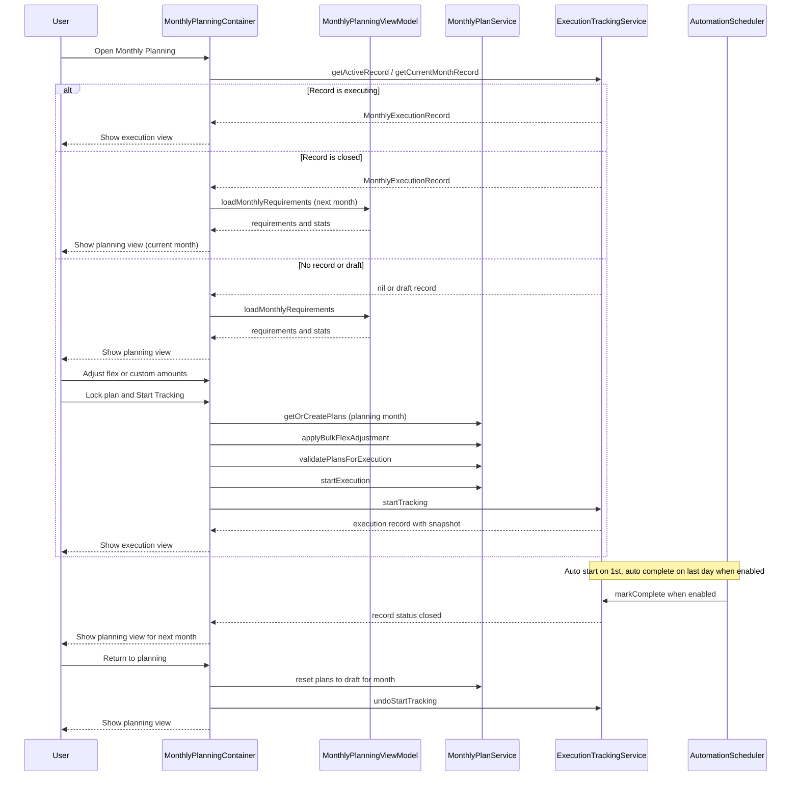
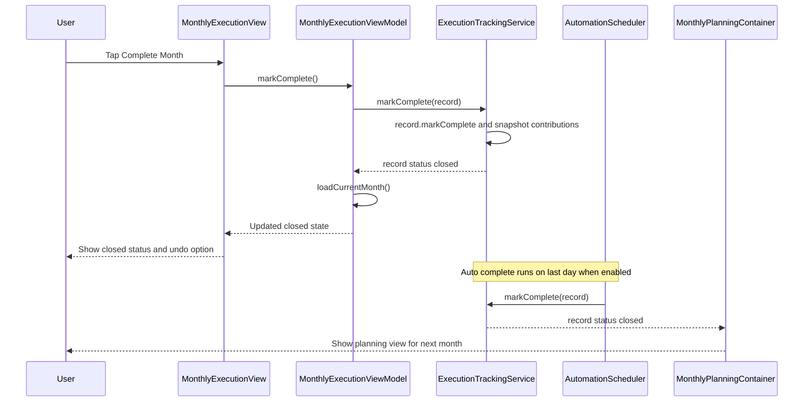
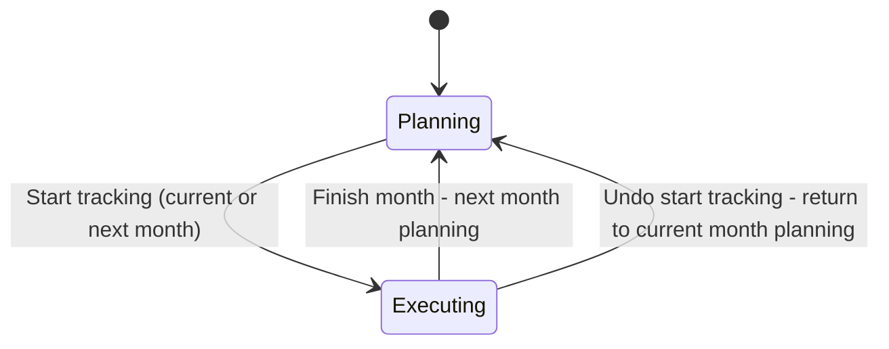
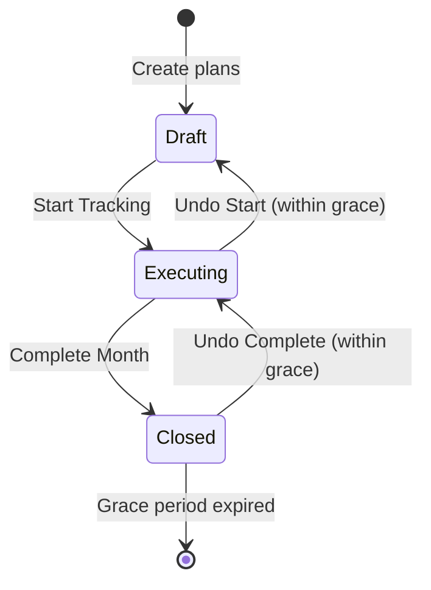
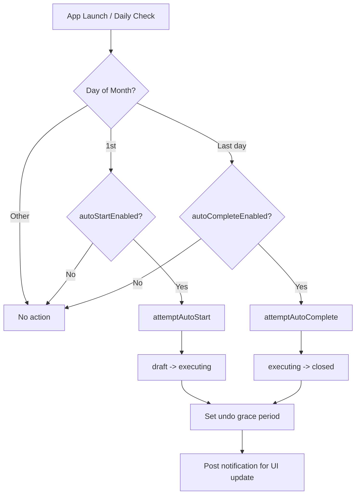

# Monthly Planning Feature Documentation

## Overview

The Monthly Planning feature is a comprehensive zero-input planning system that automatically calculates monthly savings requirements across all user goals. It includes execution tracking to monitor contributions throughout the month with full undo support.

## Table of Contents

1. [Architecture Overview](#architecture-overview)
2. [Data Models](#data-models)
3. [Services](#services)
4. [ViewModels](#viewmodels)
5. [Execution Tracking](#execution-tracking)
6. [Automation](#automation)
7. [API Reference](#api-reference)
8. [File Locations](#file-locations)

---

## Architecture Overview

### System Design Principles

1. **Zero-Input Planning**: Automatic calculation based on goal deadlines and allocated asset totals
2. **Asset-Based Progress**: Progress tracks allocated assets, not manual contributions
3. **Immutable History**: Completed executions freeze exchange rates and contribution snapshots
4. **Undo Grace Period**: Configurable window (24h-7d) to undo state transitions
5. **Duplicate Prevention**: `AsyncSerialExecutor` ensures only one set of plans per month

### High-Level Architecture

```
┌─────────────────────────────────────────────────────────────────────────┐
│                              VIEWS                                       │
│  MonthlyPlanningContainer → MonthlyPlanningView / MonthlyExecutionView  │
└─────────────────────────────────┬───────────────────────────────────────┘
                                  │
┌─────────────────────────────────▼───────────────────────────────────────┐
│                           VIEWMODELS                                     │
│         MonthlyPlanningViewModel          MonthlyExecutionViewModel      │
└──────────────┬─────────────────────────────────────┬────────────────────┘
               │                                     │
┌──────────────▼─────────────────────────────────────▼────────────────────┐
│                            SERVICES                                      │
│  ┌─────────────────────┐  ┌─────────────────────┐  ┌──────────────────┐ │
│  │ MonthlyPlanService  │  │ ExecutionTracking   │  │ FlexAdjustment   │ │
│  │ (Plan CRUD & state) │  │ Service (lifecycle) │  │ Service          │ │
│  └─────────┬───────────┘  └──────────┬──────────┘  └──────────────────┘ │
│            │              ┌──────────┴──────────┐                       │
│  ┌─────────▼───────────┐  │ ExecutionProgress   │  ┌──────────────────┐ │
│  │ MonthlyPlanning     │  │ Calculator          │  │ Automation       │ │
│  │ Service (calculate) │  │ (contributions)     │  │ Scheduler        │ │
│  └─────────────────────┘  └─────────────────────┘  └──────────────────┘ │
└──────────────┬─────────────────────────────────────┬────────────────────┘
               │                                     │
┌──────────────▼─────────────────────────────────────▼────────────────────┐
│                         SWIFTDATA MODELS                                 │
│  MonthlyPlan    MonthlyExecutionRecord    ExecutionSnapshot              │
│  CompletedExecution    AllocationHistory                                 │
└─────────────────────────────────────────────────────────────────────────┘
```

**Key Dependencies:**
- `MonthlyPlanningService` → `GoalCalculationService`, `ExchangeRateService`
- `ExecutionProgressCalculator` → `AllocationHistory`, `ExchangeRateService`

### Data Flow

```
┌─────────────────────────────────────────────────────────────────────────┐
│  1. PLANNING PHASE                                                      │
│                                                                         │
│  Goals ──→ MonthlyPlanningService ──→ MonthlyRequirement                │
│                    │                          │                         │
│                    ▼                          ▼                         │
│            GoalCalculationService      MonthlyPlanService               │
│            ExchangeRateService               │                          │
│                                              ▼                          │
│                                     MonthlyPlan (state: draft)          │
└─────────────────────────────────────────────┬───────────────────────────┘
                                              │
┌─────────────────────────────────────────────▼───────────────────────────┐
│  2. FLEX ADJUSTMENT (optional)                                          │
│                                                                         │
│  MonthlyPlan ──→ FlexAdjustmentService ──→ Adjusted amounts             │
│                  (redistribute savings)     (protected/flexible/skipped)│
└─────────────────────────────────────────────┬───────────────────────────┘
                                              │
┌─────────────────────────────────────────────▼───────────────────────────┐
│  3. EXECUTION PHASE                                                     │
│                                                                         │
│  Start Tracking ──→ MonthlyExecutionRecord (state: executing)          │
│                            │                                            │
│                            ├──→ ExecutionSnapshot (captures plan state) │
│                            └──→ AllocationHistory (seeds baseline)      │
└─────────────────────────────────────────────┬───────────────────────────┘
                                              │
┌─────────────────────────────────────────────▼───────────────────────────┐
│  4. COMPLETION                                                          │
│                                                                         │
│  Mark Complete ──→ CompletedExecution                                   │
│                         │                                               │
│                         ├──→ Exchange rates (frozen)                    │
│                         └──→ Contribution snapshots (immutable)         │
└─────────────────────────────────────────────────────────────────────────┘
```

### Monthly Planning Sequence



Notes:
- When a month is closed, the UI switches to planning for the next month while the closed record remains available in history.

### Monthly Execution Finish Sequence



### Monthly Planning Cycle



---

## Data Models

### MonthlyPlan

**Location**: `ios/CryptoSavingsTracker/Models/MonthlyPlan.swift`

Persistent SwiftData model for monthly savings plans.

| Property | Type | Description |
|----------|------|-------------|
| `id` | `UUID` | Unique identifier |
| `goalId` | `UUID` | Associated goal |
| `monthLabel` | `String` | Format: "yyyy-MM" |
| `requiredMonthly` | `Double` | Calculated requirement |
| `remainingAmount` | `Double` | Amount remaining to target |
| `monthsRemaining` | `Int` | Payment periods until deadline |
| `currency` | `String` | Goal currency |
| `customAmount` | `Double?` | User override |
| `state` | `PlanState` | draft / executing / completed |
| `flexState` | `FlexState` | protected / flexible / skipped |
| `isProtected` | `Bool` | Cannot be reduced in flex |
| `isSkipped` | `Bool` | Excluded from this month |

**Computed Properties**:
- `effectiveAmount` - Returns `customAmount ?? requiredMonthly` (or 0 if skipped)
- `isActionable` - Not skipped AND remaining > 0 AND effectiveAmount > 0
- `needsRecalculation` - True if calculated > 1 hour ago

**State Enums**:

```swift
enum PlanState: String {
    case draft      // Planning phase, editable
    case executing  // Tracking contributions
    case completed  // Month closed
}

enum FlexState: String {
    case protected  // Cannot be reduced
    case flexible   // Can be adjusted
    case skipped    // Temporarily excluded
}
```

### MonthlyExecutionRecord

**Location**: `ios/CryptoSavingsTracker/Models/MonthlyExecutionRecord.swift`

Tracks monthly execution lifecycle with undo support.

| Property | Type | Description |
|----------|------|-------------|
| `id` | `UUID` | Unique identifier |
| `monthLabel` | `String` | Format: "yyyy-MM" |
| `status` | `ExecutionStatus` | draft / executing / closed |
| `startedAt` | `Date?` | When tracking started |
| `completedAt` | `Date?` | When marked complete |
| `canUndoUntil` | `Date?` | Undo grace period expiry |
| `trackedGoalIds` | `Data` | Encoded UUID array |
| `snapshot` | `ExecutionSnapshot?` | Captured plan states |
| `completedExecution` | `CompletedExecution?` | Frozen completion data |

**Status Enum**:

```swift
enum ExecutionStatus: String {
    case draft      // Planning phase
    case executing  // Active tracking
    case closed     // Completed/archived
}
```

### ExecutionSnapshot

**Location**: `ios/CryptoSavingsTracker/Models/ExecutionSnapshot.swift`

Captures MonthlyPlan states when execution starts for immutability.

| Property | Type | Description |
|----------|------|-------------|
| `capturedAt` | `Date` | Snapshot timestamp |
| `totalPlanned` | `Double` | Sum of planned amounts |
| `snapshotData` | `Data` | Encoded goal snapshots |

**ExecutionGoalSnapshot** (Codable):
```swift
struct ExecutionGoalSnapshot: Codable {
    let goalId: UUID
    let goalName: String
    let plannedAmount: Double  // plan.effectiveAmount at capture
    let currency: String
    let flexState: String
    let isSkipped: Bool
    let isProtected: Bool
}
```

### CompletedExecution

**Location**: `ios/CryptoSavingsTracker/Models/CompletedExecution.swift`

Frozen snapshot at completion time for history immutability.

| Property | Type | Description |
|----------|------|-------------|
| `completedAt` | `Date` | Completion timestamp |
| `exchangeRatesSnapshotData` | `Data?` | Frozen exchange rates |
| `goalSnapshotsData` | `Data?` | Frozen goal states |
| `contributionSnapshotsData` | `Data?` | Contribution records |

**CompletedExecutionContributionSnapshot**:
```swift
struct CompletedExecutionContributionSnapshot: Codable {
    let timestamp: Date
    let source: ContributionSource
    let assetId: UUID
    let assetCurrency: String
    let goalId: UUID
    let goalCurrency: String
    let assetAmount: Double
    let amountInGoalCurrency: Double
    let exchangeRateUsed: Double
}
```

### Component Relationships

```
┌─────────────────────────────────────────────────────────────────────────┐
│                            MonthlyPlan                                  │
│─────────────────────────────────────────────────────────────────────────│
│  id: UUID                     state: PlanState (draft/executing/done)   │
│  goalId: UUID                 flexState: FlexState                      │
│  monthLabel: String           customAmount: Double?                     │
│  requiredMonthly: Double      isProtected / isSkipped: Bool             │
│─────────────────────────────────────────────────────────────────────────│
│  effectiveAmount() → customAmount ?? requiredMonthly (or 0 if skipped)  │
└─────────────────────────────────────────────────────────────────────────┘
        │
        │ many plans tracked by one record
        ▼
┌─────────────────────────────────────────────────────────────────────────┐
│                       MonthlyExecutionRecord                            │
│─────────────────────────────────────────────────────────────────────────│
│  id: UUID                     status: ExecutionStatus                   │
│  monthLabel: String           startedAt / completedAt: Date?            │
│  trackedGoalIds: [UUID]       canUndoUntil: Date?                       │
└───────────────┬─────────────────────────────────┬───────────────────────┘
                │                                 │
                │ 0..1                            │ 0..1
                ▼                                 ▼
┌───────────────────────────────┐   ┌─────────────────────────────────────┐
│      ExecutionSnapshot        │   │        CompletedExecution           │
│───────────────────────────────│   │─────────────────────────────────────│
│  capturedAt: Date             │   │  completedAt: Date                  │
│  totalPlanned: Double         │   │  exchangeRatesSnapshot: [String: D] │
│  goalSnapshots:               │   │  contributionSnapshots:             │
│    [ExecutionGoalSnapshot]    │   │    [ContributionSnapshot]           │
│    - goalId, goalName         │   │    - assetId, goalId                │
│    - plannedAmount, currency  │   │    - amount, exchangeRateUsed       │
│    - flexState, isSkipped     │   │                                     │
└───────────────────────────────┘   └─────────────────────────────────────┘
```

**Relationships:**
- `MonthlyPlan` ← many-to-one → `MonthlyExecutionRecord` (via trackedGoalIds)
- `MonthlyExecutionRecord` → `ExecutionSnapshot` (created on start tracking)
- `MonthlyExecutionRecord` → `CompletedExecution` (created on mark complete)

---

## Services

### MonthlyPlanningService

**Location**: `ios/CryptoSavingsTracker/Services/MonthlyPlanningService.swift`

High-level service for calculating monthly savings requirements.

**Key Methods**:

```swift
// Calculate requirements for all goals
func calculateMonthlyRequirements(for goals: [Goal]) async -> [MonthlyRequirement]

// Calculate total in display currency
func calculateTotalRequired(for goals: [Goal], displayCurrency: String) async -> Double

// Single goal calculation
func getMonthlyRequirement(for goal: Goal) async -> MonthlyRequirement?
```

**Calculation Logic**:
1. Get current total from `GoalCalculationService` (asset allocations only)
2. Calculate remaining: `max(0, targetAmount - currentTotal)`
3. Calculate payment periods remaining using `MonthlyPlanningSettings.paymentDay`
4. Divide remaining by periods: `requiredMonthly = remaining / monthsLeft`
5. Determine status based on thresholds

**Payment Period Calculation**:
- Uses configurable payment day (1-28)
- Counts from next payment date until past goal deadline

### MonthlyPlanService

**Location**: `ios/CryptoSavingsTracker/Services/MonthlyPlanService.swift`

Single source of truth for persisted MonthlyPlan objects with duplicate prevention.

**Key Methods**:

```swift
// Main entry point - ensures one set of plans per month
func getOrCreatePlansForCurrentMonth(goals: [Goal]) async throws -> [MonthlyPlan]

// Fetch plans by month and optional state
func fetchPlans(for monthLabel: String, state: MonthlyPlan.PlanState?) -> [MonthlyPlan]

// User customization
func setCustomAmount(_ amount: Double?, for plan: MonthlyPlan)
func toggleProtection(for plan: MonthlyPlan)
func skipPlan(_ plan: MonthlyPlan, skip: Bool)

// Bulk flex adjustment (draft plans only)
func applyBulkFlexAdjustment(
    plans: [MonthlyPlan],
    adjustment: Double,
    protectedGoalIds: Set<UUID>,
    skippedGoalIds: Set<UUID>
) async throws

// State transitions
func startExecution(for plans: [MonthlyPlan])
func completePlans(for plans: [MonthlyPlan])
```

**Duplicate Prevention**: Uses `AsyncSerialExecutor` to serialize critical sections.

### ExecutionTrackingService

**Location**: `ios/CryptoSavingsTracker/Services/ExecutionTrackingService.swift`

Manages monthly execution lifecycle and contribution tracking.

**Key Methods**:

```swift
// Record management
func getCurrentMonthRecord() -> MonthlyExecutionRecord?
func getActiveRecord() -> MonthlyExecutionRecord?
func getCompletedRecords(limit: Int, offset: Int) -> [MonthlyExecutionRecord]

// Lifecycle operations
func startTracking(
    for monthLabel: String,
    from plans: [MonthlyPlan],
    goals: [Goal]
) async throws -> MonthlyExecutionRecord

func markComplete(_ record: MonthlyExecutionRecord) async throws

// Undo operations (within grace period)
func undoCompletion(_ record: MonthlyExecutionRecord) throws
func undoStartTracking(_ record: MonthlyExecutionRecord) throws

// Contribution calculations
func getContributionTotals(for record: MonthlyExecutionRecord) async -> [UUID: Double]
func calculateProgress(for record: MonthlyExecutionRecord) async -> Double
```

**AllocationHistory Seeding**: When execution starts, seeds baseline allocation snapshots for accurate contribution derivation.

### ExecutionProgressCalculator

**Location**: `ios/CryptoSavingsTracker/Services/ExecutionProgressCalculator.swift`

Derives execution contributions from transactions and allocation history.

**Key Method**:

```swift
func derivedEvents(
    for record: MonthlyExecutionRecord,
    end: Date
) async -> [DerivedEvent]

struct DerivedEvent {
    let timestamp: Date
    let source: ContributionSource  // .manualDeposit or .assetReallocation
    let assetId: UUID
    let assetCurrency: String
    let goalId: UUID
    let goalCurrency: String
    let assetDelta: Double
}
```

**Algorithm**:
1. For each tracked asset, compute balance at execution start
2. Build target allocations from AllocationHistory baseline
3. Process transactions and allocation updates chronologically
4. Compute funded amounts using pro-rata allocation when balance < targets
5. Generate events for deltas exceeding epsilon

### FlexAdjustmentService

**Location**: `ios/CryptoSavingsTracker/Services/FlexAdjustmentService.swift`

Intelligent redistribution engine for flexible payment adjustments.

**Key Methods**:

```swift
func applyFlexAdjustment(
    requirements: [MonthlyRequirement],
    adjustment: Double,
    protectedGoalIds: Set<UUID>,
    skippedGoalIds: Set<UUID>,
    strategy: RedistributionStrategy
) async -> [AdjustedRequirement]

func simulateAdjustment(
    requirements: [MonthlyRequirement],
    adjustment: Double,
    protectedGoalIds: Set<UUID>,
    skippedGoalIds: Set<UUID>
) async -> AdjustmentSimulation
```

**Redistribution Strategies**:

| Strategy | Description |
|----------|-------------|
| `balanced` | Equal distribution to eligible goals (capped at 150%) |
| `prioritizeUrgent` | Focus on shortest deadlines first |
| `prioritizeLargest` | Allocate proportionally to goal size |
| `minimizeRisk` | Prioritize high-risk goals for funding |

---

## ViewModels

### MonthlyPlanningViewModel

**Location**: `ios/CryptoSavingsTracker/ViewModels/MonthlyPlanningViewModel.swift`

```swift
@MainActor
final class MonthlyPlanningViewModel: ObservableObject {
    @Published var monthlyRequirements: [MonthlyRequirement]
    @Published var goals: [Goal]
    @Published var totalRequired: Double
    @Published var displayCurrency: String
    @Published var planningMonthLabel: String
    @Published var flexAdjustment: Double  // 0.0-1.5
    @Published var protectedGoalIds: Set<UUID>
    @Published var skippedGoalIds: Set<UUID>
    @Published var isLoading: Bool
    @Published var error: Error?

    func loadMonthlyRequirements(for monthLabel: String?) async
    func applyFlexAdjustment(_ percentage: Double) async
    func toggleProtection(for goalId: UUID)
    func toggleSkip(for goalId: UUID)
    func updateDisplayCurrency(_ currency: String)
}
```

### MonthlyExecutionViewModel

**Location**: `ios/CryptoSavingsTracker/ViewModels/MonthlyExecutionViewModel.swift`

```swift
@MainActor
final class MonthlyExecutionViewModel: ObservableObject {
    @Published var executionRecord: MonthlyExecutionRecord?
    @Published var snapshot: ExecutionSnapshot?
    @Published var contributedTotals: [UUID: Double]
    @Published var fulfillmentStatus: [UUID: Bool]
    @Published var overallProgress: Double
    @Published var showUndoBanner: Bool
    @Published var undoExpiresAt: Date?
    @Published var isLoading: Bool
    @Published var error: Error?

    // Computed for active months (live) vs closed months (frozen)
    var displayGoalSnapshots: [ExecutionGoalSnapshot]
    var displayTotalPlanned: Double
    var canUndo: Bool

    func loadCurrentMonth() async
    func startTracking(plans: [MonthlyPlan], goals: [Goal]) async
    func markComplete() async
    func undoStateChange() async
    func refresh() async
}
```

---

## Execution Tracking

### Undo Grace Period

The system provides a configurable undo grace period (default 24 hours) for:
- Undoing "Start Tracking" (executing -> draft)
- Undoing "Complete Month" (closed -> executing)



### Contribution Calculation

For **active months**: Uses `ExecutionProgressCalculator` with current exchange rates
For **closed months**: Returns immutable values from `CompletedExecution` snapshot

Progress is calculated as: `sum(contributedTotals) / sum(plannedAmounts)`

---

## Automation

### AutomationScheduler

**Location**: `ios/CryptoSavingsTracker/Services/AutomationScheduler.swift`

Manages automated monthly planning transitions.

**Settings** (via `MonthlyPlanningSettings`):
- `autoStartEnabled` - Auto-start tracking on 1st of month
- `autoCompleteEnabled` - Auto-complete on last day of month
- `undoGracePeriodHours` - 0, 24, 48, or 168 hours

**Automation Flow**:



---

## API Reference

### MonthlyRequirement

```swift
struct MonthlyRequirement: Identifiable, Sendable, Codable {
    let id: UUID
    let goalId: UUID
    let goalName: String
    let currency: String
    let targetAmount: Double
    let currentTotal: Double      // From allocated assets
    let remainingAmount: Double
    let monthsRemaining: Int      // Payment periods
    let requiredMonthly: Double
    let progress: Double          // 0.0-1.0
    let deadline: Date
    let status: RequirementStatus
}
```

### RequirementStatus

```swift
enum RequirementStatus: String, Codable {
    case completed  // remainingAmount <= 0
    case onTrack    // Normal progress
    case attention  // requiredMonthly > 5000 OR monthsRemaining <= 1
    case critical   // requiredMonthly > 10000
}
```

### AdjustedRequirement

```swift
struct AdjustedRequirement {
    let requirement: MonthlyRequirement
    let adjustedAmount: Double
    let adjustmentReason: String
    let isProtected: Bool
    let isSkipped: Bool
    let adjustmentFactor: Double
    let redistributionAmount: Double
    let impactAnalysis: ImpactAnalysis
}
```

### ImpactAnalysis

```swift
struct ImpactAnalysis {
    let changeAmount: Double
    let changePercentage: Double
    let estimatedDelay: Int  // Months to recover
    let riskLevel: RiskLevel
}

enum RiskLevel {
    case low     // reduction < 25% AND months > 4
    case medium  // reduction 25-50% OR months 2-4
    case high    // reduction > 50% OR months <= 2
}
```

### MonthlyPlanningSettings

**Location**: `ios/CryptoSavingsTracker/Models/MonthlyPlanningSettings.swift`

```swift
class MonthlyPlanningSettings: ObservableObject {
    @Published var displayCurrency: String      // Default: "USD"
    @Published var paymentDay: Int              // 1-28
    @Published var notificationsEnabled: Bool
    @Published var autoStartEnabled: Bool       // Default: false
    @Published var autoCompleteEnabled: Bool    // Default: false
    @Published var undoGracePeriodHours: Int    // 0, 24, 48, or 168

    var nextPaymentDate: Date { get }
    var daysUntilPayment: Int { get }
}
```

---

## File Locations

| Component | Path |
|-----------|------|
| **Models** | |
| MonthlyPlan | `ios/CryptoSavingsTracker/Models/MonthlyPlan.swift` |
| MonthlyExecutionRecord | `ios/CryptoSavingsTracker/Models/MonthlyExecutionRecord.swift` |
| ExecutionSnapshot | `ios/CryptoSavingsTracker/Models/ExecutionSnapshot.swift` |
| CompletedExecution | `ios/CryptoSavingsTracker/Models/CompletedExecution.swift` |
| MonthlyPlanningSettings | `ios/CryptoSavingsTracker/Models/MonthlyPlanningSettings.swift` |
| **Services** | |
| MonthlyPlanningService | `ios/CryptoSavingsTracker/Services/MonthlyPlanningService.swift` |
| MonthlyPlanService | `ios/CryptoSavingsTracker/Services/MonthlyPlanService.swift` |
| ExecutionTrackingService | `ios/CryptoSavingsTracker/Services/ExecutionTrackingService.swift` |
| ExecutionProgressCalculator | `ios/CryptoSavingsTracker/Services/ExecutionProgressCalculator.swift` |
| FlexAdjustmentService | `ios/CryptoSavingsTracker/Services/FlexAdjustmentService.swift` |
| AutomationScheduler | `ios/CryptoSavingsTracker/Services/AutomationScheduler.swift` |
| **ViewModels** | |
| MonthlyPlanningViewModel | `ios/CryptoSavingsTracker/ViewModels/MonthlyPlanningViewModel.swift` |
| MonthlyExecutionViewModel | `ios/CryptoSavingsTracker/ViewModels/MonthlyExecutionViewModel.swift` |
| **Views** | |
| MonthlyPlanningView | `ios/CryptoSavingsTracker/Views/Planning/MonthlyPlanningView.swift` |
| MonthlyExecutionView | `ios/CryptoSavingsTracker/Views/Planning/MonthlyExecutionView.swift` |
| MonthlyPlanningContainer | `ios/CryptoSavingsTracker/Views/Planning/MonthlyPlanningContainer.swift` |

---

*Last updated: December 2025*
