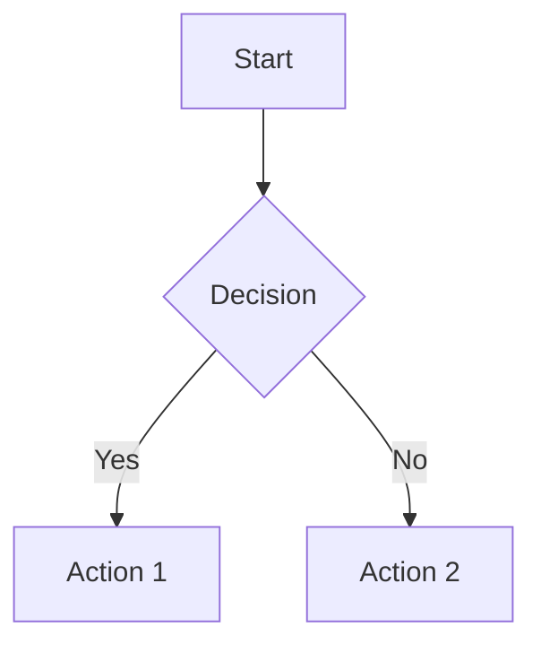

# Documentation Style Guide

> Standards and conventions for CryptoSavingsTracker documentation

| Metadata | Value |
|----------|-------|
| Status | ✅ Current |
| Last Updated | 2026-01-04 |
| Platform | Shared |
| Audience | All |

---

## Table of Contents

- [Document Structure](#document-structure)
- [Metadata Block](#metadata-block)
- [Formatting Standards](#formatting-standards)
- [Headers](#headers)
- [Lists](#lists)
- [Tables](#tables)
- [Code Blocks](#code-blocks)
- [Links and References](#links-and-references)
- [Status Badges](#status-badges)
- [Diagrams](#diagrams)
- [Section Ordering](#section-ordering)
- [File Naming](#file-naming)
- [Examples](#examples)

---

## Document Structure

Every documentation file should follow this structure:

```markdown
# Document Title

> One-line description of the document's purpose

| Metadata | Value |
|----------|-------|
| Status | ✅ Current |
| Last Updated | YYYY-MM-DD |
| Platform | iOS / Android / Shared |
| Audience | Developers / QA / All |

---

## Table of Contents
(Required for documents > 500 lines)

---

## Main Content Sections

---

## Related Documentation

- [Link](FILE.md) - Description

---

*Last updated: YYYY-MM-DD*
```

---

## Metadata Block

Every document must include a metadata table immediately after the title and description.

### Required Fields

| Field | Description | Valid Values |
|-------|-------------|--------------|
| Status | Document currency | `✅ Current`, `⚠️ Needs Update`, `📋 Planning`, `🗄️ Archived` |
| Last Updated | Last modification date | `YYYY-MM-DD` format |
| Platform | Target platform(s) | `iOS`, `Android`, `Shared` |
| Audience | Intended readers | `Developers`, `QA`, `Product`, `All` |

### Example

```markdown
| Metadata | Value |
|----------|-------|
| Status | ✅ Current |
| Last Updated | 2026-01-04 |
| Platform | Shared |
| Audience | Developers |
```

---

## Formatting Standards

### Dates

- **Format**: `YYYY-MM-DD` (ISO 8601)
- **Examples**: `2026-01-04`, `2025-12-15`
- **Never use**: "January 4, 2026", "Jan 4", "1/4/26"

### Text Emphasis

| Style | Usage | Markdown |
|-------|-------|----------|
| **Bold** | Key terms, important notes | `**text**` |
| *Italic* | File names, emphasis | `*text*` |
| `Code` | Code references, commands | `` `text` `` |

### Paragraphs

- One blank line between paragraphs
- Maximum 80-100 words per paragraph for readability
- Use line breaks for logical separation

---

## Headers

### Hierarchy

| Level | Usage | Example |
|-------|-------|---------|
| H1 `#` | Document title only (one per doc) | `# Style Guide` |
| H2 `##` | Major sections | `## Overview` |
| H3 `###` | Subsections | `### Configuration` |
| H4 `####` | Detailed subsections (use sparingly) | `#### Advanced Options` |

### Rules

- Only one H1 per document
- Do not skip levels (no H2 → H4)
- Use sentence case: "Getting started" not "Getting Started"
- No emoji in headers (use in content if needed)
- Add `---` horizontal rule after each major H2 section

### Example

```markdown
# Document Title

## Overview

Content here...

---

## Configuration

### Basic Setup

Content here...

### Advanced Options

Content here...

---
```

---

## Lists

### Unordered Lists

- Use hyphen `-` for all bullet points
- Use 2-space indentation for nested items
- Consistent punctuation (period for sentences, none for fragments)

```markdown
- First item
- Second item
  - Nested item
  - Another nested item
- Third item
```

### Ordered Lists

- Use `1.` for all items (Markdown auto-numbers)
- Use for sequential steps or ranked items
- Use 3-space indentation for nested content

```markdown
1. First step
2. Second step
   - Sub-point
   - Another sub-point
3. Third step
```

### Do Not Use

- Asterisks `*` or plus `+` for bullets
- Manual numbering (2., 3., etc.)
- Mixed bullet styles in same list

---

## Tables

### Format

- Left-align all columns using `|---|`
- No bold in headers
- Keep columns consistent width when possible

```markdown
| Column 1 | Column 2 | Column 3 |
|----------|----------|----------|
| Value 1 | Value 2 | Value 3 |
| Value 4 | Value 5 | Value 6 |
```

### Guidelines

- Maximum 5-6 columns for readability
- Use tables for structured data, not prose
- Include header row always
- Empty cells: use `-` or leave blank

---

## Code Blocks

### Language Tags

Always specify the language for syntax highlighting:

| Language | Tag |
|----------|-----|
| Swift | `swift` |
| Kotlin | `kotlin` |
| Bash/Shell | `bash` |
| JSON | `json` |
| XML | `xml` |
| YAML | `yaml` |
| Markdown | `markdown` |
| Plain text | `text` |
| Mermaid diagrams | `mermaid` |

### Examples

````markdown
```swift
func example() {
    print("Hello")
}
```

```kotlin
fun example() {
    println("Hello")
}
```

```bash
./gradlew build
```
````

### Inline Code

- Use backticks for: file names, function names, variables, commands
- Examples: `ViewModel.swift`, `fetchData()`, `userId`, `npm install`

---

## Links and References

### Internal Links

- Use relative paths from the `docs/` directory
- Use descriptive link text

```markdown
See [Architecture](ARCHITECTURE.md) for design patterns.
See [Monthly Planning](MONTHLY_PLANNING.md#execution-tracking) for details.
```

### External Links

- Use full URLs
- Include descriptive text

```markdown
See [Apple SwiftUI Documentation](https://developer.apple.com/documentation/swiftui)
```

### Section Anchors

- Link to specific sections using auto-generated anchors
- Anchors are lowercase, hyphens for spaces

```markdown
See [Data Models](#data-models)
See [API Reference](#api-reference)
```

### File References

- Use relative paths from repository root for code files
- Include line numbers when relevant

```markdown
Implementation: `ios/CryptoSavingsTracker/Services/GoalService.swift:45`
```

---

## Status Badges

### Allowed Badges

| Badge | Meaning | Usage |
|-------|---------|-------|
| ✅ | Complete/Current | Feature done, doc current |
| ❌ | Not implemented/Failed | Feature missing, test failed |
| 🔄 | In progress | Active development |
| ⚠️ | Warning/Needs attention | Deprecated, needs update |
| 📋 | Planning/Proposed | Future work, proposals |
| 🗄️ | Archived | Historical, superseded |

### Usage

```markdown
| Feature | Status |
|---------|--------|
| User authentication | ✅ Complete |
| Dark mode | 🔄 In progress |
| Offline sync | 📋 Planning |
```

### Do Not Use

- Random emoji for decoration
- Emoji in headers
- More than one badge per item

---

## Diagrams

### Mermaid Diagrams

Use Mermaid for:
- Flowcharts
- Sequence diagrams
- State diagrams
- Entity relationship diagrams

````markdown

````

### ASCII Diagrams

Use for simple architecture diagrams:

```text
┌─────────────┐     ┌─────────────┐
│   View      │────▶│  ViewModel  │
└─────────────┘     └─────────────┘
                           │
                           ▼
                    ┌─────────────┐
                    │   Service   │
                    └─────────────┘
```

---

## Section Ordering

### Feature Documentation

1. Title + Description
2. Metadata Block
3. Table of Contents (if > 500 lines)
4. Overview / Quick Start
5. Architecture / Design
6. Implementation Details
7. API Reference
8. File Locations
9. Troubleshooting (optional)
10. Related Documentation
11. Footer timestamp

### Reference Documentation

1. Title + Description
2. Metadata Block
3. Table of Contents
4. Quick Reference / Summary
5. Detailed Sections
6. Examples
7. Related Documentation
8. Footer timestamp

---

## File Naming

### Conventions

- Use `SCREAMING_SNAKE_CASE.md` for main docs
- Use `lowercase-with-hyphens.md` for supplementary docs
- Descriptive names that indicate content

### Examples

| Type | Example |
|------|---------|
| Main documentation | `ARCHITECTURE.md`, `DEVELOPMENT.md` |
| Feature documentation | `MONTHLY_PLANNING.md`, `CONTRIBUTION_FLOW.md` |
| Guides | `USER_GUIDES.md`, `STYLE_GUIDE.md` |
| Supplementary | `sample-data.md` |

### Platform-Specific Docs

- Include platform in name: `ANDROID_DEVELOPMENT_PLAN.md`
- Or note in metadata: `Platform: iOS`

---

## Examples

### Good Document Header

```markdown
# Monthly Planning

> Zero-input planning system for calculating monthly savings requirements

| Metadata | Value |
|----------|-------|
| Status | ✅ Current |
| Last Updated | 2026-01-04 |
| Platform | Shared |
| Audience | Developers |

---

## Table of Contents

- [Overview](#overview)
- [Architecture](#architecture)
- [Implementation](#implementation)

---
```

### Good Related Documentation Section

```markdown
---

## Related Documentation

- [README](README.md) - Documentation index
- [Contribution Flow](CONTRIBUTION_FLOW.md) - Execution tracking architecture
- [Budget Calculator](BUDGET_CALCULATOR.md) - Fixed budget planning

---

*Last updated: 2026-01-04*
```

### Good Code Reference

```markdown
The `GoalCalculationService` handles all goal-related calculations:

```swift
func calculateProgress(for goal: Goal) -> Double {
    let current = getCurrentTotal(for: goal)
    return min(current / goal.targetAmount, 1.0)
}
```

See `ios/CryptoSavingsTracker/Services/GoalCalculationService.swift:45` for implementation.
```

---

## Related Documentation

- [README](README.md) - Documentation index
- [Architecture](ARCHITECTURE.md) - System design patterns

---

*Last updated: 2026-01-04*
