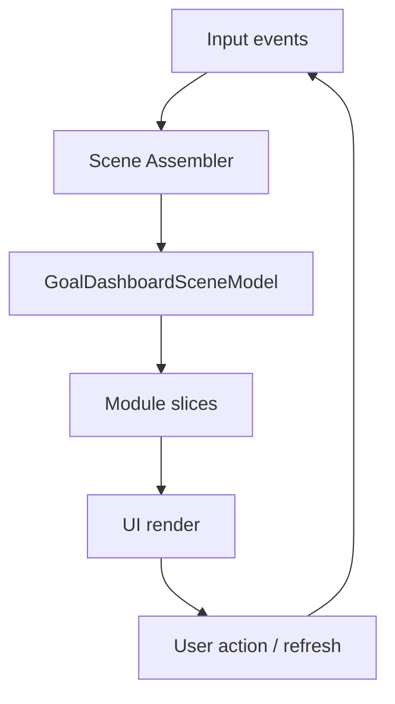

# Goal Dashboard Redesign Proposal

> Revised after triad review R3 to close wire-format, artifact bootstrap, and stability-risk gaps.

| Metadata | Value |
|---|---|
| Status | Decision-locked for implementation (post-plan lock) |
| Last Updated | 2026-03-04 |
| Platform | iOS first, Android parity required |
| Scope | Goal-specific dashboard inside goal details flow |
| Inputs | Xcode MCP audit + `GOAL_DASHBOARD_REDESIGN_PROPOSAL_TRIAD_REVIEW_R1.md` + `GOAL_DASHBOARD_REDESIGN_PROPOSAL_TRIAD_REVIEW_R2.md` + `GOAL_DASHBOARD_REDESIGN_PROPOSAL_TRIAD_REVIEW_R3.md` |

---

## 0) Current State Audit (Xcode MCP Findings)

1. Two competing dashboard implementations exist (`DashboardView.swift` and goal-specific dashboard path).
2. Production type `DashboardViewForGoal` is defined in preview-oriented file (`DashboardViewPreview.swift`).
3. `GoalDashboardView` forces iOS compact mode, which hides modules available on desktop.
4. Module parity between iPhone and iPad is inconsistent.
5. Multiple independent `DashboardViewModel` instances exist across sections.
6. `GoalDetailView` and dashboard tab overlap in purpose.
7. Visual hierarchy is noisy (many cards, shadows, equal emphasis).
8. "What should I do now?" is not deterministic as a single prominent action.

---

## 0.1 Plan Decisions Locked (2026-03-04)

1. Legacy dashboard route is removed in this rollout (no runtime fallback path).
2. Android canonical entry to Goal Dashboard is a dedicated route opened from Goal Detail.
3. Rollback strategy is git/hotfix revert only; no feature-flag rollback in production.

---

## 1) Product Goal

Goal Dashboard must be a decision-first screen that answers:

1. Where am I relative to target and deadline?
2. What is the best next action now?
3. Can I reach deadline at current pace?
4. What changed recently?

Non-goals:

1. No redesign of global app navigation.
2. No forecasting model rewrite in this proposal.

---

## 2) Target IA and Module Contract

### 2.1 Canonical module order (all size classes)

1. `goal_snapshot`
2. `next_action`
3. `forecast_risk`
4. `contribution_activity`
5. `allocation_health`
6. `utilities`

### 2.2 Layout policy

1. iPhone: single column.
2. iPad/macOS: adaptive two-column layout.
3. Semantic order is identical across platforms.
4. `next_action` is always above fold.

### 2.3 Module IDs (parity artifact baseline)

Both platforms must reference the same stable IDs:

1. `goal_snapshot`
2. `next_action`
3. `forecast_risk`
4. `contribution_activity`
5. `allocation_health`
6. `utilities`

---

## 3) P0 Architecture Contract: `GoalDashboardSceneModel`

### 3.1 Ownership

1. iOS owner: `GoalDashboardViewModel` + `GoalDashboardSceneAssembler`.
2. Android owner: `GoalDashboardViewModel` + matching assembler/use-case.
3. Views consume scene-model slices only. No raw model queries in modules.

### 3.2 Typed schema (normative)

```swift
struct GoalDashboardSceneModel {
    let goalId: UUID
    let goalLifecycle: GoalLifecycleState            // active, paused, finished, archived
    let currency: String
    let generatedAt: Date
    let freshness: DataFreshnessState                // fresh, stale, hardError
    let freshnessUpdatedAt: Date?
    let freshnessReason: String?                     // timeout, no_rates, no_balances, partial_data

    let snapshot: SnapshotSlice
    let nextAction: NextActionSlice
    let forecastRisk: ForecastRiskSlice
    let contributionActivity: ContributionActivitySlice
    let allocationHealth: AllocationHealthSlice
    let utilities: UtilitiesSlice

    let telemetryContext: DashboardTelemetryContext
}

enum DataFreshnessState { case fresh, stale, hardError }
enum GoalLifecycleState { case active, paused, finished, archived }
```

### 3.3 Required provenance/freshness fields

1. `generatedAt` is always set.
2. `freshnessUpdatedAt` is required for `stale` and `hardError`.
3. `freshnessReason` is required for `stale` and `hardError`.
4. `forecastRisk` includes assumption basis and confidence (section 5).

### 3.4 Update triggers

Scene recompute is required on:

1. goal change (target/deadline/lifecycle),
2. allocation change,
3. transaction insert/update/delete,
4. balance refresh result,
5. exchange-rate refresh result,
6. explicit user refresh,
7. app foreground when stale threshold passed.

### 3.5 Lifecycle diagram



### 3.6 Normative slice schema appendix

Shared schema artifacts:

1. `shared-test-fixtures/goal-dashboard/schemas/goal_dashboard_scene_model.v1.schema.json`
2. `shared-test-fixtures/goal-dashboard/schemas/goal_dashboard_parity.v1.schema.json`

Common enums:

1. `ModuleRenderState`: `loading | ready | empty | error | stale`
2. `DashboardRiskStatus`: `on_track | at_risk | off_track`
3. `ForecastConfidence`: `low | medium | high`
4. `NextActionResolverState`: `hard_error | goal_finished_or_archived | goal_paused | over_allocated | no_assets | no_contributions | stale_data | behind_schedule | on_track`

#### `SnapshotSlice`

| Field | Type | Required | Nullability | Notes |
|---|---|---|---|---|
| `moduleState` | `ModuleRenderState` | Yes | Non-null | |
| `currentAmount` | `Decimal` | Yes | Non-null | Goal currency |
| `targetAmount` | `Decimal` | Yes | Non-null | Goal currency |
| `remainingAmount` | `Decimal` | Yes | Non-null | `max(target-current, 0)` |
| `progressRatio` | `Double` | Yes | Non-null | `0...+inf` |
| `daysRemaining` | `Int` | No | Nullable | Null if finished/archived |
| `status` | `DashboardRiskStatus` | No | Nullable | Required in `ready` and `stale` |
| `lastUpdatedAt` | `Date` | No | Nullable | |

#### `NextActionSlice`

| Field | Type | Required | Nullability | Notes |
|---|---|---|---|---|
| `resolverState` | `NextActionResolverState` | Yes | Non-null | |
| `moduleState` | `ModuleRenderState` | Yes | Non-null | |
| `primaryCta` | `DashboardCTA` | Yes | Non-null | Exactly one |
| `secondaryCta` | `DashboardCTA` | No | Nullable | |
| `reasonCopyKey` | `String` | Yes | Non-null | |
| `isBlocking` | `Bool` | Yes | Non-null | |
| `diagnostics` | `DiagnosticsPayload` | No | Nullable | Required when `resolverState=hard_error` |

#### `ForecastRiskSlice`

| Field | Type | Required | Nullability | Notes |
|---|---|---|---|---|
| `moduleState` | `ModuleRenderState` | Yes | Non-null | |
| `status` | `DashboardRiskStatus` | No | Nullable | Required in `ready` and `stale` |
| `assumptionWindowDays` | `Int` | No | Nullable | Required in `ready` and `stale` |
| `confidence` | `ForecastConfidence` | No | Nullable | Required in `ready` and `stale` |
| `updatedAt` | `Date` | No | Nullable | Required in `ready` and `stale` |
| `targetDate` | `Date` | Yes | Non-null | |
| `projectedAmount` | `Decimal` | No | Nullable | Null in `error` |
| `whyStatusCopyKey` | `String` | No | Nullable | |
| `errorReasonCode` | `String` | No | Nullable | Required in `error` |

#### `ContributionActivitySlice`

| Field | Type | Required | Nullability | Notes |
|---|---|---|---|---|
| `moduleState` | `ModuleRenderState` | Yes | Non-null | |
| `monthContributionSum` | `Decimal` | Yes | Non-null | Goal currency |
| `recentRows` | `[ActivityRow]` | Yes | Non-null | Can be empty |
| `lastContributionAt` | `Date` | No | Nullable | |

#### `AllocationHealthSlice`

| Field | Type | Required | Nullability | Notes |
|---|---|---|---|---|
| `moduleState` | `ModuleRenderState` | Yes | Non-null | |
| `overAllocated` | `Bool` | Yes | Non-null | |
| `concentrationRatio` | `Double` | No | Nullable | |
| `topAssets` | `[AssetWeight]` | Yes | Non-null | |
| `warningCopyKey` | `String` | No | Nullable | Required when warning shown |

#### `UtilitiesSlice`

| Field | Type | Required | Nullability | Notes |
|---|---|---|---|---|
| `moduleState` | `ModuleRenderState` | Yes | Non-null | |
| `actions` | `[DashboardAction]` | Yes | Non-null | Stable order |
| `legacyWidgetPrefsApplied` | `Bool` | Yes | Non-null | Migration observability |

### 3.7 Canonical wire format contract (`Decimal` and `Date`)

JSON wire format is mandatory for shared fixtures and schema validation:

1. `Decimal` fields are encoded as strings in canonical decimal notation:
   - regex: `^-?(0|[1-9][0-9]*)(\\.[0-9]{1,18})?$`,
   - dot decimal separator only,
   - no scientific notation,
   - no locale separators.
2. `Date` fields are encoded as RFC3339 UTC strings with millisecond precision:
   - format: `YYYY-MM-DDTHH:mm:ss.SSSZ`,
   - timezone is always `Z` (UTC).
3. Round-trip invariants:
   - decode(encode(decimal)) preserves numeric precision exactly,
   - decode(encode(date)) preserves the same instant in UTC.

Reference fixture files for conformance tests:

1. `shared-test-fixtures/goal-dashboard/fixtures/goal_dashboard_scene_model.v1.json`
2. `shared-test-fixtures/goal-dashboard/fixtures/goal_dashboard_wire_roundtrip.v1.json`

---

## 4) P0 UX Contract: `Next Action` Resolver Matrix

Exactly one primary CTA must be selected for every dashboard render.

### 4.1 Priority order (top wins)

1. `hard_error`
2. `goal_finished_or_archived`
3. `goal_paused`
4. `over_allocated`
5. `no_assets`
6. `no_contributions`
7. `stale_data`
8. `behind_schedule`
9. `on_track`

### 4.2 Resolver table

| Resolver state ID | Condition | Primary CTA | Secondary |
|---|---|---|---|
| `hard_error` | freshness = hardError | `Retry Data Sync` | `View Diagnostics` |
| `goal_finished_or_archived` | lifecycle in finished/archived | `View Goal History` | `Create New Goal` |
| `goal_paused` | lifecycle = paused | `Resume Goal` | `Edit Goal` |
| `over_allocated` | allocationHealth.overAllocated = true | `Rebalance Allocations` | `Open Allocation Health` |
| `no_assets` | goal has zero assets | `Add First Asset` | `Edit Goal` |
| `no_contributions` | assets exist and month contribution sum = 0 | `Add First Contribution` | `Open Activity` |
| `stale_data` | freshness = stale | `Refresh Data` | `Continue With Last Data` |
| `behind_schedule` | forecastRisk.status = offTrack | `Plan This Month` | `Add Contribution` |
| `on_track` | default fallback | `Log Contribution` | `Open Forecast` |

### 4.3 Guarantee rules

1. Resolver is deterministic by priority order.
2. If multiple conditions match, highest priority state is selected.
3. If none match, fallback is `on_track`.

### 4.4 Hard-error diagnostics payload contract

For `resolverState=hard_error`, diagnostics sheet is mandatory and must include:

1. reason code (`diagnostics.reasonCode`),
2. last successful refresh timestamp (`diagnostics.lastSuccessfulRefreshAt`),
3. actionable next step guidance (`diagnostics.nextStepCopyKey`).

### 4.5 Diagnostics copy quality checklist

Diagnostics copy must satisfy all rules:

1. plain language only (no internal jargon, no class/service names),
2. user-facing reason in one short sentence,
3. next-step guidance in one actionable sentence that starts with a verb,
4. forbidden vague copy without action (`Unknown error`, `Unexpected issue`) unless followed by concrete next step.

Checklist gate:

1. content checklist ID: `DASH-COPY-ERR-001`,
2. owner: Product Content + UX.

---

## 5) P1 Forecast/Risk Explainability Contract

Each `forecast_risk` card in `ready`, `stale`, and `error` states must show:

1. assumption basis: `Based on last {N} days of contributions`,
2. recency: `Updated {relative time}` + absolute timestamp in details,
3. confidence level: `Low | Medium | High`,
4. disclosure action: `Why this status?`.

### 5.1 Status copy minimum

1. `on_track`: "Current pace is sufficient for deadline."
2. `at_risk`: "Current pace may miss deadline unless contributions increase."
3. `off_track`: "Current pace is not sufficient to reach target by deadline."

### 5.2 Hard constraints

1. Status may not be shown without assumption basis + recency.
2. If confidence is `Low`, `next_action` cannot suggest optimistic copy.

---

## 6) UI Contract: Tokens, Chips, Motion

### 6.1 Dashboard token map (required)

| Component | Surface token | Stroke token | Elevation token | Notes |
|---|---|---|---|---|
| `goal_snapshot` | `surface.dashboard.card.primary` | `stroke.subtle` | `elevation.card` | Primary summary card |
| `next_action` | `surface.dashboard.card.emphasis` | `stroke.subtle` | `elevation.card` | Highest visual priority |
| `forecast_risk` | `surface.dashboard.card.primary` | `stroke.subtle` | `elevation.card` | Includes chart area |
| `contribution_activity` | `surface.dashboard.card.primary` | `stroke.subtle` | `elevation.card` | |
| `allocation_health` | `surface.dashboard.card.primary` | `stroke.subtle` | `elevation.card` | |
| `utilities` | `surface.dashboard.card.secondary` | `stroke.subtle` | `elevation.flat` | Secondary controls |

Deprecated in dashboard scope:

1. raw `.shadow(color: .black.opacity(...))`,
2. mixed `.regularMaterial` + custom shadow per card,
3. hardcoded non-token status colors.

### 6.2 Status chip accessibility spec

Each chip must include:

1. icon,
2. text label,
3. semantic color token,
4. accessibility label with full meaning.

| Status | Icon | Text | Color token | Accessibility label |
|---|---|---|---|---|
| `on_track` | `checkmark.circle.fill` | `On Track` | `status.success` | `On track: current pace can reach deadline` |
| `at_risk` | `exclamationmark.triangle.fill` | `At Risk` | `status.warning` | `At risk: current pace may miss deadline` |
| `off_track` | `xmark.octagon.fill` | `Off Track` | `status.error` | `Off track: current pace will miss deadline` |

Contrast requirements:

1. text: WCAG AA >= 4.5:1,
2. non-text indicators >= 3:1.

### 6.3 Motion and orientation policy

| Transition | Duration | Curve | Reduced Motion |
|---|---:|---|---|
| `loading -> ready` | 220ms | easeOut | crossfade 120ms |
| `ready -> error` | 180ms | easeInOut | no translation, opacity only |
| `stale -> recovery` | 200ms | easeOut | opacity only |
| module insert/remove | 200ms | easeInOut | instant layout + opacity |

Rules:

1. No spring bounce in finance-critical values.
2. Reorder animations must preserve reading order focus.

### 6.4 UI contract enforcement map

| UI contract rule | Enforced by | Test/Gate ID | Owner |
|---|---|---|---|
| Token-only surfaces/elevation | lint + snapshot | `DASH-LINT-001`, `DASH-SNAP-001` | iOS + Android Eng |
| No ad-hoc shadow/material mixes | lint | `DASH-LINT-002` | Design System + Mobile Eng |
| Status chip anatomy + contrast | a11y test + snapshot | `DASH-A11Y-CHIP-001`, `DASH-SNAP-CHIP-001` | QA + Accessibility owner |
| Reduced-motion fallback | UI test | `DASH-MOTION-001` | QA |
| Module state render matrix | snapshot | `DASH-SNAP-STATE-001` | QA |

---

## 7) Module State and Recovery Table

Each module must implement `loading`, `ready`, `empty`, `error`, `stale`.

| Module | `error` recovery action | `stale` action |
|---|---|---|
| `goal_snapshot` | `Retry Data Sync` | `Refresh Snapshot` |
| `next_action` | `Retry Data Sync` | `Refresh Data` |
| `forecast_risk` | `Retry Forecast` | `Refresh Forecast` |
| `contribution_activity` | `Reload Activity` | `Refresh Activity` |
| `allocation_health` | `Recompute Allocation Health` | `Refresh Allocations` |
| `utilities` | `Open Goal Details` | `Continue` |

---

## 8) P0 Migration and Rollback Plan

### 8.1 Route cutover sequence

1. Remove legacy goal-dashboard route and legacy dashboard screen(s) from active navigation on both platforms in this rollout.
2. Canonical route is `goal/{goalId}/dashboard`.
3. Canonical entry point is Goal Detail on both platforms.
4. iOS mapping: `GoalDetailView -> GoalDashboardScreen`.
5. Android mapping: `GoalDetailScreen -> goal/{goalId}/dashboard -> GoalDashboardScreen`.
6. `goal_dashboard_v2_enabled` is not used as runtime fallback in production.
7. Acceptance and release gates validate canonical route behavior only.

### 8.2 Persisted `dashboard_widgets` compatibility

1. Read legacy `dashboard_widgets` safely.
2. Compatibility handling:
   - unknown widget IDs -> ignore and log warning,
   - incompatible layout settings -> reset to v2 default preset,
   - valid items -> map to `utilities` personalization only.
3. Never crash on malformed persisted JSON.

### 8.3 Rollback conditions and mechanism

Rollback is mandatory if any condition is met:

1. crash-free rate delta <= -0.30 percentage points vs previous stable release over rolling 24h window with >= 2,000 dashboard sessions,
2. duplicate-load rate > 0.50% over rolling 6h window with >= 500 dashboard opens,
3. CTA resolver mismatch rate > 1.00% in QA scenario suite for two consecutive runs.

Rollback mechanism:

1. Production rollback is executed only via git/hotfix revert to last stable baseline.
2. Runtime feature-toggle rollback is not supported for dashboard route.
3. Numeric thresholds are normative in this proposal and mirrored in `docs/runbooks/goal-dashboard-release-gate.md`.

### 8.4 Rollback verification

1. Prepare hotfix revert from the last stable release baseline.
2. Run smoke suite on canonical goal dashboard route from Goal Detail.
3. Verify goal/asset/transaction data integrity after hotfix.
4. Verify no legacy route is reintroduced in navigation graph.

---

## 9) Cross-Platform Parity Contract (iOS + Android)

Create shared artifact:

`shared-test-fixtures/goal-dashboard/goal_dashboard_parity.v1.json`

Required keys:

1. module IDs,
2. state IDs,
3. CTA resolver state IDs,
4. copy keys,
5. status chip IDs.

Release gate:

1. parity test must compare iOS and Android outputs against artifact.
2. release fails on drift.

### 9.1 Parity governance and versioning policy

1. Owner: Cross-platform Dashboard Working Group (`iOS lead + Android lead + QA lead`).
2. Approval path:
   - any parity artifact change requires approval from iOS and Android leads.
3. Versioning:
   - semantic version in artifact (`major.minor.patch`),
   - `major`: breaking contract,
   - `minor`: additive fields/states,
   - `patch`: typo/docs-only/no semantic change.
4. Backward compatibility:
   - minor changes must remain backward compatible for one release cycle,
   - major changes require migration note and fixture update in both platforms.
5. CI gate:
   - reject parity artifact edits without version bump and owner approvals metadata.

---

## 10) Delivery Plan

### Phase 1 (Now): P0 foundation

1. Bootstrap normative artifacts before enabling dependent CI gates:
   - create schema files referenced in section 3.6,
   - create parity artifact referenced in section 9,
   - create release runbook referenced in section 8.3.
2. Remove legacy route/screens from active navigation on both platforms.
3. Wire canonical Goal Detail -> Goal Dashboard entry on both platforms:
   - iOS: `GoalDetailView -> GoalDashboardScreen`,
   - Android: `GoalDetailScreen -> goal/{goalId}/dashboard -> GoalDashboardScreen`.
4. Scene model contract and assembler.
5. Next-action resolver matrix.
6. Migration + rollback implementation contract (hotfix-only rollback path).

### Phase 2 (Next): UX and trust

1. Forecast explainability copy.
2. Per-module recovery behavior.
3. Layout parity across size classes.

### Phase 3 (Next): visual hardening

1. Tokenized module surfaces.
2. Status chip accessibility contract.
3. Motion policy implementation.

### Phase 4 (Later): parity and release gate

1. Shared parity artifact.
2. CI parity checks on both platforms.
3. Post-release monitoring and hotfix readiness (no runtime fallback path).

### 10.5 Delivery risk: Preview/runtime stability

Risk:

1. Preview and runtime instability can hide state-render regressions in module-rich dashboard screens.

Mitigation:

1. owner: iOS lead,
2. use Xcode Preview as fast feedback only, never as sole validation source,
3. require simulator runtime snapshot/UI validation for every dashboard module state.

Fallback validation strategy:

1. if preview is unstable, release gating relies on runtime snapshot suite + integration tests.

---

## 11) Acceptance Criteria

1. All dashboard modules consume only `GoalDashboardSceneModel` slices.
2. Next-action resolver covers:
   - `hard_error`,
   - `goal_finished_or_archived`,
   - `goal_paused`,
   - `over_allocated`,
   - `no_assets`,
   - `no_contributions`,
   - `stale_data`,
   - `behind_schedule`,
   - `on_track`.
3. Exactly one primary CTA is rendered in every state.
4. Forecast card always shows assumption basis + recency + confidence.
5. Dashboard uses token map only; no ad-hoc shadows/material mixes.
6. Each module exposes explicit recovery actions for `error` and `stale`.
7. Goal dashboard is reachable only via canonical route from Goal Detail on both platforms; no legacy runtime fallback path exists.
8. Parity artifact is used by both platforms and release-gated.
9. Slice payloads validate against shared schema artifacts on both platforms.
10. `hard_error` diagnostics always include reason code, last-success timestamp, and next-step guidance.
11. Rollback decisions use numeric thresholds from section 8.3 only.
12. Each UI contract rule in section 6.4 has active CI enforcement.
13. Wire-format conformance for `Decimal` and `Date` passes strict round-trip checks.
14. Normative artifact files from section 10 Phase 1 bootstrap exist before dependent gates are enabled.
15. Diagnostics copy passes checklist `DASH-COPY-ERR-001`.
16. Rollback drill validates hotfix-only recovery path and confirms absence of runtime flag rollback.

---

## 12) Test Plan

### 12.1 Unit

1. Scene assembler tests (freshness/provenance fields).
2. Next-action resolver determinism tests with explicit coverage of:
   - `hard_error`,
   - `goal_finished_or_archived`,
   - `goal_paused`,
   - `over_allocated`,
   - `no_assets`,
   - `no_contributions`,
   - `stale_data`,
   - `behind_schedule`,
   - `on_track`.
3. Forecast trust metadata tests (assumption + confidence required).
4. Slice schema validation tests against shared JSON schema artifacts.
5. Wire-format round-trip tests for all `Decimal` and `Date` scene fields.

### 12.2 Integration + performance/concurrency gates

1. Initial load budget:
   - P95 <= 600ms for scene assembly on reference fixture.
2. Refresh budget:
   - P95 <= 700ms with cached balances and rates.
3. Duplicate-load gate:
   - no more than one active dashboard load per goal at a time.
4. Race-condition test:
   - transaction update + refresh event in same interval produces single stable scene output.
5. Navigation contract test:
   - Android: `GoalDetailScreen -> goal/{goalId}/dashboard`,
   - iOS: `GoalDetailView -> GoalDashboardScreen`.
6. Negative navigation test:
   - legacy goal-dashboard route is not reachable in production navigation graph.
7. Resolver/scene integration:
   - resolver and scene tests run only against canonical route wiring.

### 12.3 UI and snapshot

1. Snapshot matrix for all module states (`loading/ready/empty/error/stale`).
2. Dynamic type and VoiceOver label assertions for status chips.
3. Reduced-motion snapshot baseline.
4. `hard_error` diagnostics sheet snapshot includes required payload fields.
5. Diagnostics copy checklist assertions pass `DASH-COPY-ERR-001`.

### 12.4 Parity and governance checks

1. Parity fixture validation on iOS + Android against `goal_dashboard_parity.v1.json`.
2. CI check rejects parity artifact changes without semver bump.
3. CI check rejects parity artifact changes without owner approval metadata.
4. CI check validates canonical wire format in shared fixtures.
5. Rollback drill test:
   - simulate threshold breach and execute hotfix rollback checklist.
6. Post-hotfix integrity test:
   - verify goal/asset/transaction data integrity after rollback.

### 12.5 UX validation protocol for "<= 3 seconds"

Runbook requirements:

1. sample: >= 8 participants internal usability run,
2. scenario: open goal dashboard with realistic dataset,
3. task: answer "What should I do now?" and tap primary CTA,
4. pass threshold:
   - >= 85% correct answer rate,
   - median time-to-first-primary-CTA-tap <= 3.0s.

Telemetry proxy:

1. `goal_dashboard_opened`,
2. `goal_dashboard_primary_cta_shown`,
3. `goal_dashboard_primary_cta_tapped`.

---

## 13) Open Questions Resolved

1. Scene-model freshness ownership:
   - owner is assembler layer (service/use-case), not view layer.
2. UX sample size:
   - fixed at >= 8 participants for proposal acceptance.
3. Legacy widget strategy:
   - migrate compatible entries, reset incompatible entries, never ignore silently.
4. Rollback thresholds location:
   - thresholds are normative in this proposal and mirrored to release runbook.
5. Parity version bump approvals:
   - joint iOS + Android lead approval is mandatory by policy.
6. Wire-format ownership:
   - cross-platform tech leads jointly own canonical `Decimal`/`Date` encoding rules.
7. Legacy route removal timing:
   - remove legacy now in implementation rollout.
8. Android entry ownership:
   - dedicated canonical goal-dashboard route opened from Goal Detail.
9. Rollback mechanism:
   - git/hotfix revert only, no production runtime toggle rollback.

---

## 14) Implementation Checklist

1. Introduce `GoalDashboardScreen.swift` as canonical goal dashboard entry.
2. Move production `DashboardViewForGoal` out of preview file.
3. Implement scene assembler and resolver contracts.
4. Add compatibility shim for `dashboard_widgets`.
5. Create bootstrap artifacts:
   - `shared-test-fixtures/goal-dashboard/schemas/goal_dashboard_scene_model.v1.schema.json`,
   - `shared-test-fixtures/goal-dashboard/schemas/goal_dashboard_parity.v1.schema.json`,
   - `shared-test-fixtures/goal-dashboard/goal_dashboard_parity.v1.json`,
   - `docs/runbooks/goal-dashboard-release-gate.md`.
6. Add integration/performance CI gates.
7. Add parity artifact and parity tests.
8. Add wire-format conformance and round-trip tests.
9. Remove legacy goal-dashboard route/screens from active navigation (iOS + Android) in this rollout.
10. Remove production fallback usage via `goal_dashboard_v2_enabled` for dashboard cutover path.
11. Wire canonical Android entry from Goal Detail to `goal/{goalId}/dashboard`.
12. Validate hotfix rollback readiness in release runbook and rollback drill suite.
