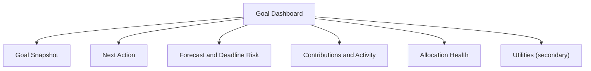

# Goal Dashboard Redesign Proposal

> UX/UI reset for Goal Dashboard based on direct Xcode MCP audit of current iOS implementation.

| Metadata | Value |
|---|---|
| Status | Draft |
| Last Updated | 2026-03-03 |
| Platform | iOS first, Android parity required |
| Scope | Goal-specific dashboard inside goal details flow |
| Inputs | Xcode MCP file audit (`DashboardView.swift`, `DashboardComponents.swift`, `DashboardViewPreview.swift`, `DetailContainerView.swift`, `GoalDetailView.swift`) |

---

## 0) Current State Audit (Xcode MCP Findings)

### 0.1 Structural and UX issues

1. Two competing dashboard implementations exist:
   - app-level dashboard in `Views/DashboardView.swift`
   - goal-level dashboard rendered via `DashboardViewForGoal` in `Views/DashboardViewPreview.swift`
2. Production type `DashboardViewForGoal` is defined in preview-oriented file (`DashboardViewPreview.swift`), reducing discoverability and ownership clarity.
3. `GoalDashboardView` forces iOS into compact mode (`isCompact == true`), so iOS users never see the richer right-column modules.
4. Compact layout on iOS omits critical blocks (quick actions, insights, recent activity), while desktop layout includes them.
5. Multiple independent `DashboardViewModel` instances are created across sections, causing repeated data loads and inconsistent timing.
6. Responsibility overlap:
   - `GoalDetailView` already shows goal health/progress/charts/assets.
   - Dashboard tab repeats parts of the same story with different semantics.
7. Visual hierarchy is noisy: repeated material cards, custom shadows on many containers, and multiple equal-priority panels.
8. Primary user question "What should I do now for this goal?" is not consistently surfaced as a single top-priority block.

### 0.2 UX consequence

Current screen behaves like a widget playground instead of a decision dashboard. Users get analytics fragments, but not a clear action ladder for this month.

---

## 1) Product Goal

Make Goal Dashboard a decision-first screen that answers, in order:

1. Where am I relative to target and deadline?
2. What is the next best action right now?
3. What happens if I keep current pace?
4. What changed recently?

Non-goal:

- No new forecasting algorithm in this proposal.
- No redesign of global app navigation.

---

## 2) Target Information Architecture

### 2.1 Mandatory module order (iPhone and iPad)

1. `Goal Snapshot`
2. `Next Action`
3. `Forecast and Deadline Risk`
4. `Contributions and Activity`
5. `Allocation Health`
6. `Utilities` (secondary actions)

### 2.2 Module intent

| Module | Primary user question | Must include |
|---|---|---|
| Goal Snapshot | "How close am I?" | progress, remaining amount, days left, risk badge |
| Next Action | "What should I do now?" | one primary CTA, one short rationale, optional secondary action |
| Forecast and Deadline Risk | "Will I finish on time?" | baseline projection, target line, behind/on-track status |
| Contributions and Activity | "What did I contribute recently?" | recent contributions list, this-month sum |
| Allocation Health | "Is my goal allocation balanced?" | top assets, concentration warning when needed |
| Utilities | "What else can I manage?" | edit goal, add asset, view full history |

### 2.3 IA flow

---

## 3) Layout and Interaction Contract

### 3.1 iPhone

1. Single-column scroll.
2. Above-the-fold max:
   - `Goal Snapshot`
   - `Next Action`
   - top of `Forecast`.
3. Quick actions are not a persistent button wall; they move into `Utilities` as secondary controls.

### 3.2 iPad/macOS

1. Two-column adaptive layout:
   - left: `Snapshot`, `Next Action`, `Utilities`
   - right: `Forecast`, `Activity`, `Allocation`
2. Same module order semantics as iPhone (no content-class divergence).

### 3.3 CTA policy

1. Exactly one primary CTA in `Next Action`.
2. CTA is state-driven:
   - no assets -> `Add First Asset`
   - assets but no contributions -> `Add First Contribution`
   - behind schedule -> `Plan This Month`
   - on track -> `Log Contribution`
3. Every CTA includes one-line reason copy.

### 3.4 State coverage

Each module must support:

1. `loading`
2. `ready`
3. `empty`
4. `error`
5. `stale`

---

## 4) Visual System Rules for Dashboard v2

1. Maximum two depth levels:
   - base background
   - card surface
2. Remove ad-hoc per-card shadow recipes from dashboard modules.
3. Use semantic status chips only:
   - `on_track`
   - `at_risk`
   - `off_track`
4. Financial values use consistent typography scale:
   - primary value
   - supporting metric
   - helper text
5. Decorative elements cannot compete with `Next Action`.

---

## 5) Architecture and Ownership Refactor

### 5.1 Canonical screen ownership

1. Introduce `GoalDashboardScreen.swift` as the only goal dashboard entry component.
2. Move `DashboardViewForGoal` out of `DashboardViewPreview.swift` into production file under `Views/Dashboard/`.
3. Keep preview-only code in preview files only.

### 5.2 Single source of dashboard state

1. Introduce `GoalDashboardSceneModel` (or equivalent) produced by one `GoalDashboardViewModel`.
2. Child modules receive precomputed view state, not raw model queries.
3. Remove multiple independent `@StateObject` loads per section.

### 5.3 Responsibility boundaries

1. `GoalDetailView` remains canonical for goal metadata and asset management workflow.
2. `GoalDashboardScreen` remains canonical for analytics + action guidance.
3. Shared computations (progress, forecast status, monthly contribution gap) live in service/use-case layer, not in view files.

---

## 6) Delivery Plan

### Phase 1 - Foundation

1. Create new dashboard screen shell and scene model.
2. Relocate production-only dashboard entry out of preview file.
3. Wire a single VM/state pipeline.

### Phase 2 - UX rebuild

1. Implement modules in target IA order.
2. Add state-driven `Next Action` block and copy keys.
3. Move legacy quick actions to secondary utilities area.

### Phase 3 - Visual cleanup

1. Replace mixed material/shadow styling with tokenized surfaces.
2. Ensure consistent spacing/typography/risk chips.

### Phase 4 - Parity and rollout

1. Port same IA/state contract to Android dashboard.
2. Keep copy keys and state taxonomy aligned.
3. Enable rollout via feature flag; remove legacy dashboard after validation.

---

## 7) Acceptance Criteria

1. iOS and iPad show same module set; only layout adapts.
2. User sees exactly one primary CTA at a time.
3. `GoalDashboardScreen` has one dashboard VM source; no duplicated load tasks per module.
4. No production dashboard types live in preview files.
5. First-screen comprehension test:
   - user can answer "What should I do now?" in <= 3 seconds.
6. Snapshot tests cover `loading/ready/empty/error/stale` for all modules.
7. Android parity note is completed before rollout exit.

---

## 8) Test Plan

### Unit

1. `GoalDashboardViewModel` state mapping tests.
2. CTA resolver tests for all goal states.
3. Forecast status mapping tests (`on_track`, `at_risk`, `off_track`).

### UI

1. Goal with no assets -> `Add First Asset` primary CTA.
2. Goal with assets/no contributions -> `Add First Contribution`.
3. Goal behind schedule -> `Plan This Month` with reason text.
4. Utilities actions remain accessible and functional.

### Snapshot

1. iPhone compact baseline.
2. iPad regular baseline.
3. Dynamic Type large categories.
4. Light and dark mode parity.

---

## 9) Risks and Mitigations

| Risk | Impact | Mitigation |
|---|---|---|
| Scope creep from "full redesign" | delayed delivery | phase-gated rollout with explicit exit criteria |
| Regression in existing goal workflows | user friction | keep goal editing/asset flows in `GoalDetailView`; dashboard only orchestrates guidance |
| Platform divergence (iOS vs Android) | inconsistent UX | shared IA contract and copy keys as parity gate |

---

## 10) Implementation Checklist

1. Create `docs/proposals/GOAL_DASHBOARD_REDESIGN_PROPOSAL.md` (this document).
2. Create technical task breakdown issue per phase.
3. Implement iOS v2 under feature flag.
4. Add test coverage from section 8.
5. Run internal UX review with real goal datasets.
6. Complete Android parity pass.
7. Remove legacy dashboard path.
